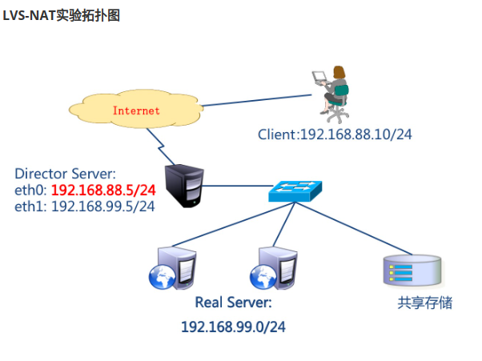
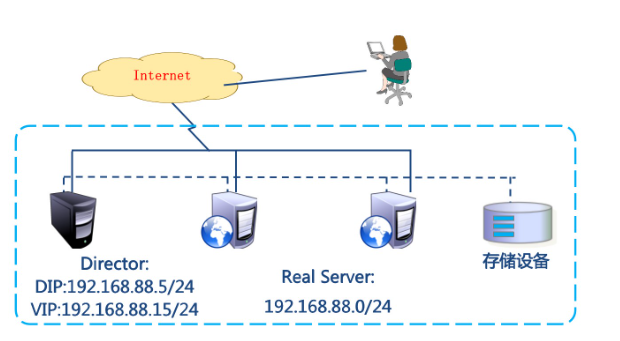
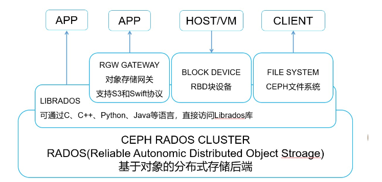
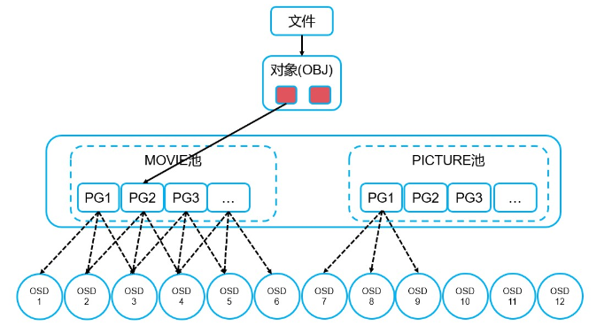

# 集群

**概念**

集群就是一组计算机，作为一个整体向用户提供一组网络资源

**集群任务**

任务调度

**目的**

- 提高性能：如计算密集型应用
- 降低成本：相对超级计算机价格低廉
- 提高可扩展性：只要增加集群节点即可
- 增强可靠性：多个节点完成相同功能，有效避免单点

**集群分类**

- HA：高可用集群（High Availability Cluster）
- LBC：负载均衡集群/负载均衡系统（Load Balance Cluster）
- HPC：
  - 科学计算集群（High Performance Computing Cluster）
  - 高性能计算集群（High Performance Computing）

# LVS

## 概念

**LVS：Linux Virtual Server，Linux虚拟服务器**

> <font color='peach'>Linux虚拟服务器是章文嵩在国防科技大学就读博士期间研发的，由于性能过于强悍被Linux内核维护组织收录，从2.4版本内核开始嵌入</font>

**功能**：实现高可用的、可伸缩的Web、Mail、Cache和Media等网络服务

**目标**：利用Linux系统和LVS集群软件实现一个高可用、高性能、低成本的服务器应用集群

**组件**：工作在内核空间的IPVS模块，工作在用户空间的ipvsadm管理工具

**工作模式**

> - <font color='bit'>**NAT：网络地址转换**</font>
> - <font color='bit'>**DR：路由模式**</font>
> - <font color='bit'>**TUN：隧道模式**</font>

**术语**

- 调度器：LVS服务器
- Real Server：提供服务的服务器
- VIP：虚拟地址，提供给用户访问的地址
- DIP：指定地址，LVS服务器上与真实服务器通信的地址
- RIP：真实地址，真实服务器地址

**常见的调度算法（共10个）**

常用的有4个

- 轮询（rr）：Real Server轮流提供服务
- 加权轮询（wrr）：根据服务器性能设置权重，权重大的得到的请求更多
- 最少连接（lc）：根据Real Server的连接数分配请求
- 加权最少连接（wlc）：类似于wrr

## LVS-NAT

实验环境准备

|主机名| IP地址              | 角色                                            |         
| ------------------- | ----------------------------------------------- | ----------- |
| pubserver（已存在） | eth0：192.168.88.240 <br />eth1->192.168.99.240 | ansible主机 |
| client              | eth0->192.168.88.10 <br />网关：192.168.88.5    | 客户端      |
| lvs1                | eth0 -> 192.168.88.5 <br />eth1->192.168.99.5   | lvs服务器   |
| web1                | eth1->192.168.99.100<br />网关：192.168.99.5    | web服务器   |
| web2                | eth1->192.168.99.200 <br />网关：192.168.99.5   | web服务器   |



测试LVS-NAT拓扑网络通信情况

```bash
cat /proc/sys/net/ipv4/ip_forward        #检查lvs1主机是否开启路由转发
1       #如果得到1则无需调整，如果得到0则执行下一步临时开启路由转发功能
echo 1 > /proc/sys/net/ipv4/ip_forward
```

**Ansible配置**

```bash
#创建单独工作目录
mkdir cluster
cd cluster/
#编写ansible配置文件和主机清单列表文件
vim ansible.cfg
[defaults]
inventory = inventory
host_key_checking = false
module_name = shell

vim inventory
[clients]
client ansible_ssh_host=192.168.88.10

[webservers]
web1 ansible_ssh_host=192.168.99.100
web2 ansible_ssh_host=192.168.99.200

[lbs]
lvs1 ansible_ssh_host=192.168.88.5

[all:vars]
ansible_ssh_user=root
ansible_ssh_pass=a

#更新yum源，由pubserver的ftp服务提供的镜像仓库以及自定义软件仓库
```

**配置Web服务**

```bash
vim files/index.html.j2
Welcome to {{ ansible_hostname}}	#

vim 02_cfg_web.yml
---
- name: config web
  hosts: webservers
  tasks:
    - name: install nginx   #安装nginx
      yum:
        name: nginx
        state: present
    - name: copy index      #发送index.html.j2生成index.html文件
      template:
        src: files/index.html.j2
        dest: /usr/share/nginx/html/index.html
    - name: start nginx     #启动nginx服务
      service:
        name: nginx
        state: started
        enabled: true		#

ansible-playbook 02_cfg_web.yml
```

**配置LVS服务器**

总结：查看LVS服务器是否开启路由转发功能，安装ipvsadm软件

```bash
absible lvs1 -a "sysctl -a | grep ip_forward"
vim 03_nat.yml
---
- name: config sysctl
  hosts: lbs
  tasks:
    - name: modify kernel args          #持久开启Linux路由转发功能
      sysctl:
        name: net.ipv4.ip_forward
        value: '1'
        sysctl_set: true
        sysctl_file: /etc/sysctl.conf
      notify: flush args
  handlers:
    - name: flush args                  #刷新sysctl.conf文件
      shell: "sysctl -p"	#
      
```

**配置LVS-NAT模式规则**

ipvsadm命令常用参数

```bash
-A: 添加虚拟服务器
-E: 编辑虚拟服务器
-D: 删除虚拟服务器
-C: 删除所有虚拟服务器
-t: 添加tcp服务器
-u: 添加udp服务器
-s: 指定调度算法。如轮询rr/加权轮询wrr/最少连接lc/加权最少连接wlc
-a: 添加虚拟服务器后，向虚拟服务器中加入真实服务器
-r: 指定真实服务器
-w: 设置权重
-m: 指定工作模式为NAT
-g: 指定工作模式为DR

ipvsadm -Ln		#-n为显示具体IP地址
IP Virtual Server version 1.2.1 (size=4096)
Prot LocalAddress:Port Scheduler Flags
  -> RemoteAddress:Port           Forward Weight ActiveConn InActConn
  
ipvsadm -A -t 192.168.88.5:80 -s rr
ipvsadm -a -t 192.168.88.5:80 -r 192.168.99.100:80 -w 1 -m
ipvsadm -a -t 192.168.88.5:80 -r 192.168.99.200:80 -w 2 -m
ipvsadm -Ln
IP Virtual Server version 1.2.1 (size=4096)
Prot LocalAddress:Port Scheduler Flags
  -> RemoteAddress:Port           Forward Weight ActiveConn InActConn
TCP  192.168.88.5:80 rr
  -> 192.168.99.100:80            Masq    1      0          0         
  -> 192.168.99.200:80            Masq    2      0          0 
```

测试访问，使用LVS集群之外的主机作为客户机

## LVS-DR模式

**实验环境**

LVS DR模式，LVS主机和web服务器都是单网卡，它们连在同一网络中

| 主机名              | IP地址                                  | 角色        |
| ------------------- | --------------------------------------- | ----------- |
| pubserver（已存在） | eth0：192.168.88.240                    | ansible主机 |
| client（已存在）    | eth0：192.168.88.10                     | 客户端      |
| lvs1（已存在）      | eth0：192.168.88.5 <br />ech1：关闭网卡 | lvs服务器   |
| web1（已存在）      | eth0：192.168.88.100                    | web服务器   |
| web2（已存在）      | eth0：192.168.88.100                    | web服务器   |

**LVS-DR实验拓扑图**



**Real Server**：配置WEB服务器，配置辅助IP地址、调整内核参数

**Director Server：**在上安装并启用ipvsadm，配置辅助IP地址，创建虚拟服务器，向虚拟服务器中加入节点

**Client：**连接虚拟服务器

使用命令`ipvsadm -C`清理已有的所有LVS规则

**Ansible配置**

调整之前的主机清单文件，将Web主机IP地址改为88网段，同时修改所有主机yum源

**ARP广播的问题**

当客户端发起访问VIP对应的域名的请求时，根据网络通信原理会产生ARP广播；因为负载均衡器和真实服务器在同一网络并且VIP设置在集群中的每一个节点上，此时集群内的真实服务器会尝试回答来自客户端的ARP广播，这会产生问题，大家都说我是”VIP“

**配置DR模式**

配置虚拟IP地址（VIP）

先安装`network-scripts`软件

配置lvs1主机eth0网卡虚拟接口IP地址，`eth0:0 192.168.88.15`子网掩码`PREFIX=24`广播地址`BROADCAST=192.168.88.255`

配置webservers主机`lo`虚拟接口IP地址，`lo:0 192.168.88.15`子网掩码`PREFIX=32`广播地址`BROADCAST=192.168.88.15`

```bash
##参数解析
net.ipv4.conf.all.arp_ignore
    Linux 系统中的一个内核参数，用于控制是否忽略来自所有网络接口的 ARP（地址解析协议）请求
    0：表示不忽略来自所有网络接口的 ARP 请求，即对所有接口发来的 ARP 请求都会进行响应
    1：表示忽略来自所有网络接口的 ARP 请求，即不会对任何接口发来的 ARP 请求进行响应

net.ipv4.conf.lo.arp_ignore
    Linux 系统中的一个内核参数，用于控制是否忽略本地回环接口(lo)上的 ARP（地址解析协议）请求
    0：表示不忽略本地回环接口上的 ARP 请求，即对本地回环接口上的 ARP 请求进行响应
    1：表示忽略本地回环接口上的 ARP 请求，即不对本地回环接口上的 ARP 请求进行响应

net.ipv4.conf.all.arp_announce
    Linux 内核参数之一，用于控制源 IP 地址在 ARP 请求中的发布方式
    0：系统使用物理接口上的 IP 地址作为 ARP 请求中的源 IP 地址。这是默认设置，适用于大多数情况。
    1： 系统使用主机上的所有 IP 地址中与目标 IP 地址在同一子网上的 IP 地址作为 ARP 请求中的源 IP 地址。这个选项适用于多地址绑定的服务器，确保 ARP 请求使用与目标 IP 在同一子网上的 IP 地址，以提高 ARP 的准确性和性能。
    2： 系统使用主机上配置的主 IP 地址作为 ARP 请求中的源 IP 地址。这个选项适用于某些特殊网络环境，例如负载均衡的集群中，确保 ARP 请求使用主 IP 地址，以避免 ARP 缓存中的旧条目导致流量被错误地发送到主机的其他地址

net.ipv4.conf.lo.arp_announce
    Linux 内核参数之一，用于控制本地回环接口（lo）上 ARP 请求中的源 IP 地址的发布方式
    0： 表示系统将使用物理接口上的 IP 地址作为 ARP 请求中的源 IP 地址。这是默认设置，适用于大多数情况。在本地回环接口上，通常情况下使用此设置，因为本地回环接口用于本地通信，不需要进行 ARP 请求。
    1： 表示系统将使用主机上的所有 IP 地址中与目标 IP 地址在同一子网上的 IP 地址作为 ARP 请求中的源 IP 地址。这个选项适用于多地址绑定的服务器，确保 ARP 请求使用与目标 IP 在同一子网上的 IP 地址，以提高 ARP 的准确性和性能
    2： 表示系统将使用主机上配置的主 IP 地址作为 ARP 请求中的源 IP 地址。这个选项适用于某些特殊网络环境，例如负载均衡的集群中，确保 ARP 请求使用主 IP 地址，以避免 ARP 缓存中的旧条目导致流量被错误地发送到主机的其他地址
```

# Keepalived

**概念**

> <font color='black'>keepalive是Linux下的一个轻量级的**高可用**解决方案，主要通过虚拟路由冗余协议(VRRP)来实现高可用功能，起初就是为了补充LVS功能而设计的，用于**监控LVS集群内后端真实服务器状态**，后来加入了VRRP的功能，它出现的目的是为了**解决静态路由出现的单点故障问题**</font>

## 使用Keepalived实现LVS高可用

**虚拟环境准备**

| 主机名              | IP地址               | 角色        |
| ------------------- | -------------------- | ----------- |
| pubserver（已存在） | eth0：192.168.88.240 | ansible主机 |
| client（已存在）    | eth0：192.168.88.10  | 客户端      |
| lvs1（已存在）      | eth0：192.168.88.5   | lvs1调度器  |
| lvs2                | eth0：192.168.88.6   | lvs2调度器  |
| web1（已存在）      | eth0：192.168.88.100 | web服务器   |
| web2（已存在）      | eth0：192.168.88.200 | web服务器   |

lvs1和lvs2节点安装keepalived软件

```bash
# 配置lvs1节点Keepalived软件
[root@lvs1 ~] vim /etc/keepalived/keepalived.conf 
global_defs {
...
   router_id lvs1           #集群节点唯一标识
   vrrp_iptables            #放行防火墙规则
   ...
   vrrp_strict              #严格遵守VRRP规则
   ...
}

vrrp_instance VI_1 {
    state MASTER            #状态
    interface eth0          #网卡
    virtual_router_id 51    #虚拟路由唯一标识符
    priority 100            #优先级
    advert_int 1            #心跳包间隔时间
    authentication {        #认证方式
        auth_type PASS      #密码认证
        auth_pass 1111      #集群密码
    }
    virtual_ipaddress {     #定义VIP
        192.168.88.15/24 dev eth0 label eth0:0  #VIP地址及绑定网卡和虚接口标签
    }
}

virtual_server 192.168.88.15 80 {   #定义LVS虚拟服务器
    delay_loop 6                    #健康检查延时6s开始
    lb_algo wrr                     #调度算法
    lb_kind DR                      #LVS工作模式
    persistence_timeout 50          #50s内相同客户端发起请求由同一服务器处理
    protocol TCP                    #虚拟服务器协议

    real_server 192.168.88.100 80 { #定义真实服务器
        weight 1                    #权重
        TCP_CHECK {                 #健康检查方式
            connect_timeout 3       #连接超时时间为3s
            nb_get_retry 3          #连续3次访问失败则认为真实服务器故障
            delay_before_retry 3    #健康检查包时间间隔
        }
    }

    real_server 192.168.88.200 80 {
        weight 2
        TCP_CHECK {
            connect_timeout 3
            nb_get_retry 3
            delay_before_retry 3
        }
    }
}

[root@lvs1 ~] systemctl enable --now keepalived    #加入开机自启并立即启动
[root@lvs1 ~] ipvsadm -Ln                          #启动服务后有LVS规则

# 配置lvs2节点Keepalived软件
[root@lvs1 ~]# scp /etc/keepalived/keepalived.conf root@192.168.88.6:/etc/keepalived/

[root@lvs2 ~]# vim /etc/keepalived/keepalived.conf 
router_id lvs2  #集群节点唯一标识符
state BACKUP    #状态
priority 50     #优先级

[root@lvs2 ~]# systemctl start keepalived
[root@lvs2 ~]# ipvsadm -Ln

# 验证真实服务器健康检查
[root@web1 ~]# systemctl stop nginx     #模拟web1故障
[root@lvs1 ~]# ipvsadm -Ln              #LVS规则中web1被擦除
TCP  192.168.88.15:80 wrr
  -> 192.168.88.200:80            Route   2      0          0         
[root@lvs2 ~]# ipvsadm -Ln
TCP  192.168.88.15:80 wrr
  -> 192.168.88.200:80            Route   2      0          0         

[root@web1 ~]# systemctl start nginx    #模拟web1修复
[root@lvs2 ~]# ipvsadm -Ln              #LVS规则中web1被添加回来
TCP  192.168.88.15:80 wrr
  -> 192.168.88.100:80            Route   1      0          0         
  -> 192.168.88.200:80            Route   2      0          0  
[root@lvs2 ~]# ipvsadm -Ln
TCP  192.168.88.15:80 wrr
  -> 192.168.88.100:80            Route   1      0          0         
  -> 192.168.88.200:80            Route   2      0          0  
  

# 验证高可用负载均衡
[root@lvs1 ~]# ip a s | grep 88.15          #VIP绑定于lvs1
    inet 192.168.88.15/24 scope global secondary eth0:0
[root@lvs1 ~]# systemctl stop keepalived    #模拟lvs1节点故障
[root@lvs1 ~]# ip a s | grep 88.15          #VIP释放
[root@lvs1 ~]# ipvsadm -Ln                  #LVS规则被清空

[root@lvs2 ~]# ip a s | grep 88.15          #VIP绑定于lvs2
    inet 192.168.88.15/24 scope global secondary eth0:0
[root@lvs2 ~]# ipvsadm -Ln
TCP  192.168.88.15:80 wrr
  -> 192.168.88.100:80            Route   1      0          0         
  -> 192.168.88.200:80            Route   2      0          0
```

# Haproxy负载均衡集群

**概念**

HAProxy是可提供高可用性、负载均衡以及基于TCP和HTTP应用的代理，是免费、快速并且可靠的一种解决方案，非常适用于并发大（并发达1w以上）web站点，这些站点通常又需要会话保持或七层处理，可以很简单安全的整合至当前的架构中，同时可以保护web服务器不被暴露到公网。

**工作模式**

- mode http：只适用于web服务
- mode tcp：适用于各种服务
- mode health：仅作健康检查，很少用

**调度算法**

- roundrobin：轮询
- static-rr：加权轮询
- leastconn：最少连接者先处理  
- source：根据请求源IP，类似于nginx的ip_hash  
- ri：根据请求的URI  
- rl_param：根据请求人URL参数'balance url_param'  
- rdp-cookie(name) ：根据cookie(name)来锁定并哈希每一次的TCP请求  
- hdr(name) ：根据HTTP请求头来锁定每一次HTTP请求

虚拟环境准备

| 主机名              | IP地址               | 角色          |
| ------------------- | -------------------- | ------------- |
| pubserver（已存在） | eth0：192.168.88.240 | ansible主机   |
| client（已存在）    | eth0：192.168.88.10  | 客户端        |
| proxy               | eth0：192.168.88.5   | haproxy服务器 |
| web1（已存在）      | eth0：192.168.88.100 | web服务器     |
| web2（已存在）      | eth0：192.168.88.200 | web服务器     |

**配置Haproxy**

```bash
## 配置Haproxy负载均衡集群
# 配置文件说明
    global为全局配置，通常保持默认即可
    defaults为缺省配置，如果后续有相同配置则覆盖缺省值
    
# 配置Haproxy
[root@haproxy ~]# vim /etc/haproxy/haproxy.cfg          
...
#先把包括64行在内的之后的行全部删除，然后添加以下配置
...
listen webservers           #定义虚拟服务器
        bind 0.0.0.0:80     #定义监听端口
        mode http           #定义工作模式
        balance roundrobin  #定义调度算法
        server web1 192.168.88.100:80 check inter 2000 rise 2 fall 5
        server web2 192.168.88.200:80 check inter 2000 rise 2 fall 5
            #check：对后端服务器进行健康检查
            #inter：健康检查心跳包发送时间间隔
            #rise：连续检查N次有响应则认为健康
            #fall：连续检查N次无响应则认为故障
[root@haproxy ~]# systemctl start haproxy
[root@haproxy ~]# ss -antlp | grep haproxy
tcp   LISTEN 0      128          0.0.0.0:80         0.0.0.0:*    users:(("haproxy",pid=33351,fd=5)) 

# 访问测试
[root@client ~]# for i in {1..6}
 do
  curl http://192.168.88.5
 done
Welcome to web1
Welcome to web2
Welcome to web1
Welcome to web2
Welcome to web1
Welcome to web2
```

**开启Haproxy健康检查页面**

```bash
## Haproxy健康检查页面

# 配置Haproxy
[root@haproxy ~]# vim /etc/haproxy/haproxy.cfg 
...
listen stats                    #定义虚拟服务器
        bind 0.0.0.0:1080       #定义监听端口
        stats refresh 30s       #定义页面刷新时间
        stats uri /stats        #定义请求路径
        stats auth admin:admin  #定义用户/密码
[root@haproxy ~]# systemctl restart haproxy
[root@haproxy ~]# ss -antlp | grep haproxy
LISTEN 0      128          0.0.0.0:1080      0.0.0.0:*    users:(("haproxy",pid=28627,fd=7))
LISTEN 0      128          0.0.0.0:80        0.0.0.0:*    users:(("haproxy",pid=28627,fd=5))

# 浏览器访问测试： http://192.168.88.5:1080/stats 用户名/密码：admin/admin
```

# 分布式存储

**概念**

是一种独特的系统架构，由一组能够通过网络连通，为完成共同任务而协调任务的计算机节点组成。分布式是为了使用廉价的普通的计算机完成复杂的计算和存储任务，目的就是利用更多的机器处理更多的数据或任务。

**特性**

- 可扩展：分布式存储系统可以扩展到几百台甚至几千台的集群规模，而且随着集群规模的增长，系统整体性能表现为线性增长
- 低成本：分布式存储系统的自动容错、自动负载均衡机制使其可以构建在普通的PC机之上。另外，线性扩展能力也使得增加、减少机器非常方便，可以实现自动运维
- 高性能：无论是针对整个集群还是单台服务器，都要求分布式存储系统具备高性能
- 易用：分布式存储系统需要能够提供易用的对外接口，另外，也要求具备完善的监控、运维工具，并与其他系统集成

- 分布式算法
  - 哈希分布
  - 顺序分布
- 常用分布式存储方案
  - Lustre
  - Hadoop
  - FastDFS
  - GlusterFS
  - <font color='red'>Ceph</font>

# Ceph

**概念**

- Ceph是一个分布式存储系统，具有高扩展、高可用、高性能等特点
- Ceph可以提供块存储、文件存储、对象存储
- Ceph支持EB级别的存储空间
- 作为软件定义存储(Software Define Storage)的优秀解决方案在行业中已得到广泛应用

**架构图**


**核心组件**

- 监视器：MON(Monitor)
  - Monitor负责管理Ceph集群的整体状态、配置信息和监控数据
  - 维护集群状态图和管理守护程序和客户端之间的身份验证
  - 它们定期选举一个Leader来协调集群中的其他节点，并接收和处理客户端和OSD的请求
  - 为了冗余和高可用性，通常至少需要三台Monitor
- 管理器：MGR(Manager)
  - Manager提供集群管理功能，包括集群状态监控、元数据管理、REST API接口等
  - 托管基于python的模块来管理和公开Ceph集群信息，包括基于web的Ceph仪表板和REST API
  - 以便管理员和用户可视化地管理和操作Ceph集群
  - 高可用性通常需要至少两台Manager
- OSD（Object Storage Daemon）
  - OSD是Ceph存储集群的核心组件
  - 负责存储数据和处理数据的复制、恢复和再平衡
  - 通过检查其他Ceph OSD守护进程的心跳来为Ceph监视器和管理器提供一些监视信息
  - 每个OSD节点都有一个或多个OSD进程来管理对应的存储设备
  - 为了实现冗余和高可用性，通常至少需要三个Ceph OSD
- MDS（Metadata Server）
  - MDS用于支持Ceph文件系统 (CephFS)
  - 负责维护文件系统的元数据
  - 回答客户端的访问请求，负责文件名到inode的映射，以及跟踪文件锁
- RGW（RADOS Gateway）
  - RGW是Ceph提供的对象存储网关，兼容S3和Swift协议
  - 它为用户提供了通过RESTful API与Ceph存储集群进行交互的能力

**辅助工具**

- Rados
  - RADOS（可靠、自适应分布式对象存储）是底层的分布式对象存储系统
  - 作为Ceph存储引擎的一部分，提供高性能、可扩展的对象存储服务
- CephFS
  - CephFS是Ceph的分布式文件系统
  - 通过将文件存储在RADOS中实现了文件级别的访问
- Librados
  - librados是Ceph提供的客户端库，允许开发人员编写基于Ceph的应用程序

**Ceph工作图**



**Ceph数据存储**

- Object：对象
  - Ceph最底层的存储单元
  - 每个Object包含元数据和数据
- Pool：存储池
  - 是存储对象的逻辑区分
  - 规定了数据冗余的类型和对应的副本分布策略
  - 支持两种类型：副本和纠删码，目前基本上使用的都是3副本类型
- PG（Placement Groups）：数据放置组
  - 是一个逻辑概念
  - 引入这一层是为了更好的分配和定位数据
- CRUSH：算法
  - 是Ceph使用的数据分布算法	
  - 确保数据分配到预期的地方
  - 是容灾级别的控制策略
  - 支持Ceph存储集群动态扩展、重新平衡和恢复



**实验环境搭建**

| 主机名              | IP地址               | 角色        | 内存/硬盘             |
| ------------------- | -------------------- | ----------- | --------------------- |
| pubserver（已存在） | eth0：192.168.88.240 | ansible主机 | 无须更改              |
| client（已存在）    | eth0：192.168.88.10  | 客户端      | 无须更改              |
| ceph1               | eth0：192.168.88.11  | ceph集群    | 4G / 额外加3块20G硬盘 |
| ceph2               | eth0：192.168.88.12  | ceph集群    | 4G / 额外加3块20G硬盘 |
| ceph3               | eth0：192.168.88.13  | ceph集群    | 4G / 额外加3块20G硬盘 |

关闭防火墙和SELinux，配置Ansible，yum源，以及域名解析，配置时间同步服务（使用系统角色），Ceph节点安装软件`python39,podman,lvm2`，详细操作看案例

## Ceph块存储

**概念**

提供像硬盘一样的设备，使用块存储的节点，第一次连接块设备需要对块设备进行分区‘、格式化、然后挂载使用。

- Ceph中的块设备叫做rbd，是rados block device的简写，表示ceph的块设备
- rados是Reliable, Autonomic Distributed Object Store的简写，意思是可靠、自主的分布式对象存储
- Ceph块设备采用精简配置，可调整大小，并将数据存储在多个OSD上
- RBD驱动已经很好的集成在了Linux内核中
- RBD提供了企业功能，如快照、COW克隆等，RBD还支持内存缓存，从而能够大大提高性能

**管理存储池**

- 存储池是Ceph存储数据的逻辑分区，关联OSD设备
- 支持数据校检，有副本和纠删码两种策略，默认3副本

常用指令

```bash
ceph -df  #查看Ceph集群存储情况
ceph osd pool get .mgr size  #获取存储池副本数
ceph osd pool ls #列出存储池
ceph osd pool create rbd 64 # 创建名为rbd的存储池
ceph osd pool aaplication enable rbd rbd #设置存储池类型为rbd
```

**管理镜像**

在存储池中划分空间提供给客户端作为硬盘使用，划分出来的空间术语叫做镜像

镜像管理命令rbd，该命令默认操作名为rbd的存储池，如果自定义存储池名称，操作时需带上`--pool poolname`

```bash
# 查看镜像
[root@ceph1 ~]# rbd ls              #返回空结果
[root@ceph1 ~]# rbd ls --pool rbd
# 创建镜像
[root@ceph1 ~]# rbd create img1 --size 10G
[root@ceph1 ~]# rbd ls
img1
# 查看镜像详情
[root@ceph1 ~]# rbd info img1
# 镜像扩容/缩容
[root@ceph1 ~]# rbd resize img1 --size 200G                 #扩容，并不会立即分配所有空间
# 删除镜像
[root@ceph1 ~]# rbd remove img1                             #删除指定镜像
```

客户端使用Ceph块设备

安装`ceph-common`软件包

1. 获取集群配置文件和用户认证文件

   从 Ceph 管理节点复制 `/etc/ceph/ceph.conf` 和`/etc/ceph/ceph.client.admin.keyring` 到客户端的 `/etc/ceph/` 目录

2. 映射RBD块设备

   创建块设备`rbd create img1 --size 10G`  ，查看img1状态`rbd status img1`，映射ceph镜像到本地`rbd map img1`，本地多出rbd类型的硬盘，使用`rbd showmapped`查看映射关系

3. 挂载使用
   格式化硬盘`mkfs.xfs /dev/rbd0`，创建挂载目录，将对应的硬盘挂载，就可以正常使用，若不需要使用则可以卸载块设备，再取消映射关系`rbd unmap img1`，删除镜像`rbd remove img1`

### 镜像快照

快照可以保存某一时间点时的状态数据，是映像在特定时间点的只读逻辑副本，希望回到以前的一个状态，可以恢复快照

镜像在客户端映射挂载使用后才可以创建快照，创建快照img1-sn`rbd snap create img1 --snap img1-sn`，回滚快照需在镜像卸载取消映射后才可以操作，使用命令`rbd snap rollback img1 --snap img1-sn`回滚到指定快照。

使用命令`rbd snap protect img1 --sanp img1-sn`保护指定快照，防止被误删除，解除使用`unprotect`

### 镜像克隆

> 不能将一个镜像同时挂载到多个节点，会损坏数据，若希望不同节点拥有相同的数据可以使用克隆技术，克隆是基于快照，<font color='red'>不能直接对镜像克隆</font>，快照也必须是收到保护的快照才能克隆

克隆命令`rbd clone img2 --snap img2-sn img2-sn-1`，克隆镜像img2-sn-1是基于快照img2-sn的，客户端可以直接在映射后挂载使用。

克隆镜像是有父镜像和块照信息的，很多数据都来自于快照链，若希望克隆镜像可以独立工作，就需要将父快照中的数据全部拷贝一份，命令`rbd flatten img2-sn-2`，在删除父镜像和快照之后，img2-sn-2仍可以正常使用

## Ceph文件存储

分布式文件系统是指文件系统管理的物理存储资源不一定直连接在本地节点上，而是通过计算机网络与节点相连，CephFS使用Ceph集群提供与POSIX兼容的文件系统，允许Linux直接将Ceph存储mount到本地

**数据与元数据**

数据是文件的主要内容

元数据则是描述这些数据的附加信息，如属组，属主，权限等

CephFS必须有MDSs节点

新建存储池data01，目的存储数据，有100PG `ceph osd pool create data01 100`，创建存储池metadata01，存储元数据`ceph osd pool create metadata01 100`，使用这两个存储池创建文件系统，`ceph fs new myfs01 netadata01 data01 `

启用MDS组件，`ceph orch apply mds myfs01 --placement='ceph1 ceph2 ceph3'`

客户端使用CephFS文件系统

Linux系统对CephFS有很好的支持，可以直接挂载，操作时要使用key，`cat /etc/ceph/ceph.client.admin.keyring`

挂载命令`mount -t ceph 192.168.88.11:/ /mydata -o name=admin,secret=AQAVfwtmJmI/CRAAKg1mVOsRIHcTvQckllYZsA==AQAVfwtmJmI/CRAAKg1mVOsRIHcTvQckllYZsA==`