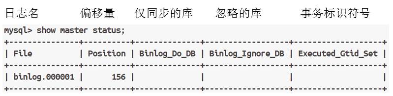

# 数据库

**常见软件**


**数据库类型**

主要

- 关系型数据库（RDBMS）
  采用表结构存储数据，使用SQL语言进行操作管理，如MySQL，Oracle，SQLServer

- 非关系型数据库（NoSQL）

  不使用表结构，而是使用键值对、文档等数据结构存储数据，常用于大数据、高并发等场景，如MongonDB，Redis、Cassandar等

# MySQL

主要版本


**特点**

适用于中小规模、关系型数据库系统，支持多种操作系统以及编程语言；典型应用环境有LAMP，LNMP。

软件安装：mysql-server,mysql

启动服务：服务名称<font color='green'>mysqld</font>，默认端口<font color='green'>3306</font>

**数据库服务相关参数**

| **文件**     | **说明**                       |
| ------------ | ------------------------------ |
| 主配置文件   | /etc/my.cnf.d/mysql-server.cnf |
| 数据库目录   | /var/lib/mysql                 |
| 端口号       | 3306                           |
| 进程名       | mysqld                         |
| 传输协议     | TCP                            |
| 进程所有者   | mysql                          |
| 进程所属组   | mysql                          |
| 错误日志文件 | /var/log/mysql/mysql.log       |
|              |                                |
|              |                                |

主配置文件默认配置

| 配置项    | 功能说名                                  |
| --------- | ----------------------------------------- |
| datadir   | 定义数据库目录位置                        |
| socket    | 定义socket文件名称及存放位置              |
| log-error | 定义错误日志文件名称及存放位置            |
| pid-file  | 定义存放数据库服务进程pid号文件及存放位置 |

连接服务

命令格式：`mysql -h -P -u -p`

选项：`-h:数据库服务器ip地址`，`-P:数据库服务端口`，`-u:用户名`，`-p:密码`

**数据库基本操作**

```bash
select version();		#擦查看软件版本
select user();			#查看登录用户
show databases;			#查看已有库
use 库名;				   #切换库
select database();		#查看当前所在库
show tables;			#查看库里已有表
```

## 密码管理与修改

命令格式（操作系统管理员有此权限）

```bash
#设置密码
mysqladmin -hlocalhost -uroot -p password "新密码"
#修改密码
mysqladmin -hlocalhost -uroot -p旧密码 password "新密码"
```

**破解密码**

```bash
#修改配置文件
vim /etc/my.cnf.d/mysql-server.cnf
[mysqld]
.....
skip-grant-tables  #添加一行，跳过授权表

#命令行输入mysql,此时无需密码，进入后修改密码
mysql>updata mysql.user set authentication_string="" where user="root";  #将原来密码内容改为空
mysql>flush privileges;  #刷新权限
mysql>exit;
#将之前添加的skip-grant-tables注释掉或者去掉，重启mysql服务
mysql -uroot -p #敲回车
msyql> alter user root@"localhost" identified by "新密码"; #修改密码格式
```

## 基础查询

### select 语法

```bash
select 字段列表（逗号隔开） from 库名.表名 where 筛选条件; 
```

**数值比较**

`> 大于 < 小于 = 等于  <= 小于等于 >= 大于等于 != 不等于`

**范围匹配**

```bash
in (值列表) ；  not in (值列表) ； between 数字 and 数字
```

**模糊匹配**

```bash
where 字段名 like  "通配符"   # _ 表示1个字符  % 表示任意个字符
```

**逻辑匹配**

```bash
|| 逻辑或 && 逻辑与 ！ 逻辑非
```

**判断非空**

```bash
is null / is not null
```

**别名/去重/合并**

```bash
别名 as(或者空格)  去重 distinct  合并 concat(表头名，"符号",表头名)  
```

### 常用函数

语法： 函数名(表头名)

```bash
select 函数名(表头名) from 库名.表名;
```

#### 字符函数

```bash
LENGTH(str)  #返字符串长度，以字节为单位，一个汉字3个字节
CHAR_LENGTH(str)        #返回字符串长度，以字符为单位
UPPER(str)和UCASE(str) 	#将字符串中的字母全部转换成大写
LOWER(str)和LCASE(str) 	#将str中的字母全部转换成小写
SUBSTR(s, start,end) 	#从s的start位置开始取出到end长度的子串
INSTR(str,str1) 		#返回str1参数，在str参数内的位置
TRIM(s) 				#返回字符串s删除了两边空格之后的字符串
```

#### 数字函数

```bash
ABS(x) 		#返回x的绝对值
PI() 		#返回圆周率π，默认显示6位小数
MOD(x,y) 	#返回x被y除后的余数
CEIL(x)、CEILING(x) 	#返回不小于x的最小整数 (x 是小数)
FLOOR(x） 		##返回不大于x的最大整数 (x 是有小数的数字)
```

#### 日期函数


#### 聚合函数


avg(字段名),sum(字段名),min(字段名),max(字段名),count(字段名)

**数学计算**

作用：对行中的列做计算

#### if函数

```bash
if(条件,v1,v2) 如果条件是TRUE则返回v1，否则返回v2
ifnull(v1,v2) 如果v1不为NULL，则返回v1，否则返回v2
```

#### case函数

```bash
CASE 表头名              
WHEN 值1 THEN 输出结果 
WHEN 值2 THEN 输出结果  
WHEN 值3 THEN 输出结果 
ELSE 输出结果  
END
或
CASE              
WHEN  判断条件1 THEN 输出结果 
WHEN  判断条件2 THEN 输出结果  
WHEN  判断条件3 THEN 输出结果 
ELSE  输出结果  
END
```

### 查询结果处理

对select查找到的数据再做处理

语法

```bash
select 表头名 from 库名.表名 where 条件 
分组 | 排序 | 过滤 | 分页
```

分组 group by 

说明：查询列表必须是分组函数和出现在group by 后面的字段


排序 order by  字段名  asc/desc

过滤：在查找到的数据里筛选符合条件的数据

语法：`select 表名 from 库名.表名 where 条件 having 条件`

分页：限制查询结果显示行数 l

```bash
limit num; #查询结果前多少行数据
limit num1,num2; #起始行，总行数 （行数记录默认从0开始，即0表示第一行）
```

### 管理表记录

**插入表记录**

不指定列名插入记录（必须给所有列赋值）

```bash
insert into 库名.表名 values (值列表)，...;
```

指定列名插入记录（仅给指定列赋值）

```bash
insert into 库名.表名(列表名) values(值列表),....;
```

使用select 查询结果赋值

```bash
insert into 库名.表名(列表名) (select 字段名 from Ku.biao where rules)
```

 

**修改表记录**

语法

```bash
update ku.table set ziduan=value1,ziduan2=value2 where tiaojian;
```

**删除表记录**

语法

```bash
delete from ku.table where tiaojian; #不接条件清空表记录
truncate table ku.table; 	#清空表记录，不支持where,不能回滚，delete可以，自增张列从1开始，delete继续编号
```

## 表连接（多表查询）

### 内连接

命令格式

```bash
SELECT 表头名 FROM 表1 as 别名 INNER JOIN 表2 as 别名  
ON 连接条件  
[WHERE 筛选条件]  
[GROUP BY 分组][HAVING 分组后筛选][ORDER BY 排序] | [limit 分页]:
```


#### 等值连接

使用相等判断做连接条件，表里必须有存储相同数据的表头

```bash
mysql> SELECT name, SUM(basic+bonus) AS total FROM employees AS e  
    -> INNER JOIN salary AS s  
    -> ON e.employee_id=s.employee_id  
    -> WHERE YEAR(s.date)=2018  
    -> GROUP BY name  
    -> ORDER BY total;
```

#### 非等值连接

表里没有相同数据时使用

```bash
select employee_id, date, basic, grade  
from salary as s inner join wage_grade as g  
on s.basic between g.low and g.high where year(date)=2018 and month(date)=12;
```

###  外连接


#### 左连接

语法格式  表名 LEFT JOIN 表名 ON 连接条件

```bash
SELECT tb1.字段..., tb2.字段  
    FROM table1 AS tb1 LEFT JOIN table2 AS tb2  
ON tb1.字段 = tb2.字段；
```
查询输出结果  
   - 左表表头记录全显示  
   - 右表表头只显示与条件匹配的记录，右表比左表少的记录使用NULL匹配

#### 右连接

语法格式  表名 RIGHT JOIN 表名 ON 连接条件

```bash
SELECT tb1.字段..., tb2.字段  FROM 
table1 AS tb1 RIGHT JOIN table2 AS tb2  
ON tb1.字段 = tb2.字段；
```

查询输出结果  
- 右表表头记录全显示  
- 左表表头只显示与条件匹配的记录，左表比右表少的记录使用NULL匹配

#### 全外连接

也称联合查询，用来合并查询结果， 可以合并同一张表的查询记录（不同表的查询记录也可合并，要求查询时，多个select语句查询表头个数必须一样 

UNION关键字默认去重，可以使用UNION ALL包含重复项  

**语法格式**

```bash
(SELECT语句) UNION    (SELECT语句); 去重
(SELECT语句) UNION ALL (SELECT语句); 不去重

(select date, max(basic) as 工资 from salary where date=20180110)
Union
(select date,min(basic) from salary where date=20180110);

(select employee_id, name, birth_date from employees where employee_id <= 5)
union all
(select employee_id, name, birth_date from employees where employee_id <= 6);
```

### 嵌套查询

嵌套查询：是指在一个完整的查询语句之中，包含若干个不同功能的小查询，从而一起完成复杂查询的一种编写形式，包含的查询放在（ ）里 

含的查询出现的位置  
   - SELECT之后  
     把查询结果当作表头使用
   - FROM之后  

     把查询结果当作表使用
   - WHERE  
     把查询结果当作查询条件
   - HAVING之后
     把查询结果当作过滤条件

## 表管理

### 建库

语法

```bash
create database [if not exists] 库名		#避免建库重名报错
[[default] character set <字符集名>]	#可选，指定使用的字符集（存储字符串）
[[default] collate <校对规则名>]			#可选，指定校对规则（比较字符串的方式）
```

**库名命名规则**

- 具体如下：
◆ 仅可以使用数字、字母、下划线、不能纯数字  
◆ 区分字母大小写  
◆ 具有唯一性  
◆ 不可使用 MySQL 命令或特殊字符

**相关命令**

```sql
show databases; 		#查看库
use  库名;			#进入库
select database();		#查看当前所在库
drop database if exists 库名;	#删除库
#修改库
alert database 库名 {
[default] character set <字符集名>
[default] collate <校对规则>
};
```

### 建表

语法

```bash
CREATE TABLE 库名.表名
{
   表头名1 数据类型,
   表头名2 数据类型,
   表头名3 数据类型,
   ...
};
# 表必须放在库里
```

相关指令

```mysql
show tables; 
desc ku.table;
selecrt * from ku.table;
drop table ku.table;
```

**修改表**

语法：`alter table Ku.table action`

| 操作命令 | 说明 |
|---|---|
| ADD | 添加新字段，一起添加多个字段使用逗号分隔ADD命令（FIRST AFTER） |
| MODIFY | 修改字段类型，也可修改字段的位置 |
| CHANGE | 修改字段名，也可以同时修改字段类型 |
| RENAME | 修改表名 |
| DROP | 删除字段，删除多个字段使用逗号分隔DROP命令 |

**复制表**

- 复制表结构及数据

  `create table ku.table select ziduan from ku.table where tiaojian;`

- 仅复制表结构

  `create table ku.table like ku.table2;`

## 数据类型

MySQL数据类型分类：

1. 数值类型：
   - 整型：TINYINT、SMALLINT、MEDIUMINT、INT、BIGINT
   - 浮点型：FLOAT（4字节）、DOUBLE（8字节）
   - 定点型：DECIMAL

2. 日期和时间类型：
   - DATE、TIME、YEAR、DATETIME、TIMESTAMP
   - 注：DATETIME和TIMESTAMP可存储精确到秒的时间戳，但存储方式和范围存在差异

3. 字符串类型：
   - 短字符串：CHAR、VARCHAR
   - 长文本：TEXT、BLOB
   - 特殊类型：ENUM（枚举）、SET（集合）

4. 布尔类型：
   - BOOL、BOOLEAN

**MySQL字符串类型对比：**

| 类型              | 名称       | 说明                   | 最大长度    |
| ----------------- | ---------- | ---------------------- | ----------- |
| CHAR(字符个数)    | 定长字符串 | 固定长度，右补空格     | 255个字符   |
| VARCHAR(字符个数) | 变长字符串 | 按实际长度动态分配空间 | 65532个字符 |

补充说明：
1. CHAR类型特点：
   - 存储时会用空格补足指定长度
   - 读取时会自动去除尾部空格
   - 适合存储长度固定的数据（如MD5哈希值）

2. VARCHAR类型特点：
   - 仅占用实际数据长度+1-2字节（记录长度）
   - 不会自动补空格
   - 适合存储长度变化的数据（如用户名、地址等）

MySQL整数类型对比：

| 类型      | 名称     | 有符号范围            | 无符号范围       |
| --------- | -------- | --------------------- | ---------------- |
| TINYINT   | 微小整数 | -2⁷ ~ 2⁷-1 (-128~127) | 0 ~ 2⁸-1 (0~255) |
| SMALLINT  | 小整数   | -2¹⁵ ~ 2¹⁵-1          | 0 ~ 2¹⁶-1        |
| MEDIUMINT | 中整型   | -2²³ ~ 2²³-1          | 0 ~ 2²⁴          |
| INT       | 大整型   | -2³¹ ~ 2³¹-1          | 0 ~ 2³²-1        |
| BIGINT    | 极大整型 | -2⁶³ ~ 2⁶³-1          | 0 ~ 2⁶⁴-1        |
| unsigned  | 使用无符号存储范围                                 |

## 导入和导出

**数据导入**

步骤：建表 》拷贝文件到检索目录》导入数据

语法格式

```sql
LOAD DATA INFILE "/目录路径/文件名" 
INTO TABLE 数据库名.表名
FIELDS TERMINATED BY "字段分隔符" 
LINES TERMINATED BY "行结束符";
```

**数据导出**

```sql
select 字段列表 from db.table into outfile "/目录名/文件名";

SELECT 字段列表 
INTO OUTFILE '/绝对路径/文件名'
FIELDS TERMINATED BY '字段分隔符' 
LINES TERMINATED BY '行结束符'
FROM 表名
[WHERE 条件];
```

## 表头基本约束

1. NOT NULL 约束
   - 作用：强制字段不允许包含NULL值
   - 示例：`name VARCHAR(50) NOT NULL`
   - 特点：插入数据时必须提供值

2. DEFAULT 约束
   - 作用：指定字段默认值
   - 示例：`status INT DEFAULT 0`
   - 特点：当插入数据未指定值时自动使用默认值

3. UNIQUE 约束
   - 作用：确保字段值唯一（允许NULL值）
   - 示例：`email VARCHAR(100) UNIQUE`
   - 特点：可创建多列组合唯一约束

4. PRIMARY KEY 约束
   - 作用：唯一标识表中的每行记录
   - 示例：`id INT AUTO_INCREMENT PRIMARY KEY`
   - 特点：
     - 不允许NULL值
     - 自动创建聚簇索引
     - 每个表只能有一个主键

5. FOREIGN KEY 约束
   - 作用：维护表间引用完整性
   - 示例：
     ```sql
     FOREIGN KEY (dept_id) REFERENCES departments(id)
     ON DELETE CASCADE
     ```
   - 特点：
     - 确保引用存在的主键值
     - 可设置级联操作（CASCADE/SET NULL等）

约束添加方式：
- 建表时定义
- 使用ALTER TABLE添加

### 主键

MySQL主键约束使用规范：

1. 基本特性
√ 唯一性：字段值不允许重复
√ 非空性：不允许赋NULL值
√ 标志：在表结构中显示为PRI（PRIMARY KEY）

2. 数量限制
√ 单表限制：每个表只能有一个主键
√ 复合主键：允许由多个字段组合构成（需同时创建）

3. 最佳实践
√ 自动增长：建议与AUTO_INCREMENT连用（INT类型）
    示例：`id INT AUTO_INCREMENT PRIMARY KEY`
√ 行标识：通常选择能唯一标识记录的字段作为主键

4. 复合主键语法
```sql
CREATE TABLE 表名 (
    字段1 数据类型,
    字段2 数据类型,
    PRIMARY KEY (字段1, 字段2)
);
```

### 外键

作用  
- 插入记录时，表头值在另一个表的表头值范围内选择。  

使用规则  
- 表存储引擎必须是innodb  
- 表头类型要一致  
- 被参照表头必须要是索引类型的一种(primary key)

基本语法结构
```sql
CREATE TABLE 数据库名.表名 (
    字段列表,
    FOREIGN KEY(外键字段名)
    REFERENCES 目标数据库.目标表(目标字段名)   #指定外键
    [ON UPDATE 引用操作]					#同步更新
    [ON DELETE 引用操作]					#同步删除
) ENGINE=InnoDB;
```

- 查看外键

  ```sql
  SHOW CREATE TABLE 库.表 \G
  
  SELECT * FROM information_schema.table_constraints WHERE table_name='表名';
  ```

- 删除外键

  ```sql
  ALTER TABLE 库.表 DROP FOREIGN KEY 外键名;
  ```

- 添加外键

  ```sql
  ALTER TABLE 库.表 ADD FOREIGN KEY(字段名) REFERENCES 库.表名(字段名) ON UPDATE CASCADE ON DELETE CASCADE;
  ```

  

## 建表范式

建表的遵循的规则：可以分为6个等级：1NF、2NF、3NF、4NF、5NF、BCNF，NF是Normal Form的缩写。一般情况下，只要把数据规范到第三范式标准就可以满足需要了。

第一范式(确保每列保持原子性)【属性不可分】

第二范式（2NF）(确保表中的每列都和主键相关)【符合第一范式，同时非主属性完全依赖于主键】

第三范式（3NF）(确保每列都和主键列直接相关,而不是间接相关)【符合2NF，并且消除传递依赖】

> 2NF与3NF的区别:在子有没有分出2张表，2NF如果一张表中包含多种不同实体的属性那么必须要分成多张表。3NF已经分成多张表后，一张表中只能有另一张表中的主键,而不能有其他的信息。

## SQL语句分类

- DDL:database define language，数据定义语句
              create/alter/drop
- DML:database manager language，数据操作语句
              insert/update/delete
- DQL:database query language，数据查询语句
              select/show        
- DCL:database control language，数据控制语句
              grant/revoke        
- TCL:transcation control language，事务控制语句
              begin/commit/savepoint/rollback  

**事务**：针对DML，，一组SQL语句要么全部执行，要么全部不执行，是保证数据准确性的机制。

**事务特性：**

- 原子性(Auomicity):在一个事务中，像增删改（DML）要么全部成功，要么全部失败
- 一致性(Consistency)：事务完成时必须所有数据都保持一致状态
- 隔离性(Isolation)：多个事务的执行是互不干扰的
- 持久性(Durability)：事务一旦提交或回滚，它对数据库中的数据的改变就是永久的

## 索引

什么是索引（index）

- 是帮助MySQL高效获取数据的数据结构。
- 为快速查找数据而排好序的一种数据结构。
- 类似书目的目录。
- 可以用来快速查询表中的特定记录，所有的数据类型都可以被索引。
- MySQL索引主要有三种结构：Btree、B+Tree、Hash。

**索引分类**

普通索引：没有任何限制

唯一索引： 使用UNIQUE参数设置，值唯一，可以快速定位某条记录

全文索引： 用于全文搜索，主要针对文本内容进行索引，使用FULL TEXT参数设置，只能在CHAR、VARCHAR、TEXT字段上使用，默认大小写敏感

索引优点

- 大大提高MySQL的检索速度
- 减少服务器需要扫描的数据量
- 避免排序和临时表
- 将随机IO变成顺序IO

缺点

- 虽然索引大大提高了查询速度，同时却会降低更新表的速度，如对表进行INSERT、UPDATE和DELETE。因为更新表时，MySQL不仅要保存数据，还要保存索引文件。
- 建立索引会占用磁盘空间的索引文件。一般情况下这个问题不太严重，但如果你在一个大表上创建了多种组合索引，索引文件的会膨胀很快。
- 如果某个数据列包含许多重复的内容，为它建立索引就没有太大的实际效果。
- 对于非常小的表，大部分情况下简单的全表扫描更高效。

## 用户管理

- 授权是在数据库服务器里添加用户并设置权限及密码
- 重复执行grant命令时如果库名和用户名不变时，是追加权限

```bash
#创建用户
create user username@'hosts' identified by 'password';
#授予权限
grant 权限列表 on 库名 to username@'hosts';
```

MySQL库存储用户权限信息，主要包含以下表：

- **user表**：保存已有的授权用户及用户对所有库的权限。
- **db表**：保存已有授权用户对某一个库的访问权限。
- **tables_priv表**：记录已有授权用户对某一张表的访问权限。
- **columns_priv表**：记录已有授权用户对某一个表字段（列）的访问权限。

库名：
```sql
*.*  #所有库所有表
库名.*    #一个库
库名.表名    #一个表
```
权限表示方式

```bash
ALL  #所有权限
USAGE   #无权限
SELECT,UPDATE,INSERT	#个别权限
SELECT,UPDATE(字段1,字段2) 	#指定字段
```

**权限说明**


**删除以授权用户的权限**

语法：`REVOKE 权限列表 ON 库名 FROM 用户名@地址;`

**相关指令**


## 数据备份

### 按数据库服务状态分类

- **冷备份**：在备份时停止数据库服务，将整个数据库复制到备份设备中。
- **热备份**：在备份时数据库保持运行状态。

### **按备份的数据类型分类**

- **物理备份**：直接备份数据库服务器上的原始数据文件，可直接拷贝恢复，速度快但依赖存储引擎。
- **逻辑备份**：备份 SQL 语句（如`mysqldump`导出的数据），适用于跨版本或异构数据库迁移，但恢复较慢。

### 备份策略


**备份三要素**


### 完全备份与恢复

#### 物理备份及恢复

备份操作

```bash
cp -r /var/lib/mysql  /bakdir/mysql.bak
tar -zcf /root/mysql.tar.gz /var/lib/mysql*
```

恢复操作

```bash
cp -r /bakdir/mysql.bak /var/lib/mysql/
tar -zxf /root/mysql.tar.gz -C /var/lib/mysql/
chown -R mysql:mysql /var/lib/mysql
```

#### 逻辑备份及恢复

完全备份

```bash
#语法
mysqldump -uroot -ppassword 库名  > /bakdir/xxx.sql
#库名的表示方法
 库名 表名列表		//备份1张表或者多张表所有数据
 -B 库名列表		 //备份1个库或者多个库所有数据
 --all-databases 或者 -A  //备份所有
```

完全恢复

```bash
mysql -uroot -ppassword  databeasname < /bakdir/xxx.sql
#恢复时库时库名可以省略
```

<font color='green'>注意：备份和恢复时，数据库服务必须是运行状态</font>

#### **备份缺点**

物理备份缺点：

- 跨平台性差
- 备份时间长、冗余备份、浪费存储空间

mysql dump备份缺点：

- 效率较低、备份和还原速度慢、锁表
- 备份过程中，数据插入和更新操作被阻塞

### 增量备份

**percona(xtrabackup)**：强大的在线热备份工具，备份过程不锁表，适合生产环境

**首次完全备份**

```bash
xtrabackup --host=127.0.0.1 --user=用户名 --password=密码 --backup 
--target-dir=备份目录 --datadir=数据库目录
```

**增量备份**

```bash
xtrabackup --host=127.0.0.1 --user=用户名 --password=密码 --backup 
--target-dir=备份目录 --incremental-basedir=参考目录 --datadir=数据库目录
```

**数据恢复**

```bash
xtrabackup --prepare --apply-log-only --target-dir=/完全备份目录
```

**合并数据**

```bash
xtrabackup --prepare --apply-log-only --target-dir=/完全备份目录 --incremental-dir=/新数据目录名
```

**拷贝数据**

```bash
#拷贝数据前清空数据库目录内容 rm -rf /var/lib/mysql/*
xtrabackup --copy-back --target-dir=/完全备份目录
```

数据恢复流程

- 准备恢复数据
- 合并数据（合并的顺序要和增量备份的顺序一致）
- 清空数据库目录
- 拷贝数据
- 修改数据库目录所有者/组用户为mysql
- 重启数据库服务

### 差异备份

**首次完全备份**

```bash
xtrabackup --host=127.0.0.1 --user=用户名 --password=密码 --backup --target-dir=/备份目录 --datadir=/数据库目录
```

**差异备份**

```bash
xtrabackup --host=127.0.0.1 --user=用户名 --password=密码 --backup --target-dir=/备份目录 --incremental-basedir=/完全备份目录 --datadir=/数据库目录
```

**数据恢复**

```bash
xtrabackup --prepare --apply-log-only --target-dir=完全备份目录
```

**合并数据**

```bash
xtrabackup --prepare --apply-log-only --target-dir=/完全备份目录 
--incremental-dir=/最后一次差异备份
```

拷贝数据

```bash
#拷贝数据前清空数据库目录
xtrabackup -copy-back --target-dir=完全备份目录
#拷贝后修改数据库目录所有者及属组为mysql
```

## Binlog日志

> <font color='black'>也称做二进制日志，保存除查询外的所有SQL命令，可用于数据的备份和恢复，配置mysql主从同步的必要条件，默认是启动的，目录为`/var/lib/mysql`</font>



**自定义日志**

| 配置项                 | 用途                     |
| ---------------------- | ------------------------ |
| server_id=numbei       | 指定id值（1-255）        |
| log_bin                | 启用binlog日志           |
| max_binlog_size=number | 指定日志文件容量，默认1G |

**恢复数据**

命令格式

```bash
mysqlbinlog /var/lib/mysql/binlog.000001  | mysql -uroot -ppassword 
```

## MySQL主从同步

数据库复制技术：将一个Mysql数据库的变更操作同步到另外一个或者多个Mysql数据库。

**主从同步原理**


Master：启用binlog日志，记录所有的数据库更新和修改操作

Slave：

- Slave_IO：复制master主机binlog日志文件里面的SQL命令到本机的relay-log文件里
- Slave_SQL：执行本机relay-log文件里面的SQL语句，实现与Master数据一致

工作流程：

主库将数据的事务操作（DML）记录到binlog日志文件里;

从库监听主库binlog日志变化，当发生变化后，IO线程去请求主库的binlog日志，并将日志变化写入到relaylog日志文件中，此时主库生产Log dump线程，给从库IO线程传输binlog日志文件内容;

从库更新relaylog文件，SQL线程将relaylog文件中的更新执行一遍，达到与主库数据一致的目的

### 构建思路

- 配置主服务器
  — 启用binlog日志，授权用户，查看binlog日志信息 （查看偏移量）

- 配置从服务器
  — 设置server_id 并重启数据库(需拷贝主服务器数据库)
  — 指定主服务器信息
  — 启动slave进程

  — 查看状态信息

```bash
#主服务器
vim /etc/my.cnf.d/mysql-server.cnf
[mysqld]
server-id=53
log-bin=mysql53
#重启服务
#创建服务用户，授权
mysql> create user repluser@"%" identified by "123qqq...A";
mysql> grant replication slave on *.*  to repluser@"%";

 #从服务器
 vim /etc/my.cnf.d/mysql-server.cnf
[mysqld]
server-id=54
#重启服务
#指定主服务器信息
mysql> change master to  
master_host="192.168.88.53", 
master_user="repluser",
master_password="123qqq...A",
master_log_file="mysql53.000001", 
master_log_pos=667;
#启动slave进程
mysql> start slave ; 
#查看状态
mysql> show slave status \G 
...
	        Slave_IO_Running: Yes   //IO线程
            Slave_SQL_Running: Yes   //SQL线程
```

## MySQL读写分离

MySQL读写分离是指将MySQL数据库的读操作和写操作分别分配到不同的服务器上，通过这种方式可以提高数据库的并发处理能力和性能、降低系统失败的风险。要保证负责读访问主机与负责写访问主机的数据一致。

### 构建思路

安装Mycat软件

定义客户端连接mycat服务使用用户密码

```bash
vim  /usr/local/mycat/conf/users/root.user.json
{
        "dialect":"mysql",
        "ip":null,
        "password":"654321",  #密码
        "transactionType":"proxy",
        "username":"mycat" 		#用户名
}
#定义连接的数据库服务器
vim  /usr/local/mycat/conf/datasources/prototypeDs.data
{
        "dbType":"mysql",
        "idleTimeout":60000,
        "initSqls":[],
        "initSqlsGetConnection":true,
        "instanceType":"READ_WRITE",
        "maxCon":1000,
        "maxConnectTimeout":3000,
        "maxRetryCount":5,
        "minCon":1,
        "name":"prototypeDs",
        "password":"123456",  #密码
        "type":"JDBC",
        "url":"jdbc:mysql://localhost:3306/mysql?useUnicode=true&serverTimezone=Asia/Shanghai&characterEncoding=UTF-8",  #连接本机的数据库服务
        "user":"plj",  #用户名
        "weight":0
}
#
```

