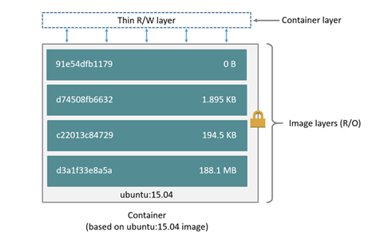
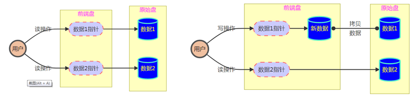
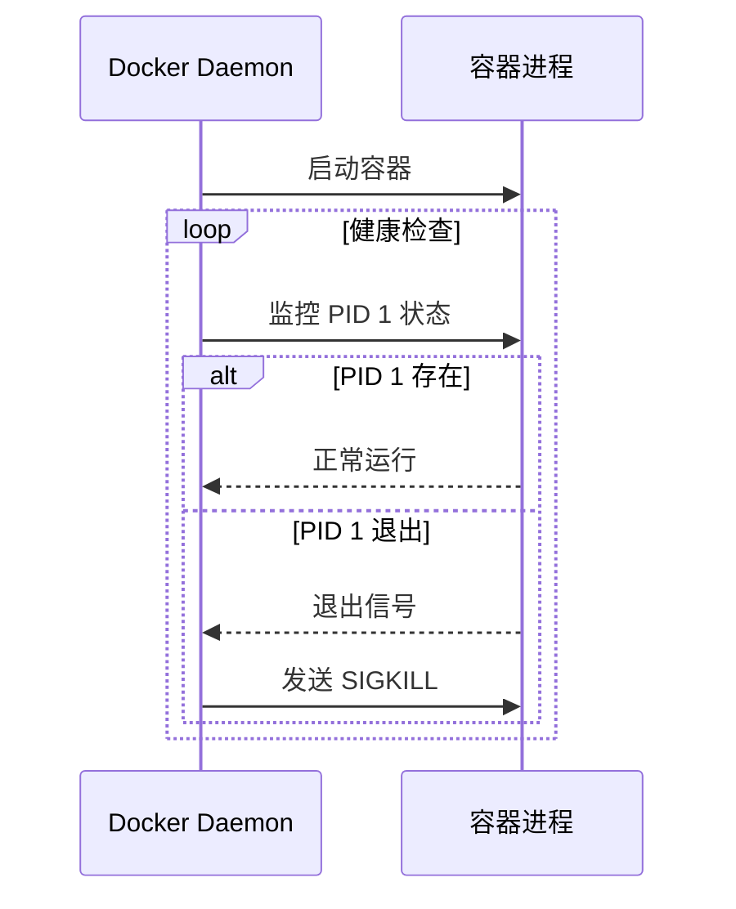

# 容器概述

容器：一个运行在隔离环境中的程序

镜像：镜像是只读的模板，包含了创建容器所需的所有文件和配置信息

仓库：用来存储、分发、管理镜像的地方

# 容器安装

安装docker软件包

容器对外提供服务依赖路由转发功能，检查宿主机是否开启路由转发功能

# Docker管理

## 镜像管理

镜像可以从官方镜像仓库下载，也可以自己制作

官方镜像仓库https://hub.docker.com，由于网络环境，国内无法正常访问官方网站，需要通过配置镜像加速器访问`/etc/docker/daemon.json`

```bash
{
    "registry-mirrors": ["这里配置镜像仓库加速器地址"],
    "insecure-registries":[]
}
```

### **指定镜像的方法**

每个镜像都对应一个唯一的ID;

镜像名称+标签 == 唯一

每一个镜像都有标签，默认标签 latest

### **管理命令**

| 镜像管理命令                        | 说明                                                         |
| :---------------------------------- | :----------------------------------------------------------- |
| docker images                       | 查看本机镜像                                                 |
| docker pull 镜像名称:标签           | 下载镜像                                                     |
| docker save 镜像名称:标签 -o 文件名 | 备份镜像为tar包                                              |
| docker load -i 备份文件名称         | 导入备份的镜像文件                                           |
| docker history 镜像名称:标签        | 查看镜像的制作历史                                           |
| docker rmi [- f ]  镜像名称/镜像ID  | 删除镜像（镜像创建的容器运行中则不能删除，强制删除只是删除了名称和ID） |
| docker  tag 镜像  新名称:标签       | 设置镜像名称标签                                             |

###  镜像概述

镜像是创建容器的核心，采用<font color='red'>COW</font>技术，分层技术，镜像始终是<font color='red'>只读</font>



**Copy on Write 写时拷贝技术**

该技术使用指针指向原始盘所有块；若一个块要被改写，首先把数据从原始盘中拷贝到前端盘，然后在前端盘进行改写，最后把数据指针指向改写过的数据，原始盘始终是只读



创建容器时，COW为镜像创建一个读写层，容器在读写层运行

## 容器管理

| 容器管理命令                         | 说明                                         |
| ------------------------------------ | -------------------------------------------- |
| docker run -it(d) 镜像名称:标签      | 创建容器                                     |
| docker ps                            | 查看容器的信息，-a 显示所有容器  -q 只显示ID |
| docker inspect 镜像名称\|容器名称    | 查询（容器/镜像）的详细信息                  |
| docker [start\|stop\|restart] 容器id | 启动、停止、重启容器                         |
| docker exec -it 容器ID 启动命令      | 在容器内执行命令                             |
| docker logs 容器ID                   | 查看容器日志                                 |
| docker cp 路径1 路径2                | 拷贝文件：路径格式（本机路径、容器ID/路径）  |
| docker rm [-f]  容器ID               | 删除容器，-f 强制删除                        |

### run 命令

docker run 常用参数

- **-i** 交互式
- **-t** 分配终端
- **-d** 后台运行
- **--name**  容器名称
- **--rm** 容器结束后自动删除，临时容器
- 转入后台快捷键 ctrl + p + ctrl + q，

注：`docker ps -aq`只显示id可以用于容器启动关闭等操作的参数

**在容器内执行命令**

```bash
docker exec -it web1 ls -l	#执行非交互命令
docker exec -it web1 bash 	#执行交互命令，进入到容器中
```

##  自定义镜像

使用现有镜像启动容器，在该容器基础上修改，使用commit制作新镜像

```bash
docker commit linux  mylinux:latest  #linux为容器名称，后面定义了新镜像的名称和标签
```

## 容器服务原理

如何在容器中启动服务？

由于容器内没有systemd，参考服务文件手工执行启动程序，如果没有service文件，参考官方手册配置、启动服务



### 守护进程的原理

在Unix/Linux系统中，守护进程是一种在后台运行的进程，它独立于控制终端。通常，一个程序要成为守护进程，会通过以下步骤：

\- <font color='red'>调用`fork()`创建一个子进程，然后父进程退出</font>（这样使得子进程成为孤儿进程，并被init进程接管）。

\- 在子进程中调用`setsid()`创建一个新的会话，并脱离控制终端。

\- 再次`fork()`一个子进程并退出父进程（即第一次创建的子进程），这样确保新的进程不是会话组长，从而防止其重新获取终端。

\- 改变工作目录（如`/`），重设文件掩码，关闭不需要的文件描述符等。

