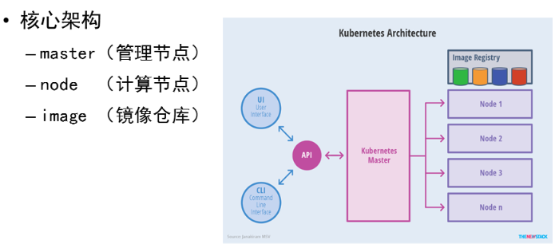
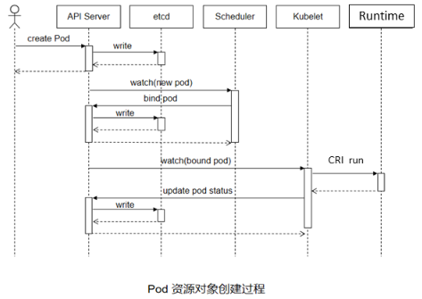
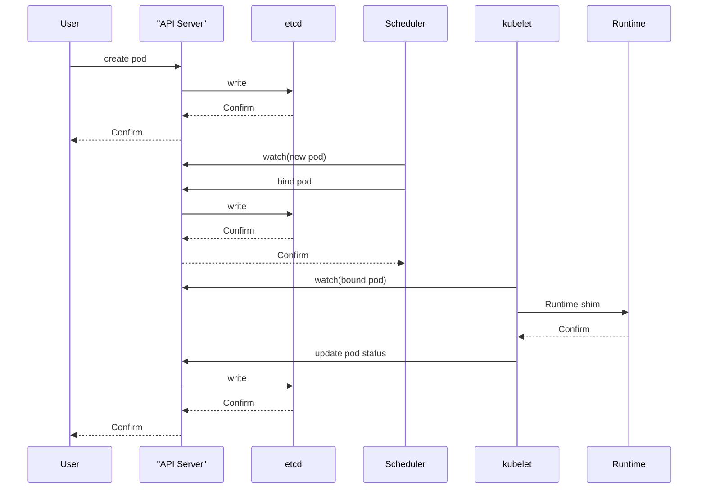
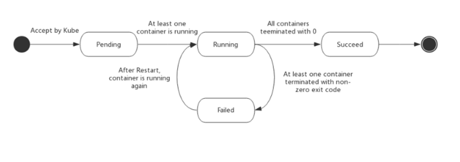

# Kubenetes概述

## k8s核心架构



**Master功能**：提供集群的控制，对集群进行全局决策，检测和响应集群事件，其核心组件：<font color='green'>APIServer,Scheduler,ControllerManager,etcd</font>

**Node功能：**运行容器的实际节点，提供运行环境，在多个节点上运行，水平拓展，核心组件<font color='green'>kubelet,kube-proxy,Runtime</font>

## 安装控制节点

官网：https://kubernetes.io

安装部署方式

- 源码安装：需创建大量证书，不方便
- 容器部署：下载镜像，启动即可

官方工具 Kubeadm

- API Server
  - 是整个系统的对外接口，供客户端和其它组件调用
  - 后端元数据存储于 etcd 中（键值数据库）
- Scheduler
  - 负责对集群内部的资源进行分配和调度
- ControllerManager
  - 负责管理控制器，相当于 “大总管”。
- etcd 的定义
  - etcd 是 CoreOS 团队于 2013 年 6 月发起的开源项目，它的目标是构建一个高可用的分布式键值（key-value）数据库，基于 Go 语言实现。在分布式系统中，各种服务的配置信息的管理分享，服务的发现是一个很基本同时也是很重要的问题。CoreOS 项目就希望基于 etcd 来解决这一问题。
  - kubernetes 在运行过程中产生的元数据全部存储在 etcd 中

**服务端口**

| 软件                    | 端口范围  | 用途               |
| ----------------------- | --------- | ------------------ |
| kubernetes-api          | 6443      | 所有组件接口服务   |
| etcd                    | 2379-2380 | 核心数据库         |
| kube-scheduler          | 10259     | 调度服务           |
| kube-controller-manager | 10257     | 控制器管理服务     |
| kubelet                 | 10250     | 节点代理服务       |
| kube-proxy              | 10256     | 网络通讯与负载均衡 |

官方下载地址：https://packages.cluod.google.com

禁用swap

安装工具软件包

- kubeadm：集群配置工具
- kubelet：管理 pod，在集群中的每个节点上启动
- kubectl：用来与集群通信的命令行工具
- containerd：容器管理软件（Runtime）
- ipvsadm：集群管理工具
- iproute-tc：网络流量管理工具

# 集群管理

kubectl用于控制Kubernetes集群的命令行工具

语法格式：

```bash
kubectl [command] [type] [name] [flags]
- command: 子命令，如create, get, decribe, delete
- type: 资源类型
- name: 资源名称
- flags: 指定可选标志
```

**信息查询命令**

| **子命令**    | **说明**                           |
| ------------- | ---------------------------------- |
| help          | 用于查看命令及子命令的帮助信息     |
| cluster-info  | 显示集群的相关配置信息             |
| api-resources | 查看当前服务器上所有的资源对象     |
| api-versions  | 查看当前服务器上所有资源对象的版本 |
| config        | 管理当前节点上的认证信息           |

## 资源对象

k8s中创建或配置的应用和服务称为资源对象，我们在集群中创建的pod，负载均衡，存储，网络服务等等都是资源对象

## Pod详解

由一个或者多个容器组成，pod是一个服务的多个进程的聚合单位，是Kubernetes中最小的管理元素，pod会自动维护在其运行的容器，Pod具有原子性、一致性，






### Pod状态



Pod 的 status 字段是一个 PodStatus 的对象，Pod 对象总是应该处于其生命进程中以下几个相位（phase）之一。

- <font color='lblue'>Pending</font> Pod 创建过程中，但它尚未被调度完成
- <font color='blue'>Running</font> Pod 中所有容器都已经被创建成功
- <font color='blue'>Completed</font> Pod 所有容器都已经成功终止，并不会被重启
- <font color='blue'>Failed</font> Pod 中的所有容器中至少有一个容器退出是非 0 状态
- <font color='blue'>Unknown</font> 无法正常获取到 Pod 对象的状态信息

### Pod 管理命令

| **子命令** | **说明**               | **备注**                 |
| ---------- | ---------------------- | ------------------------ |
| run        | 创建 Pod 资源对象      | 创建即运行，没有停止概念 |
| get        | 查看资源对象的状态信息 | 常用参数: -o 显示格式    |
| create     | 创建资源对象           | 不能创建 Pod             |
| describe   | 查询资源对象的属性信息 |                          |
| logs       | 查看容器的报错信息     | 常用参数: -c 容器名称    |

#### kubectl get

语法格式

```bash
kubectl get 资源类型 [资源名称] [选项参数]
#常用参数
-o name 只显示名字 
-o wide 详细信息 
-o yaml/json 以yaml/json格式显示资源对象
```

**系统命令空间**

- default 默认的命名空间，不声明命名空间的 Pod 都在这里
- kube-node-lease 为高可用提供心跳监视的命名空间
- kube-public 公共数据，所有用户都可以读取它
- kube-system 系统服务对象所使用的命名空间

k8s系统的核心服务都运行在<font color='red'>kube-system</font>名称空间中

#### kubectl create

```bash
kubectk create [资源对象] [选项/参数]
```

#### kubectl run

```bash
kubectl run Pod名称 [选项/参数]
```

#### kubectl describe

```bash
kubectl describe 资源类型 [资源名称] [选项参数]
kubectl -n work describe pod myweb  #查看资源对象的配置信息
kubectl describe namespaces work  #查看work名称空间的配置信息
```

#### kubectl logs

```bash
#查看容器日志
kubectl -n work logs mywed
```

| **子命令** | **说明**                         | **备注**              |
| ---------- | -------------------------------- | --------------------- |
| exec       | 在某一个容器内执行特定的命令     | 可选参数: -c 容器名称 |
| cp         | 在容器和宿主机之间拷贝文件或目录 | 可选参数: -c 容器名称 |
| delete     | 删除资源对象                     | 可选参数: -l 标签     |

**exec**

```bash
# 在容器内执行命令
[root@master ~]# kubectl exec -it myweb -- ls 
index.html  info.php

[root@master ~]# kubectl exec -it myweb -- bash
[root@myweb html]# ifconfig eth0
eth0: flags=4163<UP,BROADCAST,RUNNING,MULTICAST>  mtu 1450
        inet 10.244.1.3  netmask 255.255.255.0  broadcast 10.244.2.255
        ether 3a:32:78:59:ed:25  txqueuelen 0  (Ethernet)
... ...
```

**cp**

```bash
# 与容器进行文件或目录传输
[root@master ~]# kubectl cp myweb:/etc/yum.repos.d /root/aaa
tar: Removing leading `/' from member names
[root@master ~]# tree /root/aaa
/root/aaa
├── local.repo
├── Rocky-AppStream.repo
├── Rocky-BaseOS.repo
└── Rocky-Extras.repo

0 directories, 4 files
[root@master ~]# kubectl -n work cp /etc/passwd myhttp:/root/mima
[root@master ~]# kubectl -n work exec -it myhttp -- ls /root/
mima
```

**delete**

```bash
# 删除资源对象
[root@master ~]# kubectl delete pods myweb 
pod "myweb" deleted

# 删除 work 名称空间下所有 Pod 对象
[root@master ~]# kubectl -n work delete pods --all
pod "myhttp" deleted

# 删除名称空间
[root@master ~]# kubectl delete namespaces work 
namespace "work" deleted
```

## 资源监控

Kubernetes 的 **Metrics-server** 组件提供有关节点和 Pod 的资源使用情况的信息，包括 CPU 和内存的指标。如果将 Metrics-server 部署到集群中，就可以查询并使用到这些信息管理应用及服务。

Metrics-Server 是集群核心监控数据的聚合器。通俗地说，它存储了集群中各节点和 Pod 的监控数据，并且提供了 API 以供查询和使用，Metrics-Server 通过 kubelet 获取 node 和 Pod 的 CPU，内存等监控数据。为调度器、弹性控制器、以及 Dashboard 等 UI 组件提供数据来源

Metrics-server 是什么？

- Metrics-Server 是集群核心监控数据的聚合器。通俗地说，它存储了集群中各节点和 Pod 的监控数据，并且提供了 API 以供查询和使用。
- Metrics-Server 通过 kubelet 获取 node 和 Pod 的 CPU，内存等监控数据。为调度器、弹性控制器、以及 Dashboard 等 UI 组件提供数据来源

# 资源清单文件

Kubernetes 对象是 “目标性记录”，Kubernetes 使用这些对象去表示整个集群的状态。

创建 Kubernetes 对象时，必须提供资源对象的一些基本信息（例如：资源的对象的名字），以及描述描述该对象的期望状态特征（规约），如果我们在文件中使用 Yaml 的语法格式描述了上面的信息，这个文件就是<font style="color: rgb(0,255,0);">资源清单文件</font>。

**管理命令**

语法格式：`kubectl 子命令 -f 资源清单文件`

| **子命令** | **说明**                     | **备注**                     |
| ---------- | ---------------------------- | ---------------------------- |
| create     | 创建文件中定义的资源         | 支持指令式和资源清单文件配置 |
| apply      | 创建（更新）文件中定义的资源 | 只支持资源清单文件（声明式） |
| delete     | 删除文件中定义的资源         | 支持指令式和资源清单文件配置 |
| replace    | 更改/替换资源对象            | 强制重建 --force             |

```yaml
--- 				 # Yaml文件起始标志
kind: Pod			  # 当前创建资源的类型
apiVersion: v1 		 # 当前资源对应的版本
metadata: 				 # 属性信息，元数据
  name: myweb 		 	# 属性信息，资源的名称
spec: 					 # 资源的特性描述（规约）
  containers:	 		 # 容器资源特征描述
  - name: nginx 		 # 容器的名称
    image: myos:nginx	  # 启动容器使用的镜像
status: {} 				 # 资源状态，运行后自动生成
```

##  **命名规范**

- 当你与指定的 API 对象进行交互时，使用大写驼峰式命名法，也被称为<font style="color: rgb(0,255,0);"帕斯卡拼写（PascalCase）</font>.
- 不要将 API 对象的名称切分成多个单词。

| 正确写法：type：NodePort  | 错误写法：type：nodePort  |
| ------------------------- | ------------------------- |
| 正确写法：nodePort：30001 | 错误写法：NodePort：30001 |

## 静态 Pod

- 静态 Pod 是由 kubelet 守护进程直接管理的 Pod，不需要 API 服务器 监管。 与由控制面管理的 Pod 不同
- kubelet 监视每个静态 Pod（在它崩溃之后重新启动）
- 静态 Pod 永远都会绑定到一个指定节点上的 Kubelet
- 静态 Pod 的 spec 不能引用其他 API 对象
- 静态 Pod 配置路径：/var/lib/kubelet/config.yaml，
- staticPodPath: /etc/kubernetes/manifests，创建静态Pod只需在该目录下添加资源清单文件即可，删除文件即删除静态Pod

## 模板与帮助信息

### 生成资源清单文件模板

除Pod外，其他资源对象模板使用`create`生成，命令`--dry-run=client -o yaml`

```bash
$ kubectl create namespace work --dry-run=client -o yaml
apiVersion: v1
kind: Namespace
metadata:
  creationTimestamp: null
  name: work
spec: {}
status: {}
```

### 资源文件参数如何查询

使用`.`分割层级结构关系

```yaml
---
kind: xxx            # 一级，可以表示为 .kind
apiVersion: xx       # 一级，可以表示为 .apiVersion
metadata:            # 一级，可以表示为 .metadata
  name: xx           # 二级，可以表示为 .metadata.name
spec:                # 一级，可以表示为 .spec
  restartPolicy: xx  # 二级，可以表示为 .spec.restartPolicy
  containers:        # 二级，可以表示为 .spec.containers
  - name: xx         # 三级，可以表示为 .spec.containers.name
    image: xx        # 三级，可以表示为 .spec.containers.image
status: {}           # 一级，可以表示为 .status
```

执行`explain 资源对象 + 层级关系`

```bash
kubectl explain Pod.metadata 
kubectl explain Pod.metadata.namespace
```

## 多容器Pod

- Pod 就像是豌豆荚一样，它由一个或者多个容器组成
- Pod 是一个服务的多个进程的聚合单位
- 同一个 Pod 共享网络 IP 及权限
- 同一个 Pod 共享主机名称
- 同一个 Pod 共享存储卷

管理多容器Pod：由于多容器配置的影响，使用命令`logs exec cp `命令需要使用` -c 容器名称`指定容器

```bash
# 在 nginx 中执行命令，--避免kubectl命令将-p当作自己的选项，起到命令参数分隔符作用
[root@master ~]# kubectl exec -it mynginx -c nginx -- pstree -p
nginx(1)-+-nginx(7)
        `---nginx(8)

# 在 php 中执行命令
[root@master ~]# kubectl exec mynginx -c php -- pstree -p
php-fpm(1)

# 从容器拷贝文件
[root@master ~]# kubectl cp mynginx:/etc/php-fpm.conf /root/php.conf -c nginx
[root@master ~]# kubectl cp mynginx:/etc/php-fpm.conf /root/php.conf -c php
```

## 自定义任务

### Pod自定义命令

创建 Pod 时，可以为其设置启动时要执行的自定义命令，如果配置了自定义命令，那么镜像中自带的默认启动命令将不再执行，自定义命令设置在 command 字段下，如果命令有参数，需要填写在 args 字段下

```yaml
containers:
- name: linux
  image: myos:8.5
  command: ["sh"]        # 调用 sh 命令
  args:                  # 设置命令参数
  - -c                   # 读取脚本命令
  - |                    # 多行字符串格式
    ID=${RANDOM}         # 脚本指令，注意缩进
    for i in {1..9};do
      echo "${ID} : hello world."
      sleep 5
    done
```

### restartPolicy策略

Pod会根据策略决定容器结束后是否重启：重启[Always]，不重启[Never]，失败就重启[OnFailure]

### terminationCracePeriodSeconds策略

宽限期是为了避免服突然中断，造成的事务不一致问题，默认30s

### activeDeadlineSeconds策略

允许Pod运行的最大时长，时间到期后会向Pod发送信号，如果Pod无法结束就强制关闭，并设置为Error状态

```yaml
---
kind: Pod
apiVersion: v1
metadata:
  name: mycmd
spec:
  activeDeadlineSeconds: 60 	#可执行的最大时长
  terminationGracePeriodSeconds: 0 
  restartPolicy: OnFailure
  containers:
  - name: linux
    image: myos:8.5
    command: ["sh"]
    ......
```

# Pod调度策略

**什么是调度分配？**
在 k8s 中，调度是将 Pod 分配到合适的计算节点上，然后对应节点上的 Kubelet 运行这些 Pod
-kube-scheduler 是默认调度器，是集群的核心组件

**调度器是如何工作的？**

调度器通过 k8s 的监测（Watch）机制来发现集群中尚未被调度到节点上的 Pod。调度器依据调度原则将 Pod 分配到一个合适的节点上运行

**调度流程：**调度器给一个Pod做调度选择包含两个步骤：过滤和打分

- 过滤(筛选)：首先要筛选出满足 Pod 所有的资源请求的节点，这里包含计算资源、内存、存储、网络、端口号等等，如果没有节点能满足 Pod 的需求，Pod 将一直停留在 Pending 状态，直到调度器能够找到合适的节点运行它
- 打分(优选)：在打分阶段，调度器会根据打分规则，为每一个可调度节点进行打分。选出其中得分最高的节点来运行 Pod。如果存在多个得分最高的节点，调度器会从中随机选取一个
- 绑定：在确定了某个节点运行 Pod 之后，调度器将这个调度决定通知给 kube-apiserver，这个过程叫做绑定

# Pod生命周期

## 生命周期概述

**什么是 Pod 生命周期 ？**

- Pod 对象自从其创建开始至终止的时间范围称为生命周期
- 在这段时间中 Pod 处在不同的状态并可以执行相关操作

**生命周期有什么用途**

- 复杂服务运行时有启动顺序、依赖关系等，我们可以在生命周期中配置相关性，解决启动关系依赖等问题
- 容器服务在启动前或运行过程中需要做的相关操作，例如：配置文件生成、数据预加载、依赖服务的检测、安装等

**生命周期中能做什么**

- 必需操作：启动运行 main 容器
- 可选操作：设置容器的初始化方法：（InitContainer）
- 可选操作：配置容器探针：生命探测（livenessProbe）、就绪探测（readinessProbe）、启动探测（startupProbe）
- 可选操作：添加事件处理函数：
  启动后回调（PostStart）、结束前回调（PreStop）


## Init容器

**Init 容器（可选配置）**

- Init 容器是一种特殊容器，在 Pod 内主容器启动之前执行，可以依据需求的不同定义多个。
- Init 容器可以使用其他镜像，也可以包括一些主容器镜像中不存在的实用工具和安装脚本。
- Init 容器的生命是有限的，不能无休止的运行下去，只有在所有初始化容器执行完成以后才会启动主容器

```yaml
---
kind: Pod
apiVersion: v1
metadata:
  name: web1
spec:
  initContainers:                 # 定义初始化任务
  - name: task1                   # 如果初始化任务失败，主容器不会启动
    image: myos:latest            # 初始化可以使用不同的镜像
    command: [sh]                 # 任务，一般用脚本实现
    args:                         # 任务
    - -c                          # 任务
    - |                           # 任务
      ID=${RANDOM}                # 任务
      echo "${ID}"                # 任务
      sleep 3                     # 任务
      exit $((ID%2))              # 状态 0 成功，其他失败，如果失败会重新执行初始化
  containers:
  - name: web
    image: myos:httpd
```

Init 容器与普通的容器非常像，除了如下两点：

- 它们必须运行到完成
- 顺序执行，每个容器都必须等待上一个容器成功完成执行，如果 Init 容器失败，kubelet 会不断地重启该 Init 容器，直到该容器成功为止。
- 如果 Pod 对应的 restartPolicy 值为 "Never"，并且 Pod 的 Init 容器失败，则 Kubernetes 会将整个 Pod 状态设置为失败，主容器将无法执行。

## 容器探针

**容器探针：**kubelet对容器执行的定期诊断和检查

**探针类型：** 

- startProbe：探测目标应用是否已经启动正常
- readinessProbe：指示容器是否准备好为请求提供服务
- livenessProbe：探测容器是否能够正常运行

**探测方式：**

- tcpSocket：对指定的IP地址上的端口执行TCP检查
- httpGet：使用HTTP协议诊断服务状态
- exec：在容器内执行命令进行检测

**探测结果：**

- Success  成功
- Failure  失败
- Unknown 未知，诊断失败，不会采取任何行动

### startProbe

启动探针检查容器内的应用是否已启动。<font style='color: rgb(100,205,90)'>启动探针可以用于对慢启动容器进行存活性检测，避免它们在启动运行之前就被 kubelet 杀掉。</font>如果配置了这类探针，它会禁用存活检测和就绪检测，直到启动探针成功为止。<font style='color: rgb(100,205,90)'>该探针仅在启动时执行，如果执行成功，不会重复执行。</font>如果未定义启动探针，默认为 Success 状态。

### livenessProbe

livenessProbe 用来判断<font style='color: rgb(10,225,90)'>某个核心资源是否可用。</font>livenessProbe 在 Pod 的全部生命周期中运行，如果发现资源无法获取，kubelet 将杀死容器，依据重启策略执行。如果没有设置 restartPolicy 默认使用镜像重建容器。如果 livenessProbe 检测失败，重建容器时会重新激活启动探针，但不会重新执行 InitContainer。如果未定义存活探针，默认为 Success 状态

### readinessProbe

readinessProbe 在 Pod 的生命周期中一直存在，用来探测容器是否准备好提供服务。配置了就绪探测探针，初始的值默认状态为 Failure。探测失败：端点控制器将拒绝 Pod 所提供的服务（这里是等待，并不重启容器）。如果未定义就绪探针，默认为 Success 状态。

**案例**

使用 startupProbe 保护慢启动的服务：

- 基于 tcpSocket 的端口检测，只检测端口状态，不需要返回数据，如果端口状态为 Open 则诊断被认为是成功的。

使用 httpGet 配置 livenessProbe 检测

- 在 httpGet 的检测中，kubelet 目标 IP 上指定的端口和路径执行 HTTP GET 请求。如果响应的状态码大于等于 200 且小于 400，则诊断被认为是成功的。

使用 exec 配置 readinessProbe 检测：

- exec 选项用来执行自定义命令的检测，通过返回的的状态码判断是否成功，如果 $? == 0 则诊断被认为是成功的，其他判断为失败

```yaml
---
kind: Pod
apiVersion: v1
metadata:
  name: web2
spec:
  containers:
  - name: web
    image: myos:httpd
    startupProbe:                 # 启动探针
      initialDelaySeconds: 30     # 首次检查延时
      failureThreshold: 3         # 可失败的次数
      periodSeconds: 10           # 检查间隔
      tcpSocket:                  # 使用 tcp 协议检测
        port: 80                  # 端口号
    livenessProbe:                # 定义存活探针
      timeoutSeconds: 3           # 服务影响超时
      httpGet:                    # 使用 HTTP 协议检测
        path: /info.php           # 请求的 URL 路径
        port: 80                  # 服务端口号
    readinessProbe:               # 定义就绪探针
      failureThreshold: 3         # 失败确认次数
      periodSeconds: 5            # 检测间隔
      exec:                       # 执行命令进行检测
        command:                  # 检测命令
        - sh
        - -c
        - |
          read ver </var/www/html/version.txt
          if (( ${ver:-0} > 2 ));then
             res=0
          fi
          exit ${res:-1}          # 版本大于 2 成功，否则失败
```

## 事件处理函数

**postStart 和 prestop**

- postStart 是一个生命周期钩子函数，它与 InitContainer 不同，postStart 是在主容器创建之后被调用。这可以用于执行主容器的初始化工作，通常用于确保容器在对外提供服务之前已经完全准备好。
- prestop 也是一个生命周期钩子，它在容器被停止之前被调用。这可以用于执行清理工作，通常用于确保资源被正确释放，避免数据丢失或损坏。

```yaml
spec:
  containers:
  - name: web
    image: myos:httpd
    lifecycle:                    # 定义启动后事件处理函数
      postStart:
        exec:
          command:
          - sh
          - -c
          - |
            echo "自动注册服务" |tee -a /tmp/web.log
            sleep 10
      preStop:                    # 定义关闭前事件处理函数
        exec:
          command:
          - sh
          - -c
          - |
            echo "清除已注册的服务" |tee -a /tmp/web.log
            sleep 10
```

# Pod资源管理

<font style='color: rgb(200,25,10)'>配额：可以超出限制</font>，配额是为了在共享固定节点数目的集群时，某些应用无法获得足够的资源，影响其正常运行，保证应用能够获取其运行所需的资源

限额： 最大额度

**CPU资源类型**

CPU 资源的约束和请求以毫核（m）为单位。在 k8s 中 1m 是最小的调度单元，CPU 的一个核心可以看作 1000m，如果你有 2 颗 CPU，且每 CPU 为 4 核心，那么你的 CPU 资源总量就是 8000m

**内存资源类型**

- memory 的约束和请求以<font style='color: rgb(40,205,90)'>字节</font>为单位。
- 你可以使用以下单位来表示内存：E、P、T、G、M、k
- 你也可以使用对应的 2 的幂数：Ei、Pi、Ti、Gi、Mi、K
- 例如，以下表达式所代表的是相同的值，1k == 1000，1Ki == 1024

```bash
spec:
  containers:
  - name: web
    image: myos:httpd
    resources:                  # 配置资源策略
      requests:                 # 配额策略
        cpu: 600m              # 计算资源配额
        memory: 800Mi           # 内存资源配额    
      limits:                   # 限额策略
        cpu: 600m               # 计算资源限额
        memory: 800Mi           # 内存资源限额
```

## 节点压力驱逐

kubelet 监控集群节点的内存、磁盘空间和文件系统的等资源。当这些资源中的一个或者多个达到特定的消耗水平的时候，kubelet 可以主动的终止一个或者多个 Pod，以回收资源防止饥饿的过程。

在节点压力驱逐期间，kubelet 将所选 Pod 的状态设置为 Failed 并终止 Pod 的运行。

一般来说，Kubernetes 在触发节点压力驱逐时会考虑 QoS 类别，进行如下处理。

- Guaranteed（保障型）：这类 Pod 有稳定的资源配额 / 限额，通常情况下最不容易被驱逐。

- Burstable（爆发型）：这类 Pod 的资源使用会在一定的范围内波动，它们在节点资源不足时可能会被驱逐。

- BestEffort（尽量型）：没有明确的资源使用量，被认为是首选被驱逐的对象

# 全局资源管理

### 全局资源配额

如果有大量的容器需要设置资源配额，为每个 Pod 设置资源配额策略不方便且不好管理。管理员可以以名称空间为单位（namespace），限制其资源的使用与创建。在该名称空间中创建的容器都会受到规则的限制。

k8s 支持的全局资源配额方式有：

- 对单个 Pod 内存、CPU 进行配额：LimitRange
- 对资源总量进行配额：ResourceQuota

```yaml
---
kind: ResourceQuota
apiVersion: v1
metadata:
  name: myquota1
  namespace: work
spec:
  hard:
    pods: 3
  scopes:
  - BestEffort

---
kind: ResourceQuota
apiVersion: v1
metadata:
  name: myquota2
  namespace: work
spec:
  hard:
    pods: 10
    cpu: 2300m
    memory: 3Gi
  scopes:
  - NotBestEffort
```

