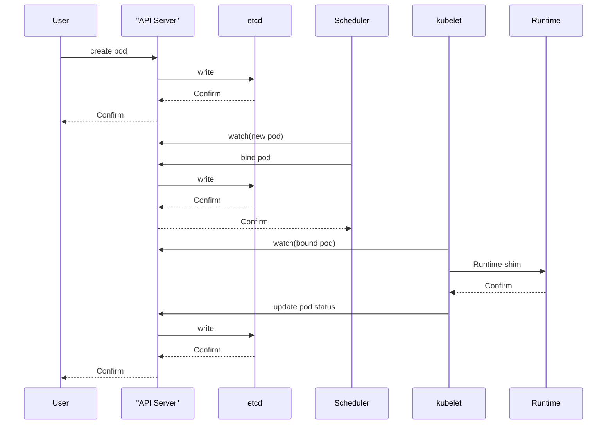

# Kubenetes概述

## k8s核心架构


**Master功能**：提供集群的控制，对集群进行全局决策，检测和响应集群事件，其核心组件：<font color='green'>APIServer,Scheduler,ControllerManager,etcd</font>

**Node功能：**运行容器的实际节点，提供运行环境，在多个节点上运行，水平拓展，核心组件<font color='green'>kubelet,kube-proxy,Runtime</font>

## 安装控制节点

官网：https://kubernetes.io

安装部署方式

- 源码安装：需创建大量证书，不方便
- 容器部署：下载镜像，启动即可

官方工具 Kubeadm

- API Server
  - 是整个系统的对外接口，供客户端和其它组件调用
  - 后端元数据存储于 etcd 中（键值数据库）
- Scheduler
  - 负责对集群内部的资源进行分配和调度
- ControllerManager
  - 负责管理控制器，相当于 “大总管”。
- etcd 的定义
  - etcd 是 CoreOS 团队于 2013 年 6 月发起的开源项目，它的目标是构建一个高可用的分布式键值（key-value）数据库，基于 Go 语言实现。在分布式系统中，各种服务的配置信息的管理分享，服务的发现是一个很基本同时也是很重要的问题。CoreOS 项目就希望基于 etcd 来解决这一问题。
  - kubernetes 在运行过程中产生的元数据全部存储在 etcd 中

**服务端口**

| 软件                    | 端口范围  | 用途               |
| ----------------------- | --------- | ------------------ |
| kubernetes-api          | 6443      | 所有组件接口服务   |
| etcd                    | 2379-2380 | 核心数据库         |
| kube-scheduler          | 10259     | 调度服务           |
| kube-controller-manager | 10257     | 控制器管理服务     |
| kubelet                 | 10250     | 节点代理服务       |
| kube-proxy              | 10256     | 网络通讯与负载均衡 |

官方下载地址：https://packages.cluod.google.com

禁用swap

安装工具软件包

- kubeadm：集群配置工具
- kubelet：管理 pod，在集群中的每个节点上启动
- kubectl：用来与集群通信的命令行工具
- containerd：容器管理软件（Runtime）
- ipvsadm：集群管理工具
- iproute-tc：网络流量管理工具

# 集群管理

kubectl用于控制Kubernetes集群的命令行工具

语法格式：

```bash
kubectl [command] [type] [name] [flags]
- command: 子命令，如create, get, decribe, delete
- type: 资源类型
- name: 资源名称
- flags: 指定可选标志
```

**信息查询命令**

| **子命令**    | **说明**                           |
| ------------- | ---------------------------------- |
| help          | 用于查看命令及子命令的帮助信息     |
| cluster-info  | 显示集群的相关配置信息             |
| api-resources | 查看当前服务器上所有的资源对象     |
| api-versions  | 查看当前服务器上所有资源对象的版本 |
| config        | 管理当前节点上的认证信息           |

## 资源对象

k8s中创建或配置的应用和服务称为资源对象，我们在集群中创建的pod，负载均衡，存储，网络服务等等都是资源对象

## Pod详解

由一个或者多个容器组成，pod是一个服务的多个进程的聚合单位，是Kubernetes中最小的管理元素，pod会自动维护在其运行的容器，Pod具有原子性、一致性，





### Pod状态


Pod 的 status 字段是一个 PodStatus 的对象，Pod 对象总是应该处于其生命进程中以下几个相位（phase）之一。

- <font color='lblue'>Pending</font> Pod 创建过程中，但它尚未被调度完成
- <font color='blue'>Running</font> Pod 中所有容器都已经被创建成功
- <font color='blue'>Completed</font> Pod 所有容器都已经成功终止，并不会被重启
- <font color='blue'>Failed</font> Pod 中的所有容器中至少有一个容器退出是非 0 状态
- <font color='blue'>Unknown</font> 无法正常获取到 Pod 对象的状态信息

### Pod 管理命令

| **子命令** | **说明**               | **备注**                 |
| ---------- | ---------------------- | ------------------------ |
| run        | 创建 Pod 资源对象      | 创建即运行，没有停止概念 |
| get        | 查看资源对象的状态信息 | 常用参数: -o 显示格式    |
| create     | 创建资源对象           | 不能创建 Pod             |
| describe   | 查询资源对象的属性信息 |                          |
| logs       | 查看容器的报错信息     | 常用参数: -c 容器名称    |

#### kubectl get

语法格式

```bash
kubectl get 资源类型 [资源名称] [选项参数]
#常用参数
-o name 只显示名字 
-o wide 详细信息 
-o yaml/json 以yaml/json格式显示资源对象
```

**系统命令空间**

- default 默认的命名空间，不声明命名空间的 Pod 都在这里
- kube-node-lease 为高可用提供心跳监视的命名空间
- kube-public 公共数据，所有用户都可以读取它
- kube-system 系统服务对象所使用的命名空间

k8s系统的核心服务都运行在<font color='red'>kube-system</font>名称空间中

#### kubectl create

```bash
kubectk create [资源对象] [选项/参数]
```

#### kubectl run

```bash
kubectl run Pod名称 [选项/参数]
```

#### kubectl describe

```bash
kubectl describe 资源类型 [资源名称] [选项参数]
kubectl -n work describe pod myweb  #查看资源对象的配置信息
kubectl describe namespaces work  #查看work名称空间的配置信息
```

#### kubectl logs

```bash
#查看容器日志
kubectl -n work logs mywed
```

| **子命令** | **说明**                         | **备注**              |
| ---------- | -------------------------------- | --------------------- |
| exec       | 在某一个容器内执行特定的命令     | 可选参数: -c 容器名称 |
| cp         | 在容器和宿主机之间拷贝文件或目录 | 可选参数: -c 容器名称 |
| delete     | 删除资源对象                     | 可选参数: -l 标签     |

**exec**

```bash
# 在容器内执行命令
[root@master ~]# kubectl exec -it myweb -- ls 
index.html  info.php

[root@master ~]# kubectl exec -it myweb -- bash
[root@myweb html]# ifconfig eth0
eth0: flags=4163<UP,BROADCAST,RUNNING,MULTICAST>  mtu 1450
        inet 10.244.1.3  netmask 255.255.255.0  broadcast 10.244.2.255
        ether 3a:32:78:59:ed:25  txqueuelen 0  (Ethernet)
... ...
```

**cp**

```bash
# 与容器进行文件或目录传输
[root@master ~]# kubectl cp myweb:/etc/yum.repos.d /root/aaa
tar: Removing leading `/' from member names
[root@master ~]# tree /root/aaa
/root/aaa
├── local.repo
├── Rocky-AppStream.repo
├── Rocky-BaseOS.repo
└── Rocky-Extras.repo

0 directories, 4 files
[root@master ~]# kubectl -n work cp /etc/passwd myhttp:/root/mima
[root@master ~]# kubectl -n work exec -it myhttp -- ls /root/
mima
```

**delete**

```bash
# 删除资源对象
[root@master ~]# kubectl delete pods myweb 
pod "myweb" deleted

# 删除 work 名称空间下所有 Pod 对象
[root@master ~]# kubectl -n work delete pods --all
pod "myhttp" deleted

# 删除名称空间
[root@master ~]# kubectl delete namespaces work 
namespace "work" deleted
```

## 资源监控

Kubernetes 的 **Metrics-server** 组件提供有关节点和 Pod 的资源使用情况的信息，包括 CPU 和内存的指标。如果将 Metrics-server 部署到集群中，就可以查询并使用到这些信息管理应用及服务。

Metrics-Server 是集群核心监控数据的聚合器。通俗地说，它存储了集群中各节点和 Pod 的监控数据，并且提供了 API 以供查询和使用，Metrics-Server 通过 kubelet 获取 node 和 Pod 的 CPU，内存等监控数据。为调度器、弹性控制器、以及 Dashboard 等 UI 组件提供数据来源

Metrics-server 是什么？

- Metrics-Server 是集群核心监控数据的聚合器。通俗地说，它存储了集群中各节点和 Pod 的监控数据，并且提供了 API 以供查询和使用。
- Metrics-Server 通过 kubelet 获取 node 和 Pod 的 CPU，内存等监控数据。为调度器、弹性控制器、以及 Dashboard 等 UI 组件提供数据来源

# 资源清单文件

Kubernetes 对象是 “目标性记录”，Kubernetes 使用这些对象去表示整个集群的状态。

创建 Kubernetes 对象时，必须提供资源对象的一些基本信息（例如：资源的对象的名字），以及描述描述该对象的期望状态特征（规约），如果我们在文件中使用 Yaml 的语法格式描述了上面的信息，这个文件就是<font style="color: rgb(0,255,0);">资源清单文件</font>。

**管理命令**

语法格式：`kubectl 子命令 -f 资源清单文件`

| **子命令** | **说明**                     | **备注**                     |
| ---------- | ---------------------------- | ---------------------------- |
| create     | 创建文件中定义的资源         | 支持指令式和资源清单文件配置 |
| apply      | 创建（更新）文件中定义的资源 | 只支持资源清单文件（声明式） |
| delete     | 删除文件中定义的资源         | 支持指令式和资源清单文件配置 |
| replace    | 更改/替换资源对象            | 强制重建 --force             |

```yaml
--- 
kind: Pod
apiVersion: v1
metadata: 
  name: myweb
spec:
  containers: 
  - name: web
    image: myos:nginx
status: {}
```

