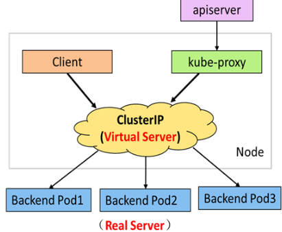

[toc]
# Kubenetes概述

## k8s核心架构


**Master功能**：提供集群的控制，对集群进行全局决策，检测和响应集群事件，其核心组件：<font color='green'>APIServer,Scheduler,ControllerManager,etcd</font>

**Node功能：**运行容器的实际节点，提供运行环境，在多个节点上运行，水平拓展，核心组件<font color='green'>kubelet,kube-proxy,Runtime</font>

## 安装控制节点

官网：https://kubernetes.io

安装部署方式

- 源码安装：需创建大量证书，不方便
- 容器部署：下载镜像，启动即可

官方工具 Kubeadm

- API Server
  - 是整个系统的对外接口，供客户端和其它组件调用
  - 后端元数据存储于 etcd 中（键值数据库）
- Scheduler
  - 负责对集群内部的资源进行分配和调度
- ControllerManager
  - 负责管理控制器，相当于 “大总管”。
- etcd 的定义
  - etcd 是 CoreOS 团队于 2013 年 6 月发起的开源项目，它的目标是构建一个高可用的分布式键值（key-value）数据库，基于 Go 语言实现。在分布式系统中，各种服务的配置信息的管理分享，服务的发现是一个很基本同时也是很重要的问题。CoreOS 项目就希望基于 etcd 来解决这一问题。
  - kubernetes 在运行过程中产生的元数据全部存储在 etcd 中

**服务端口**

| 软件                    | 端口范围  | 用途               |
| ----------------------- | --------- | ------------------ |
| kubernetes-api          | 6443      | 所有组件接口服务   |
| etcd                    | 2379-2380 | 核心数据库         |
| kube-scheduler          | 10259     | 调度服务           |
| kube-controller-manager | 10257     | 控制器管理服务     |
| kubelet                 | 10250     | 节点代理服务       |
| kube-proxy              | 10256     | 网络通讯与负载均衡 |

官方下载地址：https://packages.cluod.google.com

禁用swap

安装工具软件包

- kubeadm：集群配置工具
- kubelet：管理 pod，在集群中的每个节点上启动
- kubectl：用来与集群通信的命令行工具
- containerd：容器管理软件（Runtime）
- ipvsadm：集群管理工具
- iproute-tc：网络流量管理工具

**配置containerd**

```bash
# 生成默认配置文件
[root@master ~]# containerd config default >/etc/containerd/config.toml
[root@master ~]# vim /etc/containerd/config.toml
# 61: 配置容器镜像地址
sandbox_image = "harbor:443/k8s/pause:3.9"
# 125: 配置 cgroup 管理驱动，必须与 kubelet 一致
SystemdCgroup = true
# 154: 配置私有镜像仓库地址
[plugins."io.containerd.grpc.v1.cri".registry.mirrors."docker.io"]
endpoint = ["私有镜像仓库的地址"]
[plugins."io.containerd.grpc.v1.cri".registry.mirrors."harbor:443"]
endpoint = ["私有镜像仓库的地址"]
[plugins."io.containerd.grpc.v1.cri".registry.configs."私有仓库地址".tls]
insecure_skip_verify = true
# 启动服务
[root@master ~]# systemctl enable --now kubelet containerd
```

**配置内核参数**

```bash
[root@master ~]# vim /etc/modules-load.d/containerd.conf
br_netfilter  # 网桥防火墙模块
xt_conntrack  # 链接跟踪表模块
[root@master ~]# systemctl start systemd-modules-load.service

[root@master ~]# vim /etc/sysctl.d/99-kubernetes-cri.conf
net.ipv4.ip_forward = 1            # 开启路由转发
net.bridge.bridge-nf-call-iptables = 1  # 开启桥流量监控
net.bridge.bridge-nf-call-ip6tables = 1  # 开启桥流量监控
net.netfilter.nf_conntrack_max = 1000000  # 设置链接跟踪表大小
[root@master ~]# sysctl -p /etc/sysctl.d/99-kubernetes-cri.conf
```

## 自动补全设置

- kubectl、kubeadm 支持自动补全功能，可以节省大量输入
- 自动补全脚本由 kubectl、kubeadm 产生，仅需要在您的 shell 配置文件中调用即可

```bash
[root@master ~]# source <(kubeadm completion bash|tee /etc/bash_completion.d/kubeadm)
[root@master ~]# source <(kubectl completion bash|tee /etc/bash_completion.d/kubectl)
```

## **主控节点初始化**

```bash
[root@master ~]# vim /root/init/init.yaml
13:  advertiseAddress: 192.168.88.50
# 测试系统环境
[root@master ~]# kubeadm init --config=init/init.yaml --dry-run 2>error.log
[root@master ~]# cat error.log
# 主控节点初始化
[root@master ~]# rm -rf error.log /etc/kubernetes/tmp
[root@master ~]# kubeadm init --config=init/init.yaml |tee init/init.log
# 管理授权
[root@master ~]# mkdir -p $HOME/.kube
[root@master ~]# sudo cp -i /etc/kubernetes/admin.conf $HOME/.kube/config
[root@master ~]# sudo chown $(id -u):$(id -g) $HOME/.kube/config
# 验证安装结果
[root@master ~]# kubectl get nodes
NAME     STATUS     ROLES           AGE   VERSION
master   NotReady   control-plane   19s   v1.29.2
```

## 网络插件

**calico **

在虚拟化平台中，比如 OpenStack、Docker 等都需要实现 workloads 之间互连，但同时也需要对容器做隔离控制，设置访问策略，calico 就可以解决以上所有问题。calico 可以让不同节点上的容器，实现互联互通，同时也可以设置访问策略，它是一种容器之间网络互通的解决方案。

**calico 优势**

- 更节约资源：Calico 使用的三层路由方法，抑制二层广播，减少了资源开销，并且具有可扩展性。
- 更容易管理：因为没有隧道，意味着 workloads 之间路径更短更简单，配置更少，更容易管理。
- 更少的依赖：Calico 仅依赖三层路由可达。
- 适配性广：较少的依赖性使它能适配所有 VM、Container、白盒或者混合环境场景。

软件地址：https://github.com/projectcalico/calico

##  安装计算节点

node节点服务：**kubelet服务**：负责监视Pod，包括创建、修改、删除等；**Kube-proxy服务**：主要负责为Pod对象提供服务代理，实现service的通信与负载均衡；**Runtime**：容器管理

### token管理

node节点加入集群必须有master提供的token，token相当于证明文件

**token管理命令**

可选参数：`--print-join-command `直接打印安装命令，`--ttl`设置生命周期，0为无限

```bash
# 创建 token
[root@master ~]# kubeadm token create --ttl=0 --print-join-command
kubeadm join 192.168.88.50:6443 --token fhf6gk.bhhvsofvd672yd41 --discovery-token-ca-cert-hash sha256:ea07de5929da3d5793467......
#查询、删除
[root@master ~]# kubeadm token list
[root@master ~]# kubeadm token delete abcdef.0123456789abcdef   #后面为list中查到的token
```

**获取token证书的hash**

CA证书路径`/etc/kubernetes/pki/ca.crt`

提供openssl指令获取

```bash
[root@master ~]# cd /etc/kubernetes/pki/
[root@master pki]# openssl x509 -pubkey -in ca.crt | \
                  openssl rsa -pubin -outform der | \
                  openssl dgst -sha256 -hex
writing RSA key
(stdin)= f46dd7ee29faa3c096cad1899421d8a881f7623a543065fa6b0088c
```


# 集群管理

kubectl用于控制Kubernetes集群的命令行工具

语法格式：

```bash
kubectl [command] [type] [name] [flags]
- command: 子命令，如create, get, decribe, delete
- type: 资源类型
- name: 资源名称
- flags: 指定可选标志
```

**信息查询命令**

| **子命令**    | **说明**                           |
| ------------- | ---------------------------------- |
| help          | 用于查看命令及子命令的帮助信息     |
| cluster-info  | 显示集群的相关配置信息             |
| api-resources | 查看当前服务器上所有的资源对象     |
| api-versions  | 查看当前服务器上所有资源对象的版本 |
| config        | 管理当前节点上的认证信息           |

## 资源对象

k8s中创建或配置的应用和服务称为资源对象，我们在集群中创建的pod，负载均衡，存储，网络服务等等都是资源对象

## Pod详解

由一个或者多个容器组成，pod是一个服务的多个进程的聚合单位，是Kubernetes中最小的管理元素，pod会自动维护在其运行的容器，Pod具有原子性、一致性，


### Pod状态


Pod 的 status 字段是一个 PodStatus 的对象，Pod 对象总是应该处于其生命进程中以下几个相位（phase）之一。

- <font color='lblue'>Pending</font> Pod 创建过程中，但它尚未被调度完成
- <font color='blue'>Running</font> Pod 中所有容器都已经被创建成功
- <font color='blue'>Completed</font> Pod 所有容器都已经成功终止，并不会被重启
- <font color='blue'>Failed</font> Pod 中的所有容器中至少有一个容器退出是非 0 状态
- <font color='blue'>Unknown</font> 无法正常获取到 Pod 对象的状态信息

### Pod 管理命令

| **子命令** | **说明**               | **备注**                 |
| ---------- | ---------------------- | ------------------------ |
| run        | 创建 Pod 资源对象      | 创建即运行，没有停止概念 |
| get        | 查看资源对象的状态信息 | 常用参数: -o 显示格式    |
| create     | 创建资源对象           | 不能创建 Pod             |
| describe   | 查询资源对象的属性信息 |                          |
| logs       | 查看容器的报错信息     | 常用参数: -c 容器名称    |

#### kubectl get

语法格式

```bash
kubectl get 资源类型 [资源名称] [选项参数]
#常用参数
-o name 只显示名字 
-o wide 详细信息 
-o yaml/json 以yaml/json格式显示资源对象
```

**系统命令空间**

- default 默认的命名空间，不声明命名空间的 Pod 都在这里
- kube-node-lease 为高可用提供心跳监视的命名空间
- kube-public 公共数据，所有用户都可以读取它
- kube-system 系统服务对象所使用的命名空间

k8s系统的核心服务都运行在<font color='red'>kube-system</font>名称空间中

#### kubectl create

```bash
kubectk create [资源对象] [选项/参数]
```

#### kubectl run

```bash
kubectl run Pod名称 [选项/参数]
```

#### kubectl describe

```bash
kubectl describe 资源类型 [资源名称] [选项参数]
kubectl -n work describe pod myweb  #查看资源对象的配置信息
kubectl describe namespaces work  #查看work名称空间的配置信息
```

#### kubectl logs

```bash
#查看容器日志
kubectl -n work logs mywed
```

| **子命令** | **说明**                         | **备注**              |
| ---------- | -------------------------------- | --------------------- |
| exec       | 在某一个容器内执行特定的命令     | 可选参数: -c 容器名称 |
| cp         | 在容器和宿主机之间拷贝文件或目录 | 可选参数: -c 容器名称 |
| delete     | 删除资源对象                     | 可选参数: -l 标签     |

**exec**

```bash
# 在容器内执行命令
[root@master ~]# kubectl exec -it myweb -- ls 
index.html  info.php

[root@master ~]# kubectl exec -it myweb -- bash
[root@myweb html]# ifconfig eth0
eth0: flags=4163<UP,BROADCAST,RUNNING,MULTICAST>  mtu 1450
        inet 10.244.1.3  netmask 255.255.255.0  broadcast 10.244.2.255
        ether 3a:32:78:59:ed:25  txqueuelen 0  (Ethernet)
... ...
```

**cp**

```bash
# 与容器进行文件或目录传输
[root@master ~]# kubectl cp myweb:/etc/yum.repos.d /root/aaa
tar: Removing leading `/' from member names
[root@master ~]# tree /root/aaa
/root/aaa
├── local.repo
├── Rocky-AppStream.repo
├── Rocky-BaseOS.repo
└── Rocky-Extras.repo

0 directories, 4 files
[root@master ~]# kubectl -n work cp /etc/passwd myhttp:/root/mima
[root@master ~]# kubectl -n work exec -it myhttp -- ls /root/
mima
```

**delete**

```bash
# 删除资源对象
[root@master ~]# kubectl delete pods myweb 
pod "myweb" deleted

# 删除 work 名称空间下所有 Pod 对象
[root@master ~]# kubectl -n work delete pods --all
pod "myhttp" deleted

# 删除名称空间
[root@master ~]# kubectl delete namespaces work 
namespace "work" deleted
```

## 资源监控

Kubernetes 的 **Metrics-server** 组件提供有关节点和 Pod 的资源使用情况的信息，包括 CPU 和内存的指标。如果将 Metrics-server 部署到集群中，就可以查询并使用到这些信息管理应用及服务。

Metrics-Server 是集群核心监控数据的聚合器。通俗地说，它存储了集群中各节点和 Pod 的监控数据，并且提供了 API 以供查询和使用，Metrics-Server 通过 kubelet 获取 node 和 Pod 的 CPU，内存等监控数据。为调度器、弹性控制器、以及 Dashboard 等 UI 组件提供数据来源

Metrics-server 是什么？

- Metrics-Server 是集群核心监控数据的聚合器。通俗地说，它存储了集群中各节点和 Pod 的监控数据，并且提供了 API 以供查询和使用。
- Metrics-Server 通过 kubelet 获取 node 和 Pod 的 CPU，内存等监控数据。为调度器、弹性控制器、以及 Dashboard 等 UI 组件提供数据来源

# 资源清单文件

Kubernetes 对象是 “目标性记录”，Kubernetes 使用这些对象去表示整个集群的状态。

创建 Kubernetes 对象时，必须提供资源对象的一些基本信息（例如：资源的对象的名字），以及描述描述该对象的期望状态特征（规约），如果我们在文件中使用 Yaml 的语法格式描述了上面的信息，这个文件就是<font style="color: rgb(0,255,0);">资源清单文件</font>。

**管理命令**

语法格式：`kubectl 子命令 -f 资源清单文件`

| **子命令** | **说明**                     | **备注**                     |
| ---------- | ---------------------------- | ---------------------------- |
| create     | 创建文件中定义的资源         | 支持指令式和资源清单文件配置 |
| apply      | 创建（更新）文件中定义的资源 | 只支持资源清单文件（声明式） |
| delete     | 删除文件中定义的资源         | 支持指令式和资源清单文件配置 |
| replace    | 更改/替换资源对象            | 强制重建 --force             |

```yaml
--- 				 # Yaml文件起始标志
kind: Pod			  # 当前创建资源的类型
apiVersion: v1 		 # 当前资源对应的版本
metadata: 				 # 属性信息，元数据
  name: myweb 		 	# 属性信息，资源的名称
spec: 					 # 资源的特性描述（规约）
  containers:	 		 # 容器资源特征描述
  - name: nginx 		 # 容器的名称
    image: myos:nginx	  # 启动容器使用的镜像
status: {} 				 # 资源状态，运行后自动生成
```

##  **命名规范**

- 当你与指定的 API 对象进行交互时，使用大写驼峰式命名法，也被称为<font style="color: rgb(0,255,0);"帕斯卡拼写（PascalCase）</font>.
- 不要将 API 对象的名称切分成多个单词。

| 正确写法：type：NodePort  | 错误写法：type：nodePort  |
| ------------------------- | ------------------------- |
| 正确写法：nodePort：30001 | 错误写法：NodePort：30001 |

## 静态 Pod

- 静态 Pod 是由 kubelet 守护进程直接管理的 Pod，不需要 API 服务器 监管。 与由控制面管理的 Pod 不同
- kubelet 监视每个静态 Pod（在它崩溃之后重新启动）
- 静态 Pod 永远都会绑定到一个指定节点上的 Kubelet
- 静态 Pod 的 spec 不能引用其他 API 对象
- 静态 Pod 配置路径：/var/lib/kubelet/config.yaml，
- staticPodPath: /etc/kubernetes/manifests，创建静态Pod只需在该目录下添加资源清单文件即可，删除文件即删除静态Pod

## 模板与帮助信息

### 生成资源清单文件模板

除Pod外，其他资源对象模板使用`create`生成，命令`--dry-run=client -o yaml`

```bash
$ kubectl create namespace work --dry-run=client -o yaml
apiVersion: v1
kind: Namespace
metadata:
  creationTimestamp: null
  name: work
spec: {}
status: {}
```

### 资源文件参数如何查询

使用`.`分割层级结构关系

```yaml
---
kind: xxx            # 一级，可以表示为 .kind
apiVersion: xx       # 一级，可以表示为 .apiVersion
metadata:            # 一级，可以表示为 .metadata
  name: xx           # 二级，可以表示为 .metadata.name
spec:                # 一级，可以表示为 .spec
  restartPolicy: xx  # 二级，可以表示为 .spec.restartPolicy
  containers:        # 二级，可以表示为 .spec.containers
  - name: xx         # 三级，可以表示为 .spec.containers.name
    image: xx        # 三级，可以表示为 .spec.containers.image
status: {}           # 一级，可以表示为 .status
```

执行`explain 资源对象 + 层级关系`

```bash
kubectl explain Pod.metadata 
kubectl explain Pod.metadata.namespace
```

## 多容器Pod

- Pod 就像是豌豆荚一样，它由一个或者多个容器组成
- Pod 是一个服务的多个进程的聚合单位
- 同一个 Pod 共享网络 IP 及权限
- 同一个 Pod 共享主机名称
- 同一个 Pod 共享存储卷

管理多容器Pod：由于多容器配置的影响，使用命令`logs exec cp `命令需要使用` -c 容器名称`指定容器

```bash
# 在 nginx 中执行命令，--避免kubectl命令将-p当作自己的选项，起到命令参数分隔符作用
[root@master ~]# kubectl exec -it mynginx -c nginx -- pstree -p
nginx(1)-+-nginx(7)
        `---nginx(8)

# 在 php 中执行命令
[root@master ~]# kubectl exec mynginx -c php -- pstree -p
php-fpm(1)

# 从容器拷贝文件
[root@master ~]# kubectl cp mynginx:/etc/php-fpm.conf /root/php.conf -c nginx
[root@master ~]# kubectl cp mynginx:/etc/php-fpm.conf /root/php.conf -c php
```

## 自定义任务

### Pod自定义命令

创建 Pod 时，可以为其设置启动时要执行的自定义命令，如果配置了自定义命令，那么镜像中自带的默认启动命令将不再执行，自定义命令设置在 command 字段下，如果命令有参数，需要填写在 args 字段下

```yaml
containers:
- name: linux
  image: myos:8.5
  command: ["sh"]        # 调用 sh 命令
  args:                  # 设置命令参数
  - -c                   # 读取脚本命令
  - |                    # 多行字符串格式
    ID=${RANDOM}         # 脚本指令，注意缩进
    for i in {1..9};do
      echo "${ID} : hello world."
      sleep 5
    done
```

### restartPolicy策略

Pod会根据策略决定容器结束后是否重启：重启[Always]，不重启[Never]，失败就重启[OnFailure]

### terminationCracePeriodSeconds策略

宽限期是为了避免服突然中断，造成的事务不一致问题，默认30s

### activeDeadlineSeconds策略

允许Pod运行的最大时长，时间到期后会向Pod发送信号，如果Pod无法结束就强制关闭，并设置为Error状态

```yaml
---
kind: Pod
apiVersion: v1
metadata:
  name: mycmd
spec:
  activeDeadlineSeconds: 60 	#可执行的最大时长
  terminationGracePeriodSeconds: 0 
  restartPolicy: OnFailure
  containers:
  - name: linux
    image: myos:8.5
    command: ["sh"]
    ......
```

# Pod调度策略

**什么是调度分配？**
在 k8s 中，调度是将 Pod 分配到合适的计算节点上，然后对应节点上的 Kubelet 运行这些 Pod
-kube-scheduler 是默认调度器，是集群的核心组件

**调度器是如何工作的？**

调度器通过 k8s 的监测（Watch）机制来发现集群中尚未被调度到节点上的 Pod。调度器依据调度原则将 Pod 分配到一个合适的节点上运行

**调度流程：**调度器给一个Pod做调度选择包含两个步骤：过滤和打分

- 过滤(筛选)：首先要筛选出满足 Pod 所有的资源请求的节点，这里包含计算资源、内存、存储、网络、端口号等等，如果没有节点能满足 Pod 的需求，Pod 将一直停留在 Pending 状态，直到调度器能够找到合适的节点运行它
- 打分(优选)：在打分阶段，调度器会根据打分规则，为每一个可调度节点进行打分。选出其中得分最高的节点来运行 Pod。如果存在多个得分最高的节点，调度器会从中随机选取一个
- 绑定：在确定了某个节点运行 Pod 之后，调度器将这个调度决定通知给 kube-apiserver，这个过程叫做绑定

## Pod 定向调度
基于节点名称的调度

-  在创建 Pod 的过程中，我们可以配置相关的调度规则，从而让 Pod 运行在制定的节点
-  nodeName 标签，让 Pod 运行在制定的节点上

```yaml
spec:
  nodeName: node-0001     # 基于节点名称进行调度
  containers:
  - name: apache
    image: myos:httpd
```

## 标签管理

标签的什么

- 标签（Labels）是附加到 Kubernetes 对象上的键值对。

标签的用途

- k8s 在创建、删除、修改资源对象的时候可以使用标签来确定要修改的资源对象。在 Pod 调度的任务中，使用标签可以更加灵活的完成调度任务。
- 标签可以在创建时附加到对象，也可以在创建之后随时添加和修改。标签可以用于组织和选择对象的子集。

```bash
#设置标签
kubectl label 资源类型 [资源名称] <key>=<value>
#删除标签
kubectl label 资源类型 [资源名称] <key>-
#查看标签
kubectl get 资源类型 [资源名称] --show-labels
#使用标签选择
kubectl get 资源类型 [资源名称] -l <key>=<value>

kubectl label pod myhttp app=apache
pod/myhttp labeled
```

## 基于标签调度

```bash
# 查询 node 节点上的标签
[root@master ~]# kubectl get nodes --show-labels 
NAME        STATUS   ROLES            VERSION   LABELS
master      Ready    control-plane    v1.29.2   kubernetes.io/hostname=master
node-0001   Ready    <none>           v1.29.2   kubernetes.io/hostname=node-0001
node-0002   Ready    <none>           v1.29.2   kubernetes.io/hostname=node-0002
node-0003   Ready    <none>           v1.29.2   kubernetes.io/hostname=node-0003
# 使用 node 上的标签调度 Pod
metadata:
  name: myhttp
  labels:
    app: apache
spec:
  nodeSelector:
    kubernetes.io/hostname: node-0002
```


# Pod生命周期

## 生命周期概述

**什么是 Pod 生命周期 ？**

- Pod 对象自从其创建开始至终止的时间范围称为生命周期
- 在这段时间中 Pod 处在不同的状态并可以执行相关操作

**生命周期有什么用途**

- 复杂服务运行时有启动顺序、依赖关系等，我们可以在生命周期中配置相关性，解决启动关系依赖等问题
- 容器服务在启动前或运行过程中需要做的相关操作，例如：配置文件生成、数据预加载、依赖服务的检测、安装等

**生命周期中能做什么**

- 必需操作：启动运行 main 容器
- 可选操作：设置容器的初始化方法：（InitContainer）
- 可选操作：配置容器探针：生命探测（livenessProbe）、就绪探测（readinessProbe）、启动探测（startupProbe）
- 可选操作：添加事件处理函数：
  启动后回调（PostStart）、结束前回调（PreStop）


## Init容器

**Init 容器（可选配置）**

- Init 容器是一种特殊容器，在 Pod 内主容器启动之前执行，可以依据需求的不同定义多个。
- Init 容器可以使用其他镜像，也可以包括一些主容器镜像中不存在的实用工具和安装脚本。
- Init 容器的生命是有限的，不能无休止的运行下去，只有在所有初始化容器执行完成以后才会启动主容器

```yaml
---
kind: Pod
apiVersion: v1
metadata:
  name: web1
spec:
  initContainers:                 # 定义初始化任务
  - name: task1                   # 如果初始化任务失败，主容器不会启动
    image: myos:latest            # 初始化可以使用不同的镜像
    command: [sh]                 # 任务，一般用脚本实现
    args:                         # 任务
    - -c                          # 任务
    - |                           # 任务
      ID=${RANDOM}                # 任务
      echo "${ID}"                # 任务
      sleep 3                     # 任务
      exit $((ID%2))              # 状态 0 成功，其他失败，如果失败会重新执行初始化
  containers:
  - name: web
    image: myos:httpd
```

Init 容器与普通的容器非常像，除了如下两点：

- 它们必须运行到完成
- 顺序执行，每个容器都必须等待上一个容器成功完成执行，如果 Init 容器失败，kubelet 会不断地重启该 Init 容器，直到该容器成功为止。
- 如果 Pod 对应的 restartPolicy 值为 "Never"，并且 Pod 的 Init 容器失败，则 Kubernetes 会将整个 Pod 状态设置为失败，主容器将无法执行。

## 容器探针

**容器探针：**kubelet对容器执行的定期诊断和检查

**探针类型：** 

- startProbe：探测目标应用是否已经启动正常
- readinessProbe：指示容器是否准备好为请求提供服务
- livenessProbe：探测容器是否能够正常运行

**探测方式：**

- tcpSocket：对指定的IP地址上的端口执行TCP检查
- httpGet：使用HTTP协议诊断服务状态
- exec：在容器内执行命令进行检测

**探测结果：**

- Success  成功
- Failure  失败
- Unknown 未知，诊断失败，不会采取任何行动

### startProbe

启动探针检查容器内的应用是否已启动。<font style='color: rgb(100,205,90)'>启动探针可以用于对慢启动容器进行存活性检测，避免它们在启动运行之前就被 kubelet 杀掉。</font>如果配置了这类探针，它会禁用存活检测和就绪检测，直到启动探针成功为止。<font style='color: rgb(100,205,90)'>该探针仅在启动时执行，如果执行成功，不会重复执行。</font>如果未定义启动探针，默认为 Success 状态。

### livenessProbe

livenessProbe 用来判断<font style='color: rgb(10,225,90)'>某个核心资源是否可用。</font>livenessProbe 在 Pod 的全部生命周期中运行，如果发现资源无法获取，kubelet 将杀死容器，依据重启策略执行。如果没有设置 restartPolicy 默认使用镜像重建容器。如果 livenessProbe 检测失败，重建容器时会重新激活启动探针，但不会重新执行 InitContainer。如果未定义存活探针，默认为 Success 状态

### readinessProbe

readinessProbe 在 Pod 的生命周期中一直存在，用来探测容器是否准备好提供服务。配置了就绪探测探针，初始的值默认状态为 Failure。探测失败：端点控制器将拒绝 Pod 所提供的服务（这里是等待，并不重启容器）。如果未定义就绪探针，默认为 Success 状态。

**案例**

使用 startupProbe 保护慢启动的服务：

- 基于 tcpSocket 的端口检测，只检测端口状态，不需要返回数据，如果端口状态为 Open 则诊断被认为是成功的。

使用 httpGet 配置 livenessProbe 检测

- 在 httpGet 的检测中，kubelet 目标 IP 上指定的端口和路径执行 HTTP GET 请求。如果响应的状态码大于等于 200 且小于 400，则诊断被认为是成功的。

使用 exec 配置 readinessProbe 检测：

- exec 选项用来执行自定义命令的检测，通过返回的的状态码判断是否成功，如果 $? == 0 则诊断被认为是成功的，其他判断为失败

```yaml
---
kind: Pod
apiVersion: v1
metadata:
  name: web2
spec:
  containers:
  - name: web
    image: myos:httpd
    startupProbe:                 # 启动探针
      initialDelaySeconds: 30     # 首次检查延时
      failureThreshold: 3         # 可失败的次数
      periodSeconds: 10           # 检查间隔
      tcpSocket:                  # 使用 tcp 协议检测
        port: 80                  # 端口号
    livenessProbe:                # 定义存活探针
      timeoutSeconds: 3           # 服务影响超时
      httpGet:                    # 使用 HTTP 协议检测
        path: /info.php           # 请求的 URL 路径
        port: 80                  # 服务端口号
    readinessProbe:               # 定义就绪探针
      failureThreshold: 3         # 失败确认次数
      periodSeconds: 5            # 检测间隔
      exec:                       # 执行命令进行检测
        command:                  # 检测命令
        - sh
        - -c
        - |
          read ver </var/www/html/version.txt
          if (( ${ver:-0} > 2 ));then
             res=0
          fi
          exit ${res:-1}          # 版本大于 2 成功，否则失败
```

## 事件处理函数

**postStart 和 prestop**

- postStart 是一个生命周期钩子函数，它与 InitContainer 不同，postStart 是在主容器创建之后被调用。这可以用于执行主容器的初始化工作，通常用于确保容器在对外提供服务之前已经完全准备好。
- prestop 也是一个生命周期钩子，它在容器被停止之前被调用。这可以用于执行清理工作，通常用于确保资源被正确释放，避免数据丢失或损坏。

```yaml
spec:
  containers:
  - name: web
    image: myos:httpd
    lifecycle:                    # 定义启动后事件处理函数
      postStart:
        exec:
          command:
          - sh
          - -c
          - |
            echo "自动注册服务" |tee -a /tmp/web.log
            sleep 10
      preStop:                    # 定义关闭前事件处理函数
        exec:
          command:
          - sh
          - -c
          - |
            echo "清除已注册的服务" |tee -a /tmp/web.log
            sleep 10
```

# Pod资源管理

<font style='color: rgb(200,25,10)'>配额：可以超出限制</font>，配额是为了在共享固定节点数目的集群时，某些应用无法获得足够的资源，影响其正常运行，保证应用能够获取其运行所需的资源

限额： 最大额度

**CPU资源类型**

CPU 资源的约束和请求以毫核（m）为单位。在 k8s 中 1m 是最小的调度单元，CPU 的一个核心可以看作 1000m，如果你有 2 颗 CPU，且每 CPU 为 4 核心，那么你的 CPU 资源总量就是 8000m

**内存资源类型**

- memory 的约束和请求以<font style='color: rgb(40,205,90)'>字节</font>为单位。
- 你可以使用以下单位来表示内存：E、P、T、G、M、k
- 你也可以使用对应的 2 的幂数：Ei、Pi、Ti、Gi、Mi、K
- 例如，以下表达式所代表的是相同的值，1k == 1000，1Ki == 1024

```bash
spec:
  containers:
  - name: web
    image: myos:httpd
    resources:                  # 配置资源策略
      requests:                 # 配额策略
        cpu: 600m              # 计算资源配额
        memory: 800Mi           # 内存资源配额    
      limits:                   # 限额策略
        cpu: 600m               # 计算资源限额
        memory: 800Mi           # 内存资源限额
```

## 节点压力驱逐

kubelet 监控集群节点的内存、磁盘空间和文件系统的等资源。当这些资源中的一个或者多个达到特定的消耗水平的时候，kubelet 可以主动的终止一个或者多个 Pod，以回收资源防止饥饿的过程。

在节点压力驱逐期间，kubelet 将所选 Pod 的状态设置为 Failed 并终止 Pod 的运行。

一般来说，Kubernetes 在触发节点压力驱逐时会考虑 QoS 类别，进行如下处理。

- Guaranteed（保障型）：这类 Pod 有稳定的资源配额 / 限额，通常情况下最不容易被驱逐。

- Burstable（爆发型）：这类 Pod 的资源使用会在一定的范围内波动，它们在节点资源不足时可能会被驱逐。

- BestEffort（尽量型）：没有明确的资源使用量，被认为是首选被驱逐的对象

# 全局资源管理

### 全局资源配额

如果有大量的容器需要设置资源配额，为每个 Pod 设置资源配额策略不方便且不好管理。管理员可以以名称空间为单位（namespace），限制其资源的使用与创建。在该名称空间中创建的容器都会受到规则的限制。

k8s 支持的全局资源配额方式有：

- 对单个 Pod 内存、CPU 进行配额：LimitRange
- 对资源总量进行配额：ResourceQuota

```yaml
---
kind: ResourceQuota
apiVersion: v1
metadata:
  name: myquota1
  namespace: work
spec:
  hard:
    pods: 3
  scopes:
  - BestEffort

---
kind: ResourceQuota
apiVersion: v1
metadata:
  name: myquota2
  namespace: work
spec:
  hard:
    pods: 10
    cpu: 2300m
    memory: 3Gi
  scopes:
  - NotBestEffort
```

# 污点和容忍

污点：使节点和Pod产生排斥的一类规则

污点策略：通过嵌合在键值对上的污点标签进行声明

<font style="color: rgb(0,233,0)">污点标签：尽量不调度：PerferNoSchedule；不会被调度：NoScheudle；驱逐节点：NoExecute</font>

管理污点标签

```bash
#污点标签必须绑定在键值对上，格式为：
key=value:[污点标签]
#查看污点标签
#kubectl describe nodes [节点名字]
设置污点标签
kubectl taint node [节点名字] key=value: 污点标签
#删除污点标签
kubectl taint node [节点名字] key=value: 污点标签 -
```

<font style="color: rgb(0,0,255);">`NoSchedule`</font>: **禁止调度**，新的不容忍此污点的 Pod 将不会被调度到该节点。**已运行在节点上的 Pod 不受影响。**

<font style="color: rgb(0,0,255);">`PreferNoSchedule`</font>: **软性禁止调度**，调度器会尽量避免将不容忍此污点的 Pod 调度到该节点，但如果没有其他合适节点，仍然可能调度。

<span style="color: rgb(0,0,255)">`NoExecute`</span>: **禁止执行**，这个效果最严格：

- 新的不容忍此污点的 Pod 不会被调度到该节点。
- **已运行在节点上的 Pod，如果不容忍此污点，会被驱逐 (Evicted)**。Pod 会被终止并在其他节点上重建（如果容忍度允许的话）。
- 可以**可选地**为 `NoExecute` 污点指定 `tolerationSeconds` 字段（在 Pod 的容忍度中定义），表示 Pod 在节点被添加 `NoExecute` 污点后还能在该节点上运行多久（秒），然后才被驱逐。如果不设置 `tolerationSeconds` 或设为 `0`，则立即驱逐。

## 容忍策略

容忍策略是什么？

容忍刚好与污点相反，某些时候我们需要在有污点的节点上运行 Pod，这种无视污点标签的调度方式称为容忍

```yaml
# 配置容忍策略示例
spec:
  tolerations:          # 定义容忍策略
  - operator: "Equal"   # 匹配方式，必选（Equal，Exists）
    key: "k1"           # 设置键值对的 key，为空代表任意键值对
    value: "v1"         # 设置 values 的值
    effect: "NoSchedule"# 设置容忍的标签，为空代表所有污点标签
  containers:
  ……
```

# 抢占与优先级

**PriorityClass 简介**

- PriorityClass 是一个全局资源对象，它定义了从优先级类名称到优先级整数值的映射。在优先级类中有两个重要选项，分别是 value 和 preemptionPolicy。
- value 是一个整数值，值越大，优先级越高，取值范围是 0 到 1000000000 之间。
- preemptionPolicy 表示在资源不足时候的行为，在队列中等待或者直接抢夺低优先级应用的资源。

**优先级策略：**

- 抢占策略：PreemptLowerPriority
- 非抢占策略：Never

**描述信息与默认优先级**

- 在 PriorityClass 中还有两个可选字段，是 description 和 globalDefault，description 用来配置描述性信息，告诉用户优先级的用途，globalDefault 用于设置默认优先级状态，如果没有任何优先级设置 Pod 的优先级为 0

定义优先级资源对象

- 创建一个 value 为 1000 的优先级对象
- 设置非抢占策略 Never

```yaml
---
kind: PriorityClass
apiVersion: scheduling.k8s.io/v1
metadata:
  name: high-non              # 优先级名称
preemptionPolicy: Never       # 策略：非抢占
value: 1000                   # 优先级
```

在 Pod 中指定优先级

- 通过 low-non 指定优先级为 500

```bash
......
spec:
  nodeSelector:
    kubernetes.io/hostname: node-0002
  priorityClassName: high-non  # 指定优先级的名字
  containers:
  - name: php
    image: myos:php-fpm
    resources:
      requests:
        cpu: "1200m"
```

# 特权容器

容器是通过名称空间技术隔离的，有时候我们执行一些应用服务，需要使用或修改敏感的系统信息，这时容器需要突破隔离限制，获取更高的权限，这类容器统称特权容器。

运行特权容器会有一些安全风险，这种模式下运行容器对宿主机拥有 root 访问权限，可以突破隔离直接控制宿主机的资源配置。

```yaml
---
kind: Pod
apiVersion: v1
metadata:
  name: root
spec:
  hostPID: true                # 共享系统进程
  hostNetwork: true            # 共享主机网络
  containers:
  - name: apache
    image: myos:httpd
    securityContext:           # 安全上下文值
      privileged: true         # root容器，有root权限
```

# Pod安全性

Pod安全策略是集群级别的资源，它能够控制Pod运行的行为，以及他具有访问什么的能力

使用：Kubernetes服务器版本必须不低于v1.22，确保Podsecurity特性门控被启用

**PodSecurity**提供一种内置的Pod安全性准入控制器，作为PodSecurityPolicies特性的后继演化版本。Pod安全性限制实在Pod被创建时，在名称空间层面实施的。

**Pod安全策略**

- privileged：不受限制的策略，提供最可能范围的权限许可，允许特权提升
- baseline：弱限制的策略，禁止已知的策略提升权限，允许使用默认的Pod配置
- restricted：非常严格的 限制性策略，遵循当前的保护Pod的最佳实践

**Pod准入控制标签（MODE）**

Kubernetes定义了一组标签，你可以设置这些标签来定义某个名字空间上的Pod安全标准级别，所选的标签定义了检测到潜在违例时，会采取的动作

- enforce：策略违例会导致Pod被拒绝
- audit：策略违例会触发审计日志，但是Pod仍可以被接受
- warn：策略违例会触发用户可见的警告信息，但是Pod仍会被接受

# 存储卷

卷的概念：卷是一个抽象化的存储设备

优点：1.卷可以解决容器崩溃或重启后历史数据丢失问题；2.解决容器或者Pod被删除后数据持久保存问题；3.解决多个容器共享数据的问题；4.Pod可以同时使用任意数目的卷

## k8s 支持的卷类型

- **持久卷**：持久卷是集群中的存储资源，就像他的名字一样，在里面存储的数据不会随着 Pod 的删除而丢失。
- **临时卷**：有些应用程序需要额外的存储，但并不关心数据在重启后是否仍然可用。卷会遵从 Pod 的生命周期，与 Pod 一起创建和删除。
- **投射卷**：它允许您将多个现有卷源映射到同一个目录。通过将这些不同类型的卷源组合成一个统一的卷，可以更方便地管理和使用这些资源

**如何使用卷**

在Pod.spec下添加volumes字段，配置外部存储卷，在Pod.spec.containers中添加volumeMounts字段，声明卷在容器中的挂载位置。

<font style="color: rgb(255,0,0)">注意：卷不能挂载到其他卷上，也不能与其他卷有硬链接；Pod配置中的每个容器必须独立指定各个卷的挂载位置</font>

### hostPath卷

hostPath 是持久卷

- hostPath 卷的本质是使用本地设备，例如磁盘、分区、目录、Socket、CharDevice 和 BlockDevice 等等。hostPath 卷的可用性取决于底层节点的可用性，如果节点变得不健康，那么 hostPath 卷也将不可被访问。
- hostPath 卷里面的数据不会随着 Pod 的结束而消失。
- 注意事项：配置相同的 Pod，可能在不同的节点上表现不同，因为不同节点上映射的文件内容不同

```yaml
spec:
  volumes:
    - name: logdata  # 卷的名称，供容器挂载时引用
      hostPath:  # 使用节点本地文件系统作为存储
        path: /var/weblog  # 节点上的实际路径
        type: DirectoryOrCreate  # 如果目录不存在则自动创建
  containers:
    - name: nginx  # 容器名称
      image: myos:nginx  # 使用的镜像
      volumeMounts:  # 容器内的卷挂载配置
        - name: logdata  # 引用上面定义的卷名称
          mountPath: /usr/local/nginx/logs  # 容器内的挂载路径
```

| type 类型         | 说明                                       |
| ----------------- | ------------------------------------------ |
| DirectoryOrCreate | 卷映射对象是一个目录，如果不存在就创建它   |
| Directory         | 卷映射对象是一个目录，且必须存在           |
| FileOrCreate      | 卷映射对象是一个文件，如果不存在就创建它   |
| File              | 卷映射对象是一个文件，且必须存在           |
| Socket            | 卷映射对象是一个 Socket 套接字，且必须存在 |
| CharDevice        | 卷映射对象是一个字符设备，且必须存在       |
| BlockDevice       | 卷映射对象是一个块设备，且必须存在         |

### NFS卷

NFS 存储

- k8s 中允许将 nfs 存储以卷的方式挂载到你的 Pod 中。
- 在删除 Pod 时，nfs 存储卷会被卸载（umount），而不是被删除。nfs 卷可以在不同节点的 Pod 之间共享数据。

NFS 卷的用途

- NFS 最大的功能就是在不同节点的不同 Pod 中共享读写数据。本地 NFS 的客户端可以透明地读写位于远端 NFS 服务器上的文件，就像访问本地文件一样。

注意：由于Pod的调度是随机的，为了保证每个节点都可以使用NFS服务，每个节点都应该安装NFS软件包工具

```bash
spec:
  volumes:
    - name: website  # 存储卷名称，用于后续容器挂载引用
      nfs:  # 定义使用 NFS 类型的存储卷
        server: 192.168.88.240  # NFS 服务器的 IP 地址
        path: /var/webroot  # NFS 服务器上的共享目录路径
  containers:
    - name: nginx  # 容器名称
      image: myos:nginx  # 使用的镜像
      volumeMounts:  # 定义容器内的卷挂载点
        - name: website  # 引用上面定义的存储卷名称
          mountPath: /usr/local/nginx/html  # 挂载到容器内的路径
```

## PV/PVC管理

如何使用 PV/PVC

- PV 是资源的提供者，根据集群的基础设施变化而变化，由 K8s 集群管理员配置
- PVC 是资源的使用者，根据业务服务的需求变化来配置，用户无需知道 PV 的技术细节，只需要声明你需求什么样的资源即可
- PVC 会根据用户声明的需求，自动找到 PV 完成绑定

PV资源文件

```yaml
---
kind: PersistentVolume
apiVersion: v1
metadata:
  name: pv-local
spec:
  volumeMode: Filesystem    # 提供资源的类型 [Filesystem, Block]
  accessModes:              # 存储卷能提供的访问模式
    - ReadWriteOnce         # 卷支持的模式，支持多种  RWO, ROX, RWX, RWOP
  capacity:                 # 存储卷能提供的存储空间
    storage: 10Gi           # 空间大小
  persistentVolumeReclaimPolicy: Retain # 数据回收方式
  hostPath:
    path: /var/webroot  
    type: DirectoryOrCreate
    
---
kind: PersistentVolume
apiVersion: v1
metadata:                       
  name: pv-nfs
spec:
  volumeMode: Filesystem
  accessModes:
  - ReadWriteOnce
  - ReadOnlyMany
  - ReadWriteMany
  capacity:
    storage: 5Gi
  persistentVolumeReclaimPolicy: Retain
  mountOptions:					#mount的参数
  - nolock
  nfs:
    server: 192.168.88.240
    path: /var/webroot
```

PVC资源文件

```yaml
---
kind: PersistentVolumeClaim
apiVersion: v1
metadata:
  name: pvc1
spec:
  volumeMode: Filesystem
  accessModes:
  - ReadWriteOnce
  resources:
    requests:
      storage: 8Gi

---
kind: PersistentVolumeClaim
apiVersion: v1
metadata:
  name: pvc2
spec:
  volumeMode: Filesystem
  accessModes:
  - ReadWriteMany
  resources:
    requests:
      storage: 3Gi
```

使用PVC用户无需关心后端存储设备，系统会自动查找分配

**Pod调用PVC**

```yaml
spec:
  volumes:                  # 定义存储卷
    - name: logdata         # 存储卷名称
      persistentVolumeClaim: # 定义资源对象
        claimName: pvc1     # 资源对象PVC1
    - name: website         # 存储卷名称
      persistentVolumeClaim: # 定义资源对象
        claimName: pvc2     # 资源对象PVC2
  containers:
  - name: nginx
    image: myos:nginx
    volumeMounts:
    - name: logdata                  # PVC卷名称
      mountPath: /usr/local/nginx/logs  # 挂载路径
    - name: website                  # PVC卷名称
      mountPath: /usr/local/nginx/html  # 挂载路径     
```

## 临时卷

### configMap 卷
configMap 是一种临时卷

- configMap 卷提供了向 Pod 注入配置数据的方法，允许你将配置文件与镜像分离，使容器化的应用具有可移植性。
- configMap 在使用之前需要先创建它，configMap 不是用来保存大量数据的，在其中保存的数据不可超过 1 MiB。

configMap 的用途：

- 配置环境变量
- 修改配置文件的参数，数据库的地址等

使用命令创建configMap

```bash
kubectl create configmap timezone --from-literal=TZ="Asia/Shanghai" --dry-run=client -o yaml
kubectl create configmap nginx-php --from-file=nginx.conf 
```

使用资源清单文件创建ConfigMap

```yaml
---
kind: ConfigMap
apiVersion: v1
metadata: 
  name: timezone
data:
  TZ: Asia/shanghai
```

在Pod上调用

```yaml
---
kind: Pod
apiVersion: v1
metadata:
  name: web1
spec:
  ......
  containers:
    - name: nginx
      image: myos:nginx
      envFrom:          # 配置环境变量
        - configMapRef: # 调用资源对象
            name: timezone # configmap名称
```


### secret卷

secret 是一种临时卷

- Secret 类似于 ConfigMap 但专门用于保存机密数据
- 在设置 Secret.data 字段时，所有键值都必须是经过 base64 编码的字符串

secret 的用途：

- 配置一些需要加密的环境变量或文件（例如：https 证书）
- 访问需要认证登录的私有镜像仓库（例如：harbor 私有仓库）

创建secret语法格式

```bash
kubectl create secret 子类型 名称 [选项/参数]
#子类型
#通用类型
generic
#用于认证登录私有仓库
docker-registry
#用于创建TLS证书的子类型
tls
#案例
 kubectl create secret docker-registry harbor-auth \
                         --docker-server=harbor:443 \
                         --docker-username="用户名" \
                         --docker-password="密码"
#导出为yaml格式
Kubectl get secrets harbor-auth -o yaml
```

### emptyDir卷

emptyDir 临时卷

- emptyDir 的本质是一个简单的空目录
- emptyDir 可以提供临时空间，同一个 Pod 中容器也可以用来共享数据。案例：缓存服务器、数据统计分析、排序等。
- emptyDir 随 Pod 创建而创建，Pod 在该节点上运行期间，一直存在。当 Pod 被从节点上删除时，临时卷中的数据也会被永久删除。
- 重启 Pod 中的容器不会造成 emptyDir 数据的丢失。

**配置缓存目录**

```yaml
spec:
  imagePullSecrets:
  - name: harbor-auth
  volumes:                     # 定义卷
  - name: cache                # 卷的名字，在容器内引用
    emptyDir: {}               # 卷的类型
  containers:
  - name: apache
    image: harbor:43/private/httpd:latest
    volumeMounts:              # 在容器中挂载卷
    - name: cache              # 卷的名字
      mountPath: /var/cache    # 路径如果不存在，就创建出来
                               # 路径如果存在，就覆盖
```


# 服务管理

## Service

**服务原理**

**服务的自动感知**：服务会创建一个clusterIP这个地址对应资源地址，不管Pod如何变化，服务总能找到对应的Pod，且clusterIP保持不变

**服务的负载均衡**：如果服务后端对应多个Pod，则会通过IPTables/LVS规则将访问的请求最终映射到Pod的容器内部，自动在多个容器之间实现负载均衡

**服务的自动发现**：服务创建时会自动在内部DNS上注册域名，域名：<服务名称>.<名称空间>.svc.cluster.local


## ClusterIP服务

默认的ServiceType，通过集群的内部IP暴露服务，选择该值时服务只能够在集群内部访问

**服务的工作原理**：kube-proxy 是在所有节点上运行的代理。可以实现简单的数据转发，可以设
置更新 IPTables/LVS 规则，在服务创建时，还提供服务地址 DNS 自动注册与服务发现功能



```yaml
---
kind: Service        # 资源对象类型
apiVersion: v1       # 版本
metadata:            # 元数据
  name: websvc       # 资源对象名称
spec:                # 详细信息
  type: ClusterIP    # 服务类型
  clusterIP: 10.245.34.56  #固定IP
  selector:          # 选择算符
    app: web         # Pod 标签
  ports:             # 端口
  - protocol: TCP    # 协议
    port: 80         # 服务的端口
    targetPort: 80   # 后端 Pod 端口，可以使用端口别名
```

## 对外发布应用

**发布服务**：ClusterIP 服务可以解决集群内应用互访的问题，但外部的应用无法访问集群内的资源，某些应用需要访问集群内的资源，我们就需要对外发布服务。

**服务类型**：ClusterIP：默认类型，可以实现 Pod 的自动感知与负载均衡，是最核心的服务类型，但 ClusterIP 不能对外发布服务，如果想对外发布服务可以使用 NodePort 或 Ingress

### NodePort服务

使用基于端口映射（默认值：<font style="color: rgb(92, 217, 239)">30000-32767</font>）的方式对外发布服务，可以发布任意服务（四层），在<font style="color: rgb(170,85,0)">集群每个节点</font>的固定端口（默认 30000 - 32767 范围）暴露服务，外部可通过 `节点IP:节点端口` 访问。流量经节点端口转发到 Service，再到后端 Pod 。 

服务资源文件

```yaml
---
kind: Service
apiVersion: v1
metadata:
  name: mysvc
spec:
  type: NodePort    # 指定服务类型
  selector:
    app: web
  ports:
  - protocol: TCP
    port: 80
    nodePort: 30080  # 可选配置，不指定使用随机端口
    targetPort: 80
```

### Ingress

使用Ingress控制器（一般有Nginx，HAProxy构成），用来发布http、https服务（七层）

Ingress 公开从集群外部到集群内服务的 HTTP 和 HTTPS路由。流量路由由 Ingress 资源上定义的规则控制。Ingress 控制器通常由负载均衡器来实现（Nginx、HAProxy）


 

# 认证与授权

## ServiceAccount

**用户认证**

- 所有 Kubernetes 集群都有两类用户：由 Kubernetes 管理的服务账号和普通用户。
- 普通用户是以证书或秘钥形式签发，主要用途是认证和鉴权，集群中并不包含用来代表普通用户账号的对象，普通用户的信息无法调用和查询。
- 服务账号是 Kubernetes API 所管理的用户。它们被绑定到特定的名字空间，与一组 Secret 凭据相关联，供 Pod 调用以获得相应的授权。

创建ServiceAccount

```bash
#资源清单文件
apiVersion: v1 # 版本
kind: ServiceAccount # 资源对象类型
metadata: # 元数据
name: kube-admin # ServiceAccount 名称
namespace: kubernetes-dashboard # 名称空间

#创建登录使用的token
kubectl -n kubernetes-dashboard create token kube-admin
```

## 权限管理

### 角色与授权

如果想访问和管理 kubernetes 集群，就要对身份以及权限做验证，kubernetes 支持的鉴权模块有 Node、RBAC、ABAC、Webhook API

- Node：一种特殊用途的鉴权模式，专门对 kubelet 发出的请求进行鉴权。
- RBAC：是一种基于组织中用户的角色来控制资源使用的方法
- ABAC：基于属性的访问控制，是一种通过将用户属性与权限组合在一起像用户授权的方法。
- Webhook：是一个 HTTP 回调。

### RBAC授权

RBAC 声明了四种 Kubernetes 对象：

- **Role**：用来在某一个名称空间内创建授权角色，创建 Role 时，必须指定所属的名字空间的名字。
- **ClusterRole**：可以和 Role 相同完成授权。但属于集群范围，对所有名称空间有效。
- **RoleBinding**：是将角色中定义的权限赋予一个或者一组用户，可以使用 Role 或 ClusterRole 完成授权。
- **ClusterRoleBinding**：在集群范围执行授权，对所有名称空间有效，只能使用 ClusterRole 完成授权。

| 资源对象               | 描述                                        | 作用域       |
| ---------------------- | ------------------------------------------- | ------------ |
| **ServiceAccount**     | 服务账号，为 Pod 中运行的进程提供了一个身份 | 单一名称空间 |
| **Role**               | 角色，包含一组代表相关权限的规则            | 单一名称空间 |
| **ClusterRole**        | 角色，包含一组代表相关权限的规则            | 全集群       |
| **RoleBinding**        | 将权限赋予用户，Role、ClusterRole 均可使用  | 单一名称空间 |
| **ClusterRoleBinding** | 将权限赋予用户，只可以使用 ClusterRole      | 全集群       |

**资源对象权限**

|  create  |  delete  | deletecollection |     get      |     list     |  patch   |  update  |  watch   |
| :------: | :------: | :--------------: | :----------: | :----------: | :------: | :------: | :------: |
| **创建** | **删除** |   **删除集合**   | **获取属性** | **获取列表** | **补丁** | **更新** | **监控** |

**自定义角色**

```yaml
---
kind: Role
apiVersion: rbac.authorization.k8s.io/v1
metadata:
  namespace: default
  name: myrole       # 角色名称
rules:               # 规则
- apiGroups:         # 资源对象所属组信息
  - ""               # 分组信息
  resources:         # 要设置权限的资源对象
  - pods             # 授权资源对象名称
  verbs:             # 权限设置
  - get              # 权限
  - list             # 权限
```

**给kube-admin授普通用户权限**

```yaml
---
kind: RoleBinding
apiVersion: rbac.authorization.k8s.io/v1
metadata:
  namespace: default
  name: kube-admin-role       # 授权策略名称
roleRef:                      # 关联权限
  apiGroup: rbac.authorization.k8s.io  # 角色对象组
  kind: Role                  # 角色对象
  name: myrole                # 角色名称
subjects:                     # 授权信息
- kind: ServiceAccount        # 账号资源对象
  name: kube-admin            # 账号名称
  namespace: kubernetes-dashboard  # 账号所在的名称空间
```

**给 kube-admin 授管理员权限**

```yaml
---
apiVersion: rbac.authorization.k8s.io/v1
kind: ClusterRoleBinding
metadata:                      # 元数据
  name: kube-admin-role        # 授权策略名称
roleRef:                       # 关联权限
  apiGroup: rbac.authorization.k8s.io  # 角色对象组
  kind: ClusterRole            # 角色对象
  name: cluster-admin          # 角色名称
subjects:                      # 授权信息
- kind: ServiceAccount         # 账号资源对象
  name: kube-admin             # 账号名称
  namespace: kubernetes-dashboard  # 账号所在的名称空间
```

# 控制器

控制器是k8s内置的管理工具，可以帮助用户实现Pod的自动部署、自动维护、扩容、滚动更新等功能的自动化程序。

## Deployment控制器


最常用的无状态服务控制器，由 Deployment、ReplicaSet、Pod 组成、支持集群扩容缩容、滚动、更新、自动维护 Pod 可用性及副本数量等功能，ReplicaSet 和 Pod 由 Deployment 自动管理，用户无需干预

资源文件

```yaml
---
kind: Deployment        # 资源对象类型
apiVersion: apps/v1     # 版本
metadata:               # 元数据
  name: mydeploy        # 名称
spec:                   # 详细定义
  replicas: 3           # 副本数量
  selector:             # 定义标签选择器
    matchLabels:        # 支持 matchExpressions 表达式语法
      app: deploy-httpd # 通过标签来确定哪个 Pod 由它来管理
  template:             # 定义用来创建 Pod 的模板
    metadata:                          # Pod 元数据
      labels:                          # 名称由控制器生成
        app: deploy-httpd              # 这里只能定义标签
    spec:                              # Pod 的详细定义
      containers:                      # 容器定义
      - name: web                      # 容器名称
        image: myos:httpd              # 创建容器使用的镜像  
```

集群扩容

```bash
 kubectl scale deployment mydeploy --replicas 10
```

历史版本信息

```bash
kubectl rollout history deployment mydeploy
# 添加注释信息
kubectl annotate deployments mydeploy kubernetes.io/change-cause="httpd.v1"
#滚动更新
kubectl set image deployment mydeploy web=myos:nginx
# 给新版本添加注释信息
kubectl annotate deployments mydeploy kubernetes.io/change-cause="update nginx.v1"
#历史版本回滚
kubectl rollout undo deployment mydeploy --to-revision 1
```

## DaemonSet控制器


DaemonSet控制器：无法自定义副本数量；所创建的Pod与node节点绑定；每个node上都会运行一个Pod；当有新的Node加入集群时，会为其新增Pod副本，当Node从集群中除时，这些Pod也会被回收。典型应用：kube-proxy

**资源清单文件**

```yaml
---
kind: DaemonSet
apiVersion: apps/v1
metadata:
  name: myds
spec:
  selectors:
    matchLabels:
      app: ds-httpd
  template:
    metadata: 
      labels:
        app: ds-httpd
    spec:
      containers:
      - name: web
        image: myos:httpd
        imagePullPolicy: Always
```

## Job/CronJob控制器


**Job**是一个单任务控制器，负责执行一次任务，保证任务在一个或者多个Pod上执行成功

**CronJob**像是Job的升级版，基于时间管理的Job控制器

**定义Job资源对象**

```yaml
---
kind: Job
apiVersion: batch/v1
metadata:
  name: myjob                        # 资源对象名称
spec:                                # Job 的详细定义
  template:                          # 创建 Pod 的模板
    metadata: {}
    spec:
      restartPolicy: OnFailure       # 只支持[OnFailure,Never]
      containers:
      - name: myjob
        image: myos:8.5
        command: [sh]
        args:
        - -c
        - |
          sleep 3
          exit $((RANDOM%2))
```

**定义CronJob资源对象**

```bash
---
kind: CronJob
apiVersion: batch/v1
metadata: 
  name: mycj
spec:
  schedule: "* * * * *"			#时间周期：[分、时、日、月、周]
  jobTemplate:					#定义Job模板
    spec:
      template:						#创建Pod的模板
        spec:						#Pod的详细定义
          restartPolicy: OnFailure	
          containers:
          - name: myjob
            image: myos:8.5
            command: ["/bin/sh"]
            args:
            - -c
            - |
              sleep 3
              exit $((RANDOM%2))
```

## StatefulSet控制器


StatefulSet旨在与有状态的应用及分布式系统一起使用，涉及了Headless服务、存储卷、DNS等相关知识点。

## HPA控制器


