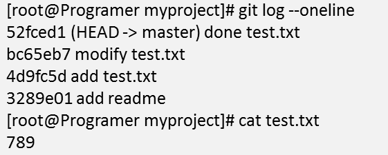

# Git基础概念

- 工作区（Workspace）：存放从仓库中提取出来文件的地方，放在磁盘上供修改和使用
- 暂存区（Index/Stage）：就是一个文件，索引文件，保存了下次将提交的文件列表信息
- 仓库（Local Repository）：保存所有数据的地方，有所有提交的版本的数据
- 远程仓库（Remote Repository）：托管代码的地方，供他人浏览下载

**工作流程**


```bash
git支持的子命令操作：
config   #修改git配置
init 	#初始化本地仓库
add 	#添加修改到暂存区
commit 	#提交修改到本地仓库
status 	#查看当前状态
clone 	#将远程服务器的仓库克隆到本地
push 	#提交修改到远程服务器
```

**git基础配置**

```bash
git config --global user.name zyu
git config --global user.email zyu@git.com
git config --global init.defaultBranch master
```

**Git初始化空版本仓库**

```bash
git init myproject
```

将已有目录制作成Git版本库，进入目录中执行`git init`

**Git文件状态**

- 未跟踪 ——>已暂存——>已提交——>已修改

# Git指针

**HEAD指针概念**

HEAD指针是一个可以在任何分支和版本移动的指针，通过移动指针我们可以将数据还原至任何版本


使用Log指令查看版本信息，获取指针

> --oneline 将每个提交压缩为一行，显示为 前7位哈希值，提交的简要说明



使用`reset`子命令回滚到指定版本


使用`git reflog`命令可以查看指针移动轨迹，在配合`reset`回到最新版本

# Git分支

分支可以让开发分多条主线同时进行，每条主线互不影响。

常见分支规范

- MASTER分支（MASTER是主分支，是代码的核心）
- DEVELOP分支（DEVELOP最新开发成果的分支）
- RELEASE分支（为发布新产品设置的分支）
- HOTFIX分支（为了修复软件BUG缺陷的分支）
- FEATURE分支（为开发新功能设置的分支）

```bash
#查看当前分支
git status
#创建分支
git branch 分支名
#查看所有分支
git branch -v
#切换分支
git checkout 分支名
#合并分支，将hotfix合并到master分支，合并前切换到master分支
git merge hosfix
#有冲突的文件会将所有分支内容放在一起，由管理员修改文件内容
```

