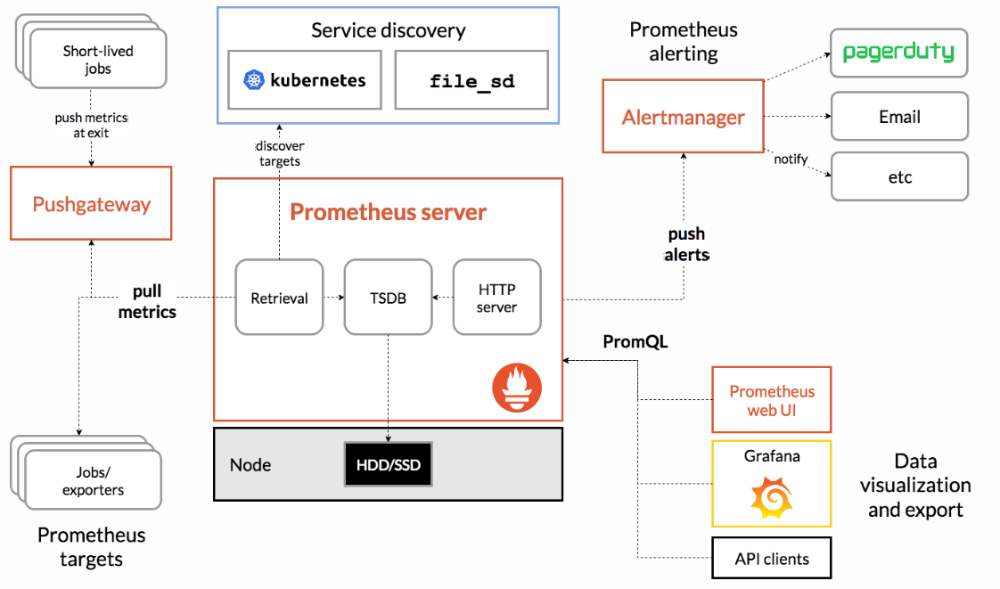

# Zabbix

zabbix通过远程主机安装agent进行数据采集，存储到MySQL数据库通过web页面进行展示。

监控服务器（需要使用web页面操作，因此需要先部署LNMP），可以通过<font color='red'>SNMP协议或者Agent客户端</font>采集数据，数据可以写入数据库中。

被监控主机需要安装Agent，常见的网络设备（<font color='green'>路由器，交换机</font>等）一般支持SNMP协议。

安装zabbix-server参考教学案例或者官网手册，安装完成后可以访问对应IP地址的8080端口(默认)

被监控主机安装zabbix-agent，修改配置文件`/etc/zabbix/zabbix_agent.conf`文件，设置开机自启

```bash
117 Server=127.0.0.1,192.168.88.5   #监控端服务器地址
182 Hostname=web1   #本机主机名
```

zabbixWeb页面添加主机客户端时，默认端口为10050


**自定义监控项key**

语法`UserParameter=自定义Key值,命令` ，命令的执行结果是Key的值；

在`/etc/zabbix/zabbix_agentd.d/`下创建配置文件，文件名自定义

```bash
vim /etc/zabbix/zabbix_agentd.d/usercnt.conf
UserParameter=usernum,sed -n '$='/etc/passwd
```

验证自定义监控项

```bash
#安装zabbix-get
zabbix_get -s 127.0.0.1 -k usernum  #本机获取监控像的值
zabbix_get -s 192.168.88.50 -k usernum #服务器获取监控端的监控项
```

**添加模板**

名称和群组均可自定义


 **主要包含项目**

1. **监控项(Items)**
   - 用于收集数据的指标
   - 包括主动式和被动式监控项
   - 支持多种数据类型(数值、文本、日志等)
2. **触发器(Triggers)**
   - 定义异常条件的逻辑表达式
   - 基于监控项数据设置阈值和告警条件
   - 支持多种严重性级别(信息、警告、一般严重、严重、灾难)
3. **图形(Graphs)**
   - 数据可视化配置
   - 可组合多个监控项
   - 支持多种图形类型(线性图、饼图等)
4. **聚合图形(Screens)**
   - 多个图形的组合视图
   - 用于创建自定义仪表板
5. **自动发现规则(Discovery Rules)**
   - 自动发现网络设备、文件系统、网络接口等
   - 包括LLD(低级别发现)规则

6. **Web场景(Web Scenarios)**

   - 用于监控网站可用性和性能

   - 包含多个HTTP请求步骤

7. **仪表板(Dashboards)**

   - 自定义监控面板

   - 可包含多种小部件(Widgets)

**添加监控项**


之后将创建的模板应用到主机，在配置中点击主机


在监测中点击主机，选择最新数据通过匹配可以看到usernum数据

**配置警告**

默认情况下，监控项不会自动发送告警消息，需要配置<font color='blue'>**触发器与告警**</font>，并通过通知方式发送消息给联系人

**触发器**：设置条件，当条件到达时，将会执行某个动作

**动作**：触发器条件到达后要采取的行为，比如发邮件或者执行命令

> ***用户数超过30时，发送告警邮件***
>
> mysql50主机用户超过30时，认为这是一个问题，当问题出现后，将会执行动作，即给管理员发邮件，需要配置邮件服务器的地址，以及管理员的email地址

- 创建触发器规则
  在我们创建的模板中点击触发器，在右上角点击创建触发器，
  
  在表达式中，选择如下，点击插入后，再点击添加
  
- 添加报警媒介
  在报警媒介中选择Email，SMTP服务器选择本机localhost，SMTP电邮自定义即可


- 为用户关联邮箱
  

- 创建动作：当出现Problem状态时，给admin发邮件
  在配置中的动作选择Trigger actions，点击创建动作
  

  

  

  添加之后点击操作，再点击添加操作
  

**验证告警配置**

在zabbixserver上配置邮件服务，安装`postfix,mailx`并启动postfix

## 自动发现

自动发现流程：

- 创建自动发现规则
- 创建动作，当主机被发现之后，执行什么操作
- 通过动作，添加主机，将模板应用到发现的主机

## 主动监控

默认zabbix使用的是被动监控，主被动监控都是针对被监控主机而言的。

- 被动监控：Server向Agent发起请求，索取监控数据。此种模式常用
- 主动监控：Agent向Server发起连接，向Server汇报


节点配置

修改配置文件只使用主动监控

```bash
vim /etc/zabbix/zabbix_agent.conf
117 #Server=127.0.0.1,192.168.88.5
142 ServerActive=192.168.88.5
242 RefreshActiveChecks=120
#重启服务后可以看到10050端口消失
```

zabbix服务器添加相同主机名的主机，即可


# Prometheus

- Prometheus是一个开源系统监控和警报工具包，最初由 SoundCloud构建。
- 也是一款监控软件，也是一个==时序数据库==。Prometheus 将其指标收集并存储为时间序列数据，即指标信息与记录时的时间戳以及称为标签的可选键值对一起存储。
- 主要用在容器监控方面，也可以用于常规的主机监控。
- 使用google公司开发的go语言编写。
- Prometheus是一个框架，可以与其他组件完美结合。



配置服务器时间，确保与当地时间一致。

安装prometheus,[官网](https://prometheus.ac.cn/download/)提供预编译二进制文件和Docker镜像，根据自身操作系统选择。

## 配置文件

包含三个配置块：global, rule_files, scrape_configs

- global块控制Prometheus服务器的全局配置

- rule_files块指定Prometheus服务器加载的规则的位置
- scrape_configs控制Prometheus监控的资源

**新建service文件，启动服务（默认端口<font color='green'>9090</font>）**

```bash
vim /usr/lib/systemd/system/prometheus.service
[Unit]
Decription=Prometheus Monitoring System
After=network.target

[Service]
ExecStart=/usr/local/prometheus/prometheus \  #反斜线表示不换行
 --config.file=/usr/local/prometheus/prometheus.yml \
 --storage.tsdb.path=/usr/local/prometheus/data/
 
[Install]
WantedBy=multi-user.target

#启动服务
systemctl daemon-reload				#修改 systemd 单元文件（如 .service、.timer、.socket 等配置文件）后，重新加载 systemd 守护进程的配置，使更改生效而无需重启系统
systemctl enable prometheus.service --now  #启动后访问9090端口
```

## 添加被监控端

监控方式：

- 拉取(pull)：监控端联系被监控端，采集数据
- 推送(push)：被监控端主动把数据发送给监控端，需要额外安装组件pushgateway

被监控端根据自身运行的服务，可以运行不同的expoter（被监控端安装的、可以与Prometheus通信，实现数据传递的软件），exporter可以在[prometheus官网](https://prometheus.io/docs/instrumenting/exporters/)进行下载

## 部署通用的监控node-exporter

node-exporter用于监控硬件和系统的常用指标

exporter运行于被监控端，以服务的形式存在，每个export使用的端口号都不一样

官网下载node-eporter的tar包，并解压到`/usr/local/node-exporter`下，创建系统服务文件

```bash
vim /usr/lib/systemd/system/node-exporter.service
[Unit]
Description=node_exporter
After=network.target

[Service]
Type=simple
ExecStart=/usr/local/node_exporter/node_exporter

[Install]
WantedBy=multi-user.target

#启动服务
systemctl daemon-reload 
systemctl enable node_exporter.service --now
```

## Grafana

Grafana是一款开源的、跨平台的、基于web的可视化工具，展示方式：客户端图表、面板插件，数据源可以来自于各种源，如prometheus

装包，启服务，访问本机的<font color='green'>3000</font>端口，初始用户名和密码都是admin。

添加prometheus数据源


之后点击保存


然后查看仪表盘

grafana模板下载https://grafana.com/grafana/dashboards/

导入主机监控模板


## **监控Mysql数据库**

创建数据库用户

```bash
mysql> create user dbuser1@localhost identified by '123456';
mysql> grant all privileges on *.* to dbuser1@localhost;
mysql> quit
```

**配置mysql exporter**

安装msyqld_exporter

编写配置文件`/usr/local/msyqld_exporter/.my.cnf`

```bash
[client]
host=127.0.0.1
port=3306
user=dbuer1
password=123456
```

创建service文件`/usr/lib/systemd/system/mysqld_exporter.service`

```bash
[Unit]
Description=mysqld_exporter
After=network.target

[Service]
ExecStart=/usr/local/mysqld_exporter/mysqld_exporter \
 --configs.my-cnf=/usr/local/mysqld_exporter/.my.cnf
 
[Install]
WantedBy=multi-user.target
```

之后在重新加载系统文件，启动服务

## **配置Prometheus监控mysqld**

修改配置文件，启动服务

```bash
#在配置文件中追加内容
...
  - job_name: "mysql"
    static_configs:
      - targets: ["192.168.88.50:9104"]
```


在grafana中通过导入mysql相应模板展示数据


## 自动发现机制

自动发现是指Prometheus自动对节点进行监控，不需要手动一个一个去添加，和Zabbix的自动发现、自动注册一个道理，Prometheus有多种自动发现发现，比如`file_sd_configs`基于文件自动发现、基于K8S自动发现、基于openstack自动发现、基于consul自动发现等。

### 基于文件自动发现

file_sd_configs实现文件级别的自动发现，使用文件自动发现功能后，Prometheus会定期检查配置文件是否有更新，如果有更新就将新加入的节点接入监控，服务端无需重启

修改配置文件`/usr/local/prometheus/prometheus.yml`

```bash
#删除静态配置，添加自动发现规则
#将scrape_configs及一下的内容修改为
 21 scrape_configs:
 22   - job_name: "prometheus"
 23     file_sd_configs:
 24       - refresh_interval: 120s
 25         files:
 26           - /usr/local/prometheus/sd_config/*.yml
 
 #重启服务
 #创建自动发现规则文件，修改
 mkdir /usr/local/prometheus/sd_configs
 #修改配置文件
 - targets:
     - 192.168.88.5:9090
     - 192.168.88.100:9100
     - 192.168.88.100:9104
```

刷新Prometheus的Web页面


## Alertmanager

Prometheus服务器中的告警规则向Alertmanager发送告警。然后，Alertmanager管理这些告警，包括静默、抑制、分组以及通过电子邮件、即时消息系统和聊天平台等方法发出通知


设置告警和通知的主要步骤是：

- 设置和配置Alertmanager
- 配置Prometheus与Alertmanager对接
- 在普罗米修斯中创建告警规则

在Prometheus中一条告警规则主要由以下几部分组成：

- 告警名称：用户需要为告警规则命名
- 告警规则：告警规则实际上主要由PromQL进行定义，其实际意义是当表达式（PromQL）查询结果持续多长时间（During）后出发告警


- Alertmanager处理客户端应用程序(如Prometheus服务器)发送的警报。它负责重复数据删除、分组，并将其路由到正确的接收方集成
- 分组：分组将性质相似的警报分类到单个通知中。这在较大的停机期间特别有用，此时许多系统同时发生故障，数百到数千个警报可能同时发出。
- 抑制：抑制是当某一告警发出后，可以停止重复发送由此告警引发的其它告警的机制。
- 静默提供了一个简单的机制可以快速根据标签对告警进行静默处理。如果接收到的告警符合静默的配置， Alertmanager则不会发送告警通知。静默设置需要在Alertmanager的Web页面上进行设置。

### 部署Alertmanager

软件安装`alertmanager-0.25.0.linux-amd64.tar.gz `，解压后移到`/usr/local/`目录下

编写服务文件

```bash
vim /usr/lib/systemd/system/alertmanager.service
[Unit]
Description=alertmanager System

[Service]
ExecStart=/usr/local/alertmanager/alertmanager \
--config.file=/usr/local/alertmanager/alertmanager.yml

[Install]
WantedBy=multi-user.target

systemctl daemon-reload
systemctl enable alertmanager.service --now
```

访问本机的9093端口可以看到web配置页面

#### 配置文件

- Alertmanager的配置主要包含两个部分：路由(route)以及接收器(receivers)。所有的告警信息都会从配置中的顶级路由(route)进入路由树，根据路由规则将告警信息发送给相应的接收器。
- 在Alertmanager中可以定义一组接收器，比如可以按照角色(比如系统运维，数据库管理员)来划分多个接收器。接收器可以关联邮件，Slack以及其它方式接收告警信息。
- 目前配置文件中只设置了一个顶级路由route并且定义的接收器为default-receiver。因此，所有的告警都会发送给default-receiver。
- 因此在Alertmanager配置中一般会包含以下几个主要部分：
  - 全局配置（global）：用于定义一些全局的公共参数，如全局的SMTP配置
  - 模板（templates）：用于定义告警通知时的模板，如HTML模板，邮件模板等
  - 告警路由（route）：根据标签匹配，确定当前告警应该如何处理
  - 接收器（receivers）：接收器是一个抽象的概念，它可以是一个邮箱也可以是微信，Slack或者Webhook 等，接收器一般配合告警路由使用
  - 抑制规则（inhibit_rules）：合理设置抑制规则可以减少垃圾告警的产生

#### Prometheus与Alertmanager对接

修改Prometheus配置文件，修改alerting配置

```bash
vim /usr/local/prometehus/peometheus.yml
....
8 alerting:
9   alertmanagers:
10    - static_configs:
11        - targets:
12            - localhost:9093
#重启服务
```

访问9090端口的config页面，查看配置是否生效


#### 配置Alertmanager发送邮件告警

修改配置文件`/usr/local/alertmanager/alertmanager.yml`

```bash
global:
  smtp_from: 'zzg@tedu.cn'      # 发件人地址
  smtp_smarthost: 'localhost:25'   # 邮件服务器地址
  smtp_require_tls: false       # 是否使用TLS安全连接
route:
  group_by: ['alertname']
  group_wait: 30s
  group_interval: 5m
  repeat_interval: 1h
  receiver: 'default-receiver'  # 接收器
receivers:
  - name: 'default-receiver'    # 配置接收器为邮件
    email_configs:
      - to: 'root@localhost.localdomain'
inhibit_rules:
  - source_match:
      severity: 'critical'
    target_match:
      severity: 'warning'
    equal: ['alertname', 'dev', 'instance']
```

定义告警规则

创建规则文件目录`/usr/local/prometheus/rules`

创建规则文件`/usr/local/prometheus/rules/hoststats-alert.rules`

```bash
roups:
- name: example
  rules:

  - alert: InstanceDown
    expr: up == 0
    for: 5m 
    labels:
      severity: warn
    annotations:
      summary: "Instance {{ $labels.instance }} down"
      description: "{{ $labels.instance }} of job {{ $labels.job }} has been down for more than 5 minutes."

  - alert: hostMemUsageAlert
    expr: (node_memory_MemTotal - node_memory_MemAvailable)/node_memory_MemTotal > 0.85
    for: 1m 
    labels:
      severity: warn
    annotations:
      summary: "Instance {{ $labels.instance }} MEM usgae high"
```

#### 在Prometheus中声明规则文件位置

配置文件`/usr/local/prometheus/prometheus.yml `

```bash
...略...
 15 rule_files:
 16   - /usr/local/prometheus/rules/*.rules
...略...
```

重启服务，安装邮件服务


