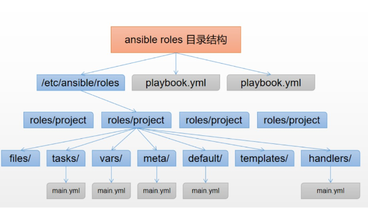

运维方式：

- 传统运维
  - 手动操作：很多任务需要手动完成，包括系统部署、配置和故障排查等
  - 资源密集型：依赖大量人力投入，容易受到人为因素的影响
  - 反应式：更多地是根据问题出现后再进行处理和修复，缺乏主动性和预防性
  - 时间成本高：由于手动操作和反应式处理，时间成本相对较高，而且容易出现人为失误
- 自动化运维
  - 自动化工具：广泛使用自动化工具来完成系统管理、部署、监控和故障处理等任务
  - 自动化流程：通过编写脚本或使用自动化平台来实现工作流程的自动化，减少人工干预
  - 预防性维护：更注重预防性维护，通过自动化监控和报警系统，能够在问题出现前进行预警和处理
  - 时间成本低：自动化运维能够大大降低时间成本，提高效率，减少人为错误

总的来说，掌握自动化运维有助于提高工作效率，简化运维工作

**自动化运维工具**

- Puppet：
  - Puppet 是一个基于客户端/服务器模型的自动化配置管理工具
  - 使用Ruby语言开发
  - 基于SSL，远程执行命令能力较弱能
- Chef：
  - Chef 使用 Ruby 语言编写配置文件
  - 能够实现基础设施的自动化部署、配置和管理
- SaltStack：
  - SaltStack 是一个快速、灵活的系统管理和自动化软件
  - 使用 Python 编开发
  - 支持远程执行命令、配置管理等功能
- Ansible
  - 目前应用最为广泛的自动化运维工具
  - 2012年首次发布，2015年被RedHat收购
  - 基于 Python的paramiko 开发，分布式
  - 基于SSH进行远程管理，被控节点无需额外安装任何客户端软件，轻量级
  - 配置语法使用 YMAL 及 Jinja2 模板语言
  - 使用模块管理被控节点，具备更强的远程命令执行操作能力

# Ansible

**Ansible使用环境**

- 控制节点
  - 安装Ansible软件
  - Python环境支持：Python>=2.6
  - 必要的模块：如PyYAML等
- 被控节点
  - 启用SSH服务
  - 允许控制节点登录，通常设置免密登录
  - Python环境支持

**环境准备**

准备4台主机，配置好主机名、IP地址、YUM源。关闭防火墙和SELinux！！！

| 主机名    | IP地址         | 角色                |
| --------- | -------------- | ------------------- |
| pubserver | 192.168.88.240 | 控制节点            |
| web1      | 192.168.88.11  | 被控节点(webserver) |
| web2      | 192.168.88.12  | 被控节点(webserver) |
| db1       | 192.168.88.13  | 被控节点(database)  |

**控制节点安装Ansible**

安装软件ansible

配置主机名解析

```bash
vim /etc/hosts
    92.168.88.240  pubserver
    192.168.88.11   web1
    192.168.88.12   web2
    192.168.88.13   db1
```

配置免密登录被控节点（SSH的免密配置）

Ansible**配置文件查找顺序**

- 首先检测ANSIBLE_CONFIG变量定义的配置文件
- 其次检查当前目录下的./ansible.cfg文件
- 再次检查当前用户家目录下的~/ansible.cfg文件
- 最后检查/etc/ansible/ansible.cfg文件

控制节点配置

```bash
# 查看默认配置文件
[root@pubserver ~]# cat /etc/ansible/ansible.cfg            #查看默认配置，通常不用该文件
[root@pubserver ~]# ansible-config init     #根据提示查看配置条目

# 自定义Ansible工作目录
[root@pubserver ~]# mkdir ansible       #自定义工作目录，名称自定义
[root@pubserver ~]# cd ansible/         #进入工作目录，以后关于ansible操作均在此目录下进行

[root@pubserver ansible]# vim ansible.cfg               #编辑配置文件   
[defaults]                  #通用配置
inventory = inventory       #主机清单列表文件
host_key_checking = false   #不检查主机秘钥，=两边有无空格均可

[root@pubserver ansible]# vim inventory     #编辑主机清单列表文件
[webservers]        #定义主机组，名称自定义
web[1:2]            #[1:2]表示从1到2

[dbs]
db1

[cluster:children]  #cluster为组名，:children为固定写法，表示为cluster的子组
webservers
dbs

```

## 使用方法介绍

- ad-hoc临时命令
  - 在命令行下是使用ansible命令调用Ansible模块，实现节点远程控制管理
  - 通常用于查询信息或者临时简易操作
  - 语法：ansible  [主机或组列表]  -m  模块  -a  "参数"
- Playbook剧本
  - 把管理任务已特定的格式编辑在文件中，通过ansible-playbook命令远程管理被控节点
  - 通常用于复杂任务设计及远程执行

## Ansible常用模块

**模块是什么**

- Ansible在使用过程中通过模块来完成指定任务
- Ansible模块的本质是一个文件，通常是为实现具体功能的Python脚本
- Ansible已经有很多开发好的模块，可以直接调用，具备开发能力也可以自行开发
- 多数模块都支持使用参数，需要使用的时候指定参数

### 模块查询ansible-doc

```bash
ansible-doc -l 			#列出目前全部可用的Ansible模块
ansible-doc  yum 	 	#查看指定模块的帮助文档
```

### Linux系统相关模块

**command模块**

- Ansible使用的默认模块，用于在被控节点执行Linux命令
- 不支持bash特性，如管道、重定向

**shell模块**

- 用于在被控节点执行Linux命令
- 支持bash特性

```bash
#修改Ansible配置文件调整默认模块
vim (工作目录)/ansible.cfg
    [defaults]
    inventory = inventory
    host_key_checking = false
    module_name = shell				#加入此行设置默认模块
```

**script模块**

- 用于在被控节点执行脚本
- 不限于shell脚本

```bash
 ansible webservers -m script -a "test.sh" #执行test.sh脚本
```

### Linux文件操作相关模块

#### **file模块**

- 用于在被控节点创建文件目录链接文件等
- 还可以修改权限、归属

**常用参数**

- path：指定文件路径
- owner：设置文件所有者
- group：设置文件所属组
- state：状态，touch表示创建文件，directory表示创建目录，link表示创建软链接，absent表示删除，mode设置权限
- src：source的简写，源
- dest：目标

```bash
ansible webservers -m file -a "path=/tmp/file.txt state=touch"    #touch指文件不存在则创建，存在则刷新时间戳
ansible webservers -m file -a "path=/tmp/demo state=directory"
ansible webservers -m file -a "src=/etc/hosts dest=/tmp/hosts.txt state=link"
ansible webservers -m file -a "path=/tmp/file.txt owner=sshd group=adm mode=0777"
```

#### copy模块

**功能**：用于将控制节点指定文件发送到被控节点，可以理解为上传操作

**常用参数**

- src：源，控制端文件路径
- dest：目标，被控制端文件路径
- content：内容，需要写到文件中的内容

```bash
# 使用copy模块发送控制节点指定文件到被控节点指定目录并重命名(如果dest指定到目录则文件名不变)
ansible webservers -m copy -a "src=test.sh dest=/tmp/adduser.sh"
ansible webservers -m copy -a "content='Hello World' dest=/tmp/mytest.txt"
## |和>的区别：|保留换行符；>不保留换行符，在使用content参数时
```

#### template模块

- 用于上传**具备特殊格式的文件**(如文件中包含，<font color='blue'>变量</font>)，文件的语法叫<font color='blue'>Jinja2</font>
- 被控节点接收到文件时，模板文件中的**变量名会被替换成具体的值**
- 相比于copy模块更加灵活

常用参数

- src：上传文件路径
- dest：目标文件路径

#### fetch模块

**功能**：用于将被控节点指定文件发送到控制节点，可以理解为下载操作

**常用参数**

- src：源
- dest：目标

```bash
# 使用fetch模块收集被控节点指定文件到控制节点(默认在控制节点生成/dest_path/主机名/src_path/file)
ansible webservers -m fetch -a "src=/etc/hostname dest=~/"
ls /root/web1/etc/
hostname
# 使用fetch模块收集被控节点指定文件到控制节点(不生成目录结构，只保留文件到指定目录)
ansible web1 -m fetch -a "src=/etc/hosts dest=~/ flat=yes"
```

#### lineinfile模块

**功能**：用于确保被控节点指定文件内有指定行，替换场景写替换内容为整行内容

**常用参数**

- path：待修改的文件路径
- line：写入文件的一行内容
- regexp：正则表达式，用于查找文件中的内容

```bash
ansible webservers -m lineinfile -a "path=/etc/issue line='Hello World'"				# 确保/etc/issue文件中有Hello World行，如果不存在则追加到文件末尾

# 替换/etc/issue文件中带Hello的行为Hello Linux
ansible webservers -m lineinfile -a "path=/etc/issue regexp='Hello' line='Hello Linux'"
```

#### replace模块

**功能**：用于关键词匹配替换

- path：待修改的文件路径
- replace：将正则表达式查到的内容替换为该参数内容
- regexp：正则表达式，用于查找文件中的内容

```bash
ansible webservers -m replace -a "path=/etc/issue regexp='Hello' replace='Hi'" 		#替换/etc/issue文件中包含Hello的行中Hello为Hi
```

### Linux用户管理相关模块

#### user模块

**常用参数**

- name：待创建的用户名
- uid：用户ID
- group：设置基本组
- groups：设置附加组
- home：设置家目录
- password：设置用户密码，password_hash()是函数，sha512是加密算法
- state：状态，present表示创建，默认选项，absent删除
- remove：删除家目录、邮箱，值为yes或true

```bash
ansible webservers -m user -a "name=jim uid=1010 group=adm groups=daemon,root home=/home/jim password={{'123456'|password_hash('sha512')}}"			# 使用user模块创建用户并设置用户属性，group是属组，groups是附加组,password_hash()是函数，sha512是加密算法

ansible webservers -m user -a "name=jim state=absent remove=true"
```

#### group模块

**常用参数**

- name：组名
- gid：GID
- state：present,默认;absent删除

### Linux软件管理相关模块

#### yum_repository模块

**功能**：用于管理被控节点YUM源配置文件（repo文件）

**常用参数**

- file：指定repo文件，不写则默认以name字段为标准，不用加后缀repo
- name：仓库唯一标识符，[ ]中的内容
- desciption：仓库信息描述
- baseurl：仓库地址
- gpgcheck：是否校检秘钥
- enabled：是否启用该仓库
- state：文件状态

```bash
ansible webservers -m yum_repository -a "file=myrepo name='BaseOS' description='Rocky Linux BaseOS' baseurl='ftp://192.168.88.240/dvd/BaseOS/' gpgcheck=false enabled=true"
#添加到同一个文件，会追加到文件后面
ansible webservers -m yum_repository -a "file=myrepo name='AppStream' description='Rocky Linux AppStream' baseurl='ftp://192.168.88.240/dvd/AppStream/' gpgcheck=false enabled=true"
# 清理指定文件中的源(如果清理指定name的源文件内还有其他源则文件保留，如果无其他源则同时删除文件)
ansible webservers -m yum_repository -a "file=myrepo name=BaseOS state=absent"
```

#### yum模块

**功能**：用于管理被控节点的rpm包，如升级，安装，卸载

**常用参数**

- name：包名
- state：present安装，已安装则忽略；latest安装或者升级到最新版本；absent卸载

### Linux<font color='salmon'>服务</font>管理相关模块

#### service模块

**功能**：用于管理Linux系统服务，启动，关闭，重启，开机自启

**常用参数**

- name：控制的服务名
- state：started;启动  stopped：关闭  restarted：重启
- enabled：yes(true)/ no(false)

```bash
# 使用service模块管理nginx服务,启动nginx，加入开机自启
ansible webservers -m service -a "name=nginx state=started enabled=true"
```

#### Firewalld模块

**功能：**

- 该模块用于配置`firewalld`防火墙规则
- 防火墙一般默认拒绝访问，对于明确允许的服务进行放行操作
- 有一些服务有名字，有些服务没有名字。但是最终都是基于TCP或UDP的某些端口
- 比如http服务基于TCP80端口。服务名和端口号对应关系的说明文件是：`/etc/services`

**常用参数**

- port：声明端口
- permanent：永久生效，但不会立即生效
- immediate：立即生效，临时的
- state： enabled,disabled

### Linux磁盘管理相关模块

#### parted模块

**常用参数**

- device：待分区的设备
- number：分区编号
- state：present创建，absent删除
- part_start：分区起始位置，不写表示从头开始
- part_end：分区的结束位置，不写表示到结尾
- label：磁盘标签类型（MRB,GPT），分区表

```bash
ansible web1 -m parted -a "device=/dev/vdb number=1 part_end=5GiB label=gpt state=present"        #不指定part_start则从0%开始
ansible web1 -m parted -a "device=/dev/vdb number=2 part_start=5GiB label=gpt state=present"      #不指定part_end则到100%为止
```

#### lvg模块

用于卷组管理

常用参数

- vg：定义卷组名
- pvs：有哪些物理卷组成
- pesize：指定物理区块大小，默认4M
- state：present创建，absent删除

#### lvol模块

管理逻辑卷

**常用参数**

- vg：指定在那个卷组上创建逻辑卷
- lv：逻辑卷名
- size：逻辑卷大小，不写单位，已M为单位
- state：present创建，absent删除

#### filesystem模块

**功能**：格式化分区

**常用参数**

- fstype：指定文件系统类型
- dev：指定要格式化的设备
- state：状态
- force：用于强制操作

#### mount模块

**功能**：挂载指定分区

**常用参数**

- path：挂载点，如果不存在，则自动创建
- src：待挂载的设备
- fstype：文件系统类型
- state：mounted永久挂载(写入配置文件)，unmounted临时卸载，present临时挂载，absent永久卸载

## Ansible Playbook 剧本

playbook剧本要求按照YAML格式书写

### YAML格式

YAML（YAML Aln't Markup Language）

- 文件以 .yaml或 .yml 扩展名为常见
- 文件以`---`作为第一行，不是必须，但是常用
- 键值对使用`:`表示，冒号后面必须有空格
- 数组使用`-`表示，`-`后必须有空格
- 相同的层级必须有相同的缩进，缩进不对则语法错误，每一级缩进建议2个空格
- 全文不能使用tab键，必须使用空格（可以修改VIM配置文件）

```bash
vim ~/.vimrc
set ai et ts=2
set cursorline
set cursorcolumn
```

### Playbook剧本样例

一个剧本可以包含多个剧

每个剧用于在指定的主机或组上执行一个或者多个任务(task)

每个任务task有模块和参数组成

```bash
vim fileop.yml
---
- name: create dir and copy file
  hosts: dbs,web1
  tasks:
    - name: create dir
      file:
        path: /tmp/demo/
        state: directory
        mode: '0755'
    - name: copy file
      copy:
        src: /etc/hosts
        dest: /tmp/demo/hosts
        
ansible-playbook --syntax-check fileop.yml  #进行语法检查
ansible-playbook  fileop.yml 				#剧本执行

#在webservers组安装httpd/php/php-mysqllnd软件，安装Development Tools组，更新系统所有软件
yum group list    #获取包组名称
vim pkgs.yml
---
- name: manage packages
  hosts: webservers
  tasks:
    - name: install pkg
      yum:
        name:
          - httpd
          - php
          - php-mysqlnd
        state: present
    - name: install group
      yum: 
        name: "@Development Tools"		# @组名，开发工具
        state: present
    - name: update
      yum:
        name: '*' 			#*指系统上面已安装的所有软件
        state: latest
```

### 错误处理机制

当Playbook有多个tasks时，莫个任务执行过程中失败则后续任务终止执行

使用`ignore_errors`对可能出现错误的task进行忽略处理，可用于tasks级别，忽略指定任务，也可以用于全局作用于所有任务

```bash
---
- name: test error task
  hosts: webservers
  tasks:
    - name: start mysqld
      service: 
        name: mysqld
        state: started
        enabled: true
      ignore_errors: true       #任务级

    - name: touch file
      file:
        path: /tmp/mysql.txt
        state: touch
```

### 触发执行任务

介绍

- 通过handlers定义一组任务
- 仅当某个任务触发(notify) handlers时才会执行相应任务
- 若有多个notify触发，也只执行一次
- 仅当任务状态为changed使才会执行
- handlers任务在所有其他任务都执行后才执行

```bash
#加入触发器，只有配置文件修改了才重启服务
---
- name: configure nginx
  hosts: webservers
  vars:
    http_port: 80
  tasks:
    - name: upload nginx.conf
      template:
        src: nginx.conf
        dest: /etc/nginx/nginx.conf
      notify: restart nginx     #任务状态为changed时触发指定任务执行

  handlers:
    - name: restart nginx
      service:
        name: nginx
        state: restarted
```

### when条件判断

当满足某些条件时才执行任务，多任务使用and或or进行链接，表达逻辑关系

注意： when变量不需要使用{{}}

**常用操作符**

```bash
==：相等
!=：不等
>:大于
<：小于
<=：小于等于
>=:大于等于

#单条件测试：目标主机内存至少4G时安装MySQL软件
---
- name: test when
  hosts: dbs
  tasks:
    - name: install mysql soft
      yum:
        name: mysql-server
        state: present	
      when:								#此处为单挑件测试
        ansible_memtotal_mb >= 4096
      when: >   #多条件合并成1行			#此处为多条件测试
        ansible_distribution == "Rocky"
        and
        ansible_distribution_major_version == "8"  
```

### register注册变量

- register是用于捕获和保存任务执行结果的，它允许将其他任务的输出作为变量使用
- register是一个关键字，可以将任务执行的结果赋值给指定的变量名称
- 这个变量可以在后续任务中使用
- register模块可以捕获各种类型的输出，包括stdout、stderr、rc、changed等
- 可以与其他模块一起使用，例如"when"条件、"loop"循环等

```bash
---
- name: test register
  hosts: web1
  tasks:
    - name: create file
      file:
        path: /tmp/reg1.txt
        state: touch
      register: result

    - name: display result
      debug:
        msg: "{{result}}"

---
- name: test register
  hosts: web1
  ignore_errors: true   #如果不忽略则任务2无法执行
  tasks:
    - name: create file
      file:
        path: /tmp/abcdemo/abc
        state: touch
      register: result

    - name: debug out
      debug:
        msg: "create failed"
      when: result.failed
```

### 任务块block

可以通过block关键字，将多个任务组合到一起；可以控制整个block任务组，一起控制是否执行

- **rescue和always**

  - block中的任务都执行成功则rescue中的任务不执行
  - block中的任务出现失败则执行rescue中的任务
  - always中的任务总是执行

  ```bash
  ---
  - name: test block/rescue/always
    hosts: webservers
    tasks:
      - name: test
        block:
          - name: touch file1
            file:
              path: /tmp/test1.txt
              state: touch
        rescue:
          - name: touch file2
            file:
              path: /tmp/test2.txt
              state: touch
        always:
          - name: touch file3
            file:
              path: /tmp/test3.txt
              state: touch
  ```

### loop循环

类似于shell中的for循环，特点是变量名固定为：item

```bash
#变量定义方法
#简单变量
	loop: [a,b,c,d]
	loop:
	  - a
	  - b
	  - c
	  - d
#复杂变量：整体赋值给item，可以用item.key获取指定value
	loop:
	  - {"key1": "value1","key2": "value2"}
```


## Ansible变量

### Facts变量

- facts组件是Ansible用于采集被管理机器设备信息的一个功能
- 用于采集的被控节点的设备信息
- 主要包含IP地址、操作系统、以太网设备、mac 地址、时间/日期相关数据，硬件信息等
- facts变量可以理解为Ansible中的预定义变量

**查看facts变量**：使用setup模块，用于获取所有facts的信息

```bash
#facts变量是一个有很大的由{}构成的键值对字典，在{}中，有很多层级的嵌套。可以通过参数过滤出第一个层级的内容
ansible all -m setup -a "filter=ansible_bios_version"		#filter参数用于过滤指定信息
```

**剧本中使用facts变量**

- 剧本中可以使用debug模块打印变量信息
- 默认Gathering Facts的任务，收集到Facts信息后使用该模块打印
- 变量格式：{{变量名}}
- 常用参数：
  - msg：打印变量值，格式{{变量名}}
  - var：打印变量值，格式：变量名

**自定义变量名**

- Ansible变量定义的位置，下列变量优先级从低到高

  - role defaults ：roles defaults目录下的变量
  - inventory vars：inventory文件中定义的变量
  - inventory group_vars：inventory文件组的变量
  - inventory host_vars：inventory文件主机的变量
  - playbook group_vars：剧本中组的变量
  - playbook host_vars：剧本中主机的变量
  - host facts：事实变量
  - play vars：vars定义的变量
  - play vars_prompt：vars_prompt定义的变量
  - play vars_files：vars_files导入的变量
  - registered vars：注册变量
  - role and include vars：roles中单独定义的及导入的变量
  - block vars (only for tasks in block)：block中定义的变量
  - task vars (only for the task)：任务中定义的变量
  - extra vars (always win precedence)：命令行指定的变量

- 主机清单变量

  ```bash
  vim inventory
  [webservers]
  web[1:2]
  
  [dbs]
  db1  username="niuniu"			#定义属于主机db1的变量
  
  [cluster:children]
  webservers
  dbs
  
  [webservers:vars] 	#定义属于组的变量，:vars是固定格式
  username="lisi"
  ```

  

- 剧本变量

  ```bash
  #在Playbook中定义变量
  vim var.yml
  ---
  - name: vars
    hosts: webservers
    vars_files: fvars.yml		#引用变量文件
    vars:
    	username: "zhangsan"
    	password: "12346"	#数字作为密码必须用引号，表示字符串
    tasks:
    	- name: play var
    	  user:
    	    name: "{{username}}"
    	    password: "{{password|password_hash('sha512')}}"
    	    state: present
    	    
  #变量文件
  vim fvars.yml
  ---
  username: "lisi"
  password: "123456"
  ```

  

## Ansible角色

### Roles目录结构



```bash
roles：				#角色必须放在roles目录下，可以自定义位置，默认/etc/ansible/roles/
	project:			#角色项目名称
		files:			#用于存放静态文件
		template:		#用于存放动态文件，即jinja2模板，tamplate模块会自动到此目录下寻找模块文件
		tasks:			#定义任务列表的地方
			main.yml		#任务列表内容编写在此文件中
		handlers:		#定义触发器的地方
			main.yml		#触发器内容编写在此文件中
		vars:			#定义变量的地方（优先级最高）
			main.yml		
		defaults:		#定义缺省值的地方（优先级低）
			main.yml
		meta:			#定义版本，作者等信息
			main.yml	
		README.md		#角色描述
```

修改配置文件

```bash
vim ansible.cfg
[defaults]
inventory = inventory
host_key_checking = false
module_name = shell
roles_path = ./roles
```

创建角色命令：`ansible-galaxy init roles/motd`

## Ansible加密解密文件

### ansible-vault命令

**常用选项**

- encrypt：加密
- dectypt：解密
- view：查看
- rekey：重置密码

```bash
ansible-vault encrypt passwd.txt		#加密文件
New Vault password: 1234
Confirm New Vault password: 1234
Encryption successful

ansible-vault decrypt passwd.txt		#解密文件
Vault password: 1234
Decryption successful
```

## 特殊主机清单变量

如某个被控节点不能免密登录，ssh服务端口不是标准22端口等情况

```bash
##常用配置
	ansible_ssh_host:指定被控节点服务器IP地址
	ansible_ssh_user:指定远程登录主机的用户名
	ansible_ssh_port:指定远程登录主机的端口号
	ansible_ssh_pass:指定远程登录主机的密码
```

