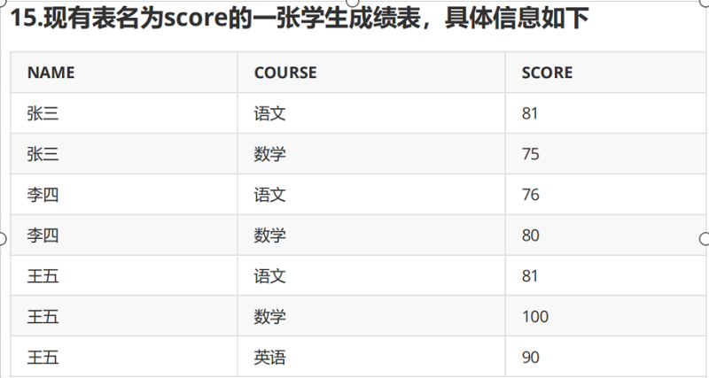
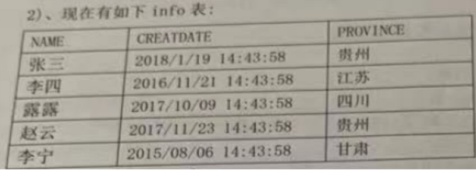
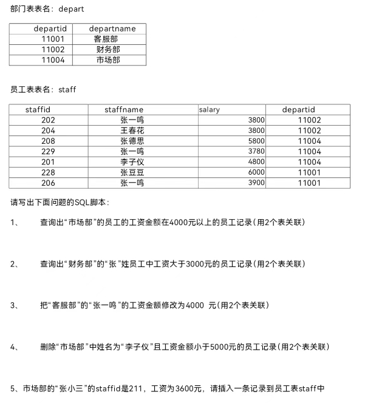

1，
破解数据库密码的方法和流程

```bash
修改配置文件/etc/my.cnf.d/mysql-server.cnf,新添加一行skip-grant-tables
重启服务 systemctl restart mysqld
输入 mysql就可以直接进入
通过alter user root@'localhost' identified by 'newpasswd'; 设置新密码 
```

2.
建库的命令； 建表的命令； 对表内容的增删改查的语句分别是什么？

```bash
create database 库名;
create table 表名 (表头);
select update delete insert
```



4.查看上图，用一条sql语句查询出语文课成绩大于80分的学生姓名及分数

```bash
select NAME,SCORE from score where COURSE='语文' and SCORE>80;
```

5.用一条sql语句查询出语文课成绩大于80分的学生总人数

```bash
select count(NAME) from score where COURSE='语文' and SCORE>80;
```

6.用一条sql语句查询出每门课都大于80分的学生姓名

```bash
select NAME from score group by name having min(score)>80 ;
#取反
select name from score where name not in (select name from score where score<80);
```



7.查看上图，统计贵州省的用户数

```bash
select count(name) as 用户数 from info where PROVINCE='贵州';
```

8.删除江苏省的用户记录

```bash
delete from info where PROVINCE='江苏';
```

9.把甘肃省的用户名字改为刘备

```bash
update info set NAME='刘备' where PROVINCE='甘肃';
```

10.查询出创建时间大于2016年的记录

```bash
select * from info where year(CREATDATE)>2016;
```



```bash
1.
SELECT s.*,departname FROM staff as s INNER JOIN depart as d on s.departid=d.departid WHERE salary>4000 AND departname='市场部';
2.
SELECT s.*,departname FROM staff as s INNER JOIN depart as d on s.departid=d.departid WHERE salary>3000 AND departname='财务部' AND staffname LIKE '张%';
3.
update staff set salary='4000'  WHERE departid=(SELECT departid FROM depart where departname='客服部') AND staffname='张一鸣';
4.
DELETE FROM staff WHERE staffname='李子仪' AND departid=(SELECT departid FROM depart where departname='市场部');
5.
INSERT INTO staff(staffid,staffname,salary,departid) 
VALUES ('211','张小三','3600','11004');


```

第二次实操

1.把/etc/passwd文件的内容保存到testdb库的user表里,需要自己创建testdb数据库和user表，导入文件到数据库的操作为：load data infile "/var/lib/mysql/myfiles/passwd" into table user fields terminated by ":" lines terminated by "\n";

```bash
create database testdb; create table testdb.user(   id int auto_increment ,  username char(20),      password char(1),     uid int,     gid int,      comment varchar(50),     homedir varchar(80),                               shell char(30),primary key(id));
vim /etc/my.cnf.d/mysql-server.cnf 
secure_file_priv=/var/lib/mysql/myfiles
```

2 复制user表的所有记录到teadb库的teacher表里（复制表）

```bash
create table testdb.teacher select * from testdb.user;
```

3 只复制user表的表结构给新teadb库的tea2表 (快速建表)    

```bash
create table testdb.tea2 like testdb.user;
```

4 查看teadb库的tea2表的表结构，并删除 id 字段    

```bash
desc testdb.tea2;
alter table testdb.tea2 drop id;
```

对teadb库的teacher表执行如下操作：

5.把username字段设置为index索引

```bash
create index suoyin on teacher(username);
```

6.在username字段下方添加s_year字段 存放出生年份 默认值是1990

```bash
alter table testdb.teacher add s_year year default(1990) after username;
```

7
在username字段下方添加字段名sex字段值只能是 girl 或 boy 默认值是 boy

```bash
alter table testdb.teacher add sex enum('girl','boy') default('boy') after username;
```

8在sex字段下方添加 age 字段  存放年龄 不允许输入负数。默认值 是 21

```bash
alter table testdb.teacher add age int unsigned default(21) after sex;
```

9把id字段值是1到10之间的用户的性别修改为 girl

```bash
update testdb.teacher set sex='girl' where id between 1 and 10;
```

10统计性别是girl的用户有多少个。

```bash
select count(username) as num_of_girl from testdb.teacher where sex='girl'; 
```

11查看性别是girl用户里 最大的uid号 是什么。

```bash
select max(uid) from testdb.teacher where sex='girl';
```

12添加一条新记录只给username、uid 字段赋值 值为rtestd  1000

```bash
insert into testdb.teacher(username,uid) values (rtestd,1000);
```

13显示 uid 是四位数的用户的用户名和uid值。

```bash
select username,uid from testdb.teacher where  uid between 1000 and 9999;
```

14显示名字是以字母 r 开头 且是以字母d结尾的用户名和uid。

```bash
select username,uid from testdb.teacher where username like 'r%d';
```

15查看是否有名字以字母 a 开头 并且是以字母 c 结尾的用户。

```bash
select username,uid from testdb.teacher where username like 'a%c';
```

16把 gid 在100到500间用户的家目录修改为/root

```bash
update testdb.teacher set homedir='/root' where gid between 100 and 500;
```

 17把用户是 root 、 bin 、  sync 用户的shell 修改为  /sbin/nologin

```bash
update testdb.teacher set shell='/sbin/nologin' where username in ('root','bin','sync');
```

 18查看  gid 小于10的用户 都使用哪些shell

```bash
select distinct shell from testdb.teacher where gid<10;
```

19删除  名字以字母d开头的用户。

```bash
deletc from testdb.teacher where username like 'd%';
```

20查询  gid 最大的前5个用户 使用的 shell

```bash
select shell from testdb.teacher order by gid desc limit 5;
```

21查看哪些用户没有家目录

```bash
select username from testdb.teacher where homedir is null;
```

 22显示 gid 大于500的用户的用户名 家目录和使用的shell

```bash
select username,homedir,shell from testdb.teacher where gid>500;
```

23删除uid大于100的用户记录

```bash
DELETE FROM testdb.teacher WHERE uid>100;
```

24显示uid号在10到30区间的用户有多少个。

```bash
SELECT COUNT(username)FROM testdb.teacher WHERE uid BETWEEN 10 AND 30;
```

25显示uid号是100以内的用户使用shell的类型。

```bash
SELECT DISTINCT(shell) FROM testdb.teacher WHERE uid<100;
```

26 显示uid号小于50且名字里有字母a  用户的详细信息

```bash
SELECT * FROM testdb.teacher  WHERE uid< 50 AND username LIKE '%a%';
```

27
只显示用户 root   bin   daemon  3个用户的详细信息。

```bash
SELECT * FROM testdb.teacher  WHERE username in ('root','bin','daemon');
```

28显示除root用户之外所有用户的详细信息。

```bash
SELECT * FROM testdb.teacher WHERE username!='root';
```

29统计username 字段有多少条记录

```bash
SELECT COUNT(username) FROM testdb.teacher;
```

30显示名字里含字母c  用户的详细信息

```bash
select * from testdb.teacher where username like '%c%';
```

31在sex字段下方添加名为pay的字段，用来存储工资，默认值    是5000.00

```bash
ALTER TABLE testdb.teacher ADD pay float DEFAULT 5000.00 AFTER sex;
```

32把所有女孩的工资修改为8000

```bash
update testdb.teacher set pay='8000' where sex='girl';
```

33查看所有用户的名字和工资

```bash
select username,pay from testdb.teacher 
```

34查看工资字段的平均值

```bash
select avg(pay) from testdb.teacher 
```

